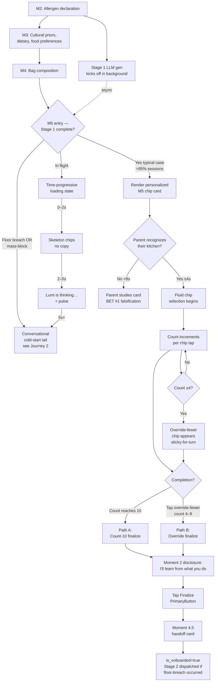
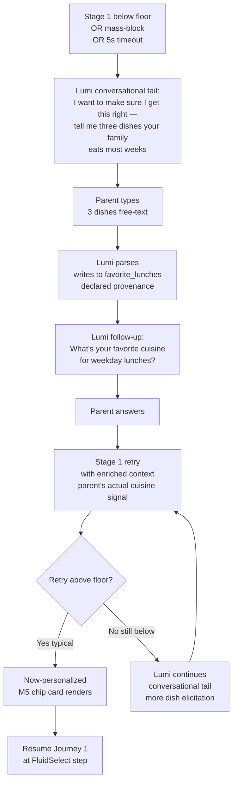
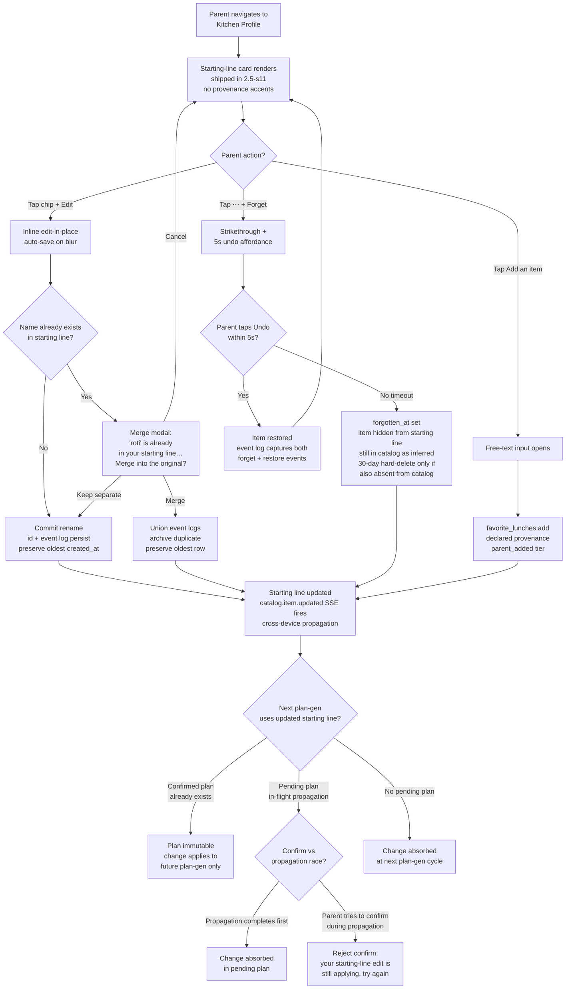
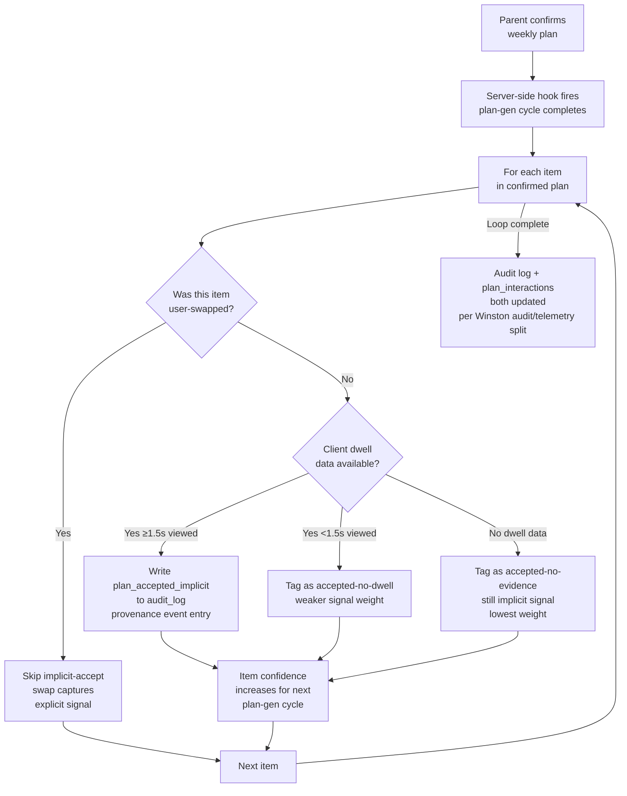

# UX Design Specification — HiveKitchen Household Food Catalog

**Author:** Menon
**Date:** 2026-05-22
**Status:** Complete (workflow finalized 2026-05-23)
**Scope:** This is a focused design specification for **one feature area** — the Household Food Catalog as the spine of Lumi's food memory. It inherits voice, tone, design tokens, component library, and layout patterns from the master UX spec at `_bmad-output/planning-artifacts/ux-design-specification.md`. Where this document is silent, the master spec applies.

---

## Why this specification exists

Slice 2.5-s9 ("A starting line for Lumi") shipped on 2026-05-21 with a static 18-item lunch catalog hardcoded into the agent prompt. PM review on 2026-05-22 surfaced that this catalog violates Lumi's *"only suggests things that fit"* promise for any household whose cultural / dietary / allergen profile does not align with the static set's Anglo-Western-with-some-South-Asian shape. The fix proposed during the bmad-ux-designer (Sally) session evolved beyond a chip-catalog patch into a **household-scoped food memory architecture** with implications across M5 onboarding, the Kitchen Profile, plan generation, swap suggestions, and Visible Memory.

This specification formalizes that architecture before code lands.

---

## Architectural decisions inherited from prior conversation

The following decisions were committed during the prior conversation (Sally session, 2026-05-22) and are inputs to this design pass, not open questions:

| # | Decision | Why |
|---|---|---|
| 1 | M5 chips will be personalized from M1, M2, M3, M4 signals (allergens, cultural priors, dietary preferences, age bands, bag composition) | Static catalog contradicts Lumi's "only suggests things that fit" promise for non-Anglo households |
| 2 | Wire format: client submits **labels** for M5 chips (M2/M3 keep using **keys** because those are canonical enum values stored in DB) | M5 labels ARE the canonical persisted values (ciphertext of label is what `favorite_lunches.item` stores). M2/M3 keys are stable enum identifiers used in tool calls. |
| 3 | The static chip-key → label lookup table in `apps/api/src/agents/prompts/onboarding.prompt.ts` will be deleted | The wire format change makes it unnecessary |
| 4 | `favorite_lunches` table keeps its row-per-favorite shape (not JSONB array on `households`) | Atomic idempotent writes via unique index, clean field-level encryption, per-row identity for Visible Memory edit/forget, hot M5 path concurrency-safety |
| 5 | Free-text + chip selection paths both flow through agent tool calls (no new design needed for this) | Already works in shipped 2.5-s9 architecture |
| 6 | Build a local catalog table over LLM-on-every-turn or Tavily-per-turn approaches | Deterministic, fast, cheap, privacy-preserving |
| 7 | The catalog is **per-household**, not a global reference table | Mirrors how families actually think about their food (~50–200 known items, growing over time); enables the catalog to become Lumi's food memory for the family, used across onboarding, plan generation, and swap suggestions |

---

## Catalog lifecycle (committed shape)

```
Stage 0 — Curated baseline (one-time, shipped pre-launch)
────────────────────────────────────────────────────────
~50 hand-curated items tagged across major cuisine × dietary × allergen
intersections. Stored as a global reference (NOT per-household). Acts as
safety net when LLM produces nothing useful for a particular cultural
intersection (e.g., Somali, Yemeni, Tibetan, sub-regional cuisines where
LLM training is sparse). Provenance tag: 'curated_baseline'.

Stage 1 — Catalog Seeding (synchronous, during onboarding after M2-M4)
────────────────────────────────────────────────────────
LLM reads household state (M1 children + age bands, M2 allergens, M3 cultural
priors + dietary + cuisines + food preferences, M4 bag composition) →
generates 50 lunch ideas tailored to this family. EVERY item passes through
the existing Allergy Guardrail Service (Story 3.1 — deterministic, outside
agent boundary) before persistence. Items that match the curated baseline
inherit 'curated_baseline' provenance; LLM-original items get 'llm_seeded'.

The M5 chip card draws its ~18 chips from this household-specific catalog.

Stage 2 — Catalog Refinement (asynchronous, after M5 finalizes)
────────────────────────────────────────────────────────
After parent selects 5–10 favorites from the M5 card, a background job
reads the selections, infers the family's taste shape, and asks the LLM
to generate another 50 items tuned to that pattern. Items pass through
allergy guardrail; persisted with 'llm_refined' provenance. The parent
never waits for this — it runs between M5 finalize and the first weekly
plan generation, which itself is scheduled per-timezone.

Stage 3 — Living catalog (during normal operation)
────────────────────────────────────────────────────────
- Planner queries household catalog first; falls back to Tavily-cached
  `recipes` table (Story 3-31) only if catalog is insufficient
- Swap suggestions drawn from catalog
- Items accumulate learning signals: times_proposed, times_accepted,
  times_rejected, last_used_at
- Plan-promoted items earn 'plan_promoted' provenance
- Parent additions (via Kitchen Profile) earn 'parent_added' provenance
- Soft-forgotten items (Epic 7-s4 pattern) flagged via `forgotten_at`,
  hidden from query, hard-deleted by nightly job after 30 days
```

---

## Provenance tiers (committed)

Every item in `household_food_catalog` carries a provenance tag that drives both trust weighting in the planner and visual treatment in the Kitchen Profile:

| Provenance | Source | Trust weight | UI treatment (preview — to be designed) |
|---|---|---|---|
| `parent_added` | Parent typed in M5 free-text or added via Kitchen Profile | **Highest** — source of truth | "You told me" — bold, no provenance chip needed |
| `plan_promoted` | Planner used it successfully across N weeks; auto-promoted | High — performance-validated | "We've been making this" — subtle confidence chip |
| `curated_baseline` | Hand-tagged seed item from Stage 0 | High — humans verified | "Lumi knows this one" — minimal chip |
| `llm_refined` | LLM generated at Stage 2 based on parent's favorite selections | Medium-high — informed by signal | "Lumi suggested this — let me know" — neutral chip |
| `llm_seeded` | LLM generated at Stage 1 from M1-M4 alone | Medium — pre-signal | "Lumi suggested this — let me know" — neutral chip with subtle confidence dim |

---

## Safety bar (non-negotiable, committed)

Every LLM-generated item (Stage 1 + Stage 2) **must** pass through the existing **Allergy Guardrail Service** (architecture.md §3.1; Story 3.1) **before being persisted to `household_food_catalog`**. The guardrail is deterministic, rule-based, and lives outside the Agent Orchestrator's process boundary. LLMs may hallucinate; the database **may not** accept hallucinations that violate declared M2 allergens.

This is the same architectural principle that governs the planner: tool-cleared ≠ guardrail-cleared. The catalog gets the same treatment.

---

## Master UX spec inheritance — what we are NOT redesigning

This scoped specification inherits from the master UX spec. The following are **already locked** and not reopened:

- Visual language (warm neutrals — honey, olive, clay, oat, charcoal)
- Typography (Instrument Serif for headlines, Public Sans for body)
- Design tokens (semantic aliases `bg`, `surface`, `fg`, `border`; warm-neutral scale)
- Honey rule (amber reserved for recognition moments; never button hovers)
- Button taxonomy (5 variants — primary, secondary, tertiary, proposal, destructive)
- `<StickyBottomBar>` pattern for primary action surfaces
- `<PrimaryButton>` / `<SecondaryButton>` / `<TalkToLumiButton>` / `<RailCard>` / `<TextField>` primitives
- `<AppHeader>` / `<DetailHeader>` / `<AppFooter>` layout shells
- Scope tags (`.app-scope`, `.grandparent-scope`, `.child-scope`)
- Dark-mode-first; WCAG 2.2 AA across app, AAA inside child-scope
- Lumi voice/tone principles (Collaborative not commanding; Warm not casual; Concise not terse; Honest not hedged)
- AI Proposes, Humans Decide; Progressive Disclosure; Explainability On Demand; Communicate Uncertainty; Feedback Without Friction; Multimodal Seamless Switching

If this spec needs to deviate from any of the above, that deviation will be flagged explicitly and the master spec's section number cited.

---

## Open design questions (to be resolved through subsequent workflow steps)

1. Where does the catalog live in the Kitchen Profile / Visible Memory surface? Is it a new section? Does it replace or extend the existing "Lumi's starting line" card?
2. How does the parent EDIT the catalog (soft-forget items, add new ones, mark "we don't eat this anymore")?
3. What's the visual treatment of provenance? Do parents see "Lumi suggested this" vs "You told me about this" vs "We've been making this for months"? With what level of subtlety?
4. How does the M5 chip card draw from this catalog, given the chip card needs ~18 items but the catalog might have 50+? Sort order? Diversity constraint?
5. How does the planner UX show "this week is mostly familiar items + 1 new try" so the parent feels Lumi is curating rather than randomizing?
6. What does the catalog page itself look like? Filter / sort affordances? Confidence indicators? Edit affordances?
7. Cold-start UX: if a household's culture is poorly represented and the LLM produces a weak Stage 1 catalog, what does the M5 chip card look like? Does Lumi acknowledge the limitation? How?
8. Visible Memory integration: Epic 7 (especially 7-s2 provenance chips, 7-s3 edit, 7-s4 soft-forget) already designs trust affordances around `memory_nodes`. The food catalog is a **structured-data sibling** to `memory_nodes`. How do the two trust surfaces relate visually and conceptually? Do they share affordances?
9. Slice decomposition: this is likely 3–5 implementation slices. How do we sequence them so user-visible value lands incrementally? What's the MVP wall?

---

## Project Vision

The Household Food Catalog is a per-household structured table that captures, refines, and persists the foods that fit *this* family. **It is internal infrastructure**, not a browsable user surface. It feeds three user-visible surfaces, in order of first user encounter:

1. **M5 onboarding chip card** — personalized starting line drawn from the catalog (rather than the static 18-item global set that shipped in 2.5-s9). This is the *cold-start trust moment* — the JTBD here is **transparency** ("did Lumi hear what I just said?"), not browsing. The chip card shows ~18 chips at a time, a bounded curated subset.
2. **Weekly plan generation** — Lumi's primary source pool. Tavily-cached `recipes` (story 3-31) is fallback only. Parent sees the plan, not the catalog.
3. **Swap suggestions** — drawn from items Lumi already knows fit the family, not regenerated from scratch. Parent sees the alternatives, not the catalog.

The user-facing artifact at Kitchen Profile is the **bounded "Lumi's starting line" card** (the ≤~20 favorite_lunches the parent declared at M5 or added directly) — *already shipped in 2.5-s11*. The catalog itself (potentially 50–150+ items, growing over time) is **never directly browsable** by the parent.

> **Scope correction (2026-05-23):** A previous draft treated the catalog as a fourth user-visible surface ("steady-state Visible Memory browse"). That surface is cut. Exposing the whole catalog would grow into noise the parent doesn't want to manage; Mary's Round 1 critique on this point was correct and the prior draft underweighted it. The catalog becomes infrastructure; the starting line stays the user's artifact.

**Acceptance criterion (operational framing):** *"Lumi remembers what fits the household, so M5 suggestions feel personal and the planner does not propose blocked items."*

## Target Users — Two-Tier Cohort Framing

The catalog's user-visible surfaces touch the **Primary Parent** at four moments (M5 chip card, first weekly plan, Kitchen Profile *starting-line* card visit, swap interaction). The catalog itself is invisible at all four. Secondary caregiver is read-only on Kitchen Profile at MVP.

The previous "pluralistic households" mood-board framing collapsed continents and erased sub-regional gradients. It has been replaced with the two-tier model below. Where research is missing, it is named, not hidden.

### Served-by-precedent cohorts (defensible at launch)

These cohorts have **adjacent-category precedent** or **LLM training-data saturation** strong enough that Stage 1 will produce a competent catalog out of the box:

| Cohort | Evidence type |
|---|---|
| Anglo + Tex-Mex-adjacent + generic Mediterranean | Competitive precedent (every mainstream planner handles these) + LLM saturation |
| South Asian Halal | Adjacent-category precedent (Zabihah, HappyCow) + reasonable LLM coverage |
| Hindu vegetarian | Adjacent-category precedent + strong LLM coverage |
| Kosher | Adjacent-category precedent (Instacart kosher overlays, OU certification UX) |

### To-validate cohorts (architectural bets, research-required)

| Cohort | Bet we are making | What would falsify it |
|---|---|---|
| Latin American (sub-regional: Oaxacan, Salvadoran, Peruvian, Argentine…) | LLM has enough coverage to seed competent Stage 1 catalogs | M5 catalog quality below competence floor in user testing |
| East Asian (sub-regional: Sichuanese, Cantonese, Korean, Vietnamese, Japanese, Hokkien…) | Same as above | Same as above |
| African (West African, Ethiopian/Eritrean, North African Maghrebi…) | Same — but training data is sparser here | Below-floor catalog quality + parent feedback of stereotyping |
| Somali, Yemeni, Tibetan, sub-regional Caribbean | **Lowest confidence.** No competitive precedent in our artifacts; LLM training thin. | Likely to hit the cold-start fallback path. |

## Catalog Lifecycle (committed)

### Stage 0 — Curated baseline (shipped pre-launch, one-time)

~50 hand-tagged items across major cuisine × dietary × allergen intersections. Acts as the safety net when Stage 1 produces nothing useful for an under-represented cultural intersection. Items live in a shared `curated_baseline_items` table referenced by ID from per-household rows (avoids duplicating 50 rows × N households). Per-household reference rows carry `provenance: 'inferred'` with a Stage 0 event in the event log.

### Stage 1 — Background-async catalog seeding (during onboarding)

**Stage 1 is background-async, kicked off at M2 completion. M3-M4 absorb the latency. M5 entry gates on Stage 1 completion or, if still in flight, a brief "Lumi is thinking about your kitchen" moment that resolves to the catalog within ~5s or falls through to the conversational cold-start path.**

LLM reads household state (M1 children + age bands, M2 allergens, M3 cultural priors + dietary + cuisines + food preferences, M4 bag composition) → generates ~50 lunch ideas tailored to this family. Every item passes through the existing Allergy Guardrail Service (Story 3.1 — deterministic, outside agent boundary) before persistence.

### Catalog floor and mass-block recovery (UX commitment)

Stage 1 targets a post-guardrail floor of **≥35 items per household**. If Stage 1 lands below the floor, the system retries once with an enriched prompt naming the blocked categories; if still below, the catalog ships as-is and Stage 2 is triggered as the recovery path. A **mass-block event (>50% of generated items blocked by the Allergy Guardrail)** falls back to the shared `curated_baseline_items` table for the household's declared cuisine buckets, with `parent_added` items preserved.

**Lena never sees an empty kitchen.**

### Stage 2 — Recovery-only (NOT a learning loop)

**Stage 2 fires only on the two named triggers:**
- **(a) Stage 1 item-count floor breach (<35 items post-guardrail)**, OR
- **(b) Mass-block event (>50% blocked).**

**It does NOT run as a background enrichment pass. It does NOT run on a schedule. Trigger or not at all.**

The Epic 7 ambition of Stage 2 as a general catalog-improvement loop is explicitly deferred and listed in post-validation roadmap. In MVP, Stage 2 is plumbing — the dead-letter handler for Stage 1 failure modes. Lena never hears about Stage 2.

Stage 2 must be best-effort: plan generation does NOT block on Stage 2 completion. If Stage 2 is in-flight or failed, planner reads Stage 0 + Stage 1 (~50–100 items) and proceeds.

### Stage 3 — Living catalog (during normal operation)

- Planner queries household catalog first; Tavily-cached `recipes` is fallback only
- Swap suggestions drawn from catalog
- Items accumulate learning signals (`times_proposed`, `times_accepted`, `times_rejected`, `last_used_at`, `current_confidence`) per provenance tier
- Plan-acceptance events captured in the provenance event log (not as a new state tier)
- Parent additions and edits captured as event log entries
- Soft-forgotten items (Epic 7-s4 pattern) flagged via `forgotten_at`, hidden from query, hard-deleted by nightly job after 30 days

## Privacy / Encryption Boundary (architectural lock-in)

The catalog is **per-household, not global-with-overrides**. A global catalog leaks inference signal in plaintext even when household overrides are encrypted — per-household is the only shape that holds the privacy model across the encryption boundary. This commits the architectural shape; future "shared catalog with per-household overrides" proposals do not need to be re-litigated.

## Day-1 Observability

**Catalog quality is measured, not assumed.** From the first shipped catalog: `times_proposed`, `times_accepted`, `times_rejected`, and `current_confidence` are tracked per item by provenance tier. Without this, the bet ledger has no signal source.

## Provenance Model (3-state + event log)

Provenance on each catalog item is a **three-state field** consumed by the Allergy Guardrail and the M5 transparency surface:

| State | Meaning |
|---|---|
| `declared` | The parent explicitly told Lumi this fits (M5 free-text, M5 chip selection, Kitchen Profile add) |
| `inferred` | Lumi suggested this from M1-M4 signals (Stage 0 baseline, Stage 1 LLM seed, Stage 2 recovery) |
| `parent_added` | The parent added this directly via Kitchen Profile after onboarding |

Full provenance history (which Stage produced the item, when it was added, when it was edited or forgotten, planner acceptance events) is captured as an **append-only event log per item**, NOT as additional states on the item record. This follows Amelia's pattern and enables Visible Memory affordances later without state-enum churn.

## Cold-start Fallback Path (design commitment)

When Stage 1's confidence-per-cuisine-bucket falls below a **research-required competence threshold**, the M5 chip card does NOT render a sparse stereotyped catalog. Instead, the surface routes to a **conversational tail**:

> *"I want to make sure I get this right — tell me three dishes your family eats most weeks."*

The fallback path is the design commitment. The threshold is a research question. Falling below the threshold without the fallback is the failure mode this commitment exists to prevent.

## Key Design Challenges (6 — revised 2026-05-23)

1. **The promise paradox** — feel intimate without surveillance. The catalog encodes culture, religion, allergies. Visual language must be matter-of-fact, not flaunting. *(With the catalog now invisible at Kitchen Profile, this challenge narrows to M5 — the only place catalog content surfaces visibly.)*

2. **The cold-start trust moment** — M5 first impression. The conversational fallback path is the design response. Communicate Uncertainty made literal in a high-stakes first impression.

3. ~~**Provenance subtlety**~~ — *Removed 2026-05-23.* With provenance never visible (catalog browse cut; M5 chip card doesn't differentiate inferred vs declared), there is no provenance UX to subtlety-tune. The 3-state field + event log remain as internal data structure powering the planner; no visual surface.

4. ~~**Edit/forget mental model coherence with Epic 7**~~ — *Removed 2026-05-23.* The Kitchen Profile starting-line card (shipped in 2.5-s11) edits the bounded favorite_lunches set, not the whole catalog. Its edit/forget semantics are simpler than memory_nodes and don't need coherence-design work here. The catalog itself is never edited by the parent.

5. **Lumi-suggested vs Lumi-applied boundary** — when does an `inferred` item become "the family eats this"? Implicit-by-not-rejecting? Explicit tap? Promoted via N successful plan-uses? Each rule has UX consequences. *(Resolved in Step 3 Principle 2 — three pathways: explicit, implicit, deferred.)*

6. **Stage 2 discipline** — Stage 2 is recovery-only in MVP. The challenge is **institutional**: keeping it from drifting into "background enrichment" or "scheduled learning loop" by month 3. AC, code review, and roadmap must all preserve the *"trigger or not at all"* guardrail.

7. **Cohort-asymmetric failure + catalog drift + observability** — the same architecture produces *radically different perceived quality* across cohorts (Anglo magic vs. Tibetan stereotype generator). Household state changes (allergen edited via Epic 7, child added, dietary reversed) must trigger re-validation, not silent staleness. Items have *histories*, not states — provenance is an event log (internal). Without telemetry on `times_proposed/accepted/rejected` aggregated by provenance tier, we will never detect lying catalogs until churn.

## Design Opportunities (2 defended — revised 2026-05-23)

### Defended opportunities

1. **(1a) Cold-start recognition surface at M5** — the catalog (invisibly) sources the chip card which functions as a *receipt for what Lumi heard*. The parent has just spent ~15 minutes describing their kids' allergies and grandmother's Friday tradition. The JTBD in that specific window is NOT "stop thinking about lunch" — it is *"did this expensive thing I just did actually land?"* That is a transparency JTBD, narrow but real. The chip card carries that proof.

2. **Parent edits-on-starting-line as structural learning events** — soft-forgetting "pizza slice" from the Kitchen Profile starting-line card IS the feedback signal; the planner reflects it on next-week generation. Feedback Without Friction made structural rather than a thumbs-button hidden behind a menu. *(Narrowed 2026-05-23: edits apply to the bounded starting line, not the whole catalog. The catalog's internal learning happens via plan-acceptance signals, never via parent browsing.)*

### Removed 2026-05-23

- ~~**Provenance as quiet confidence calibration**~~ — with provenance never visible (no catalog browse; M5 chips no longer carry provenance accents), there is no calibration surface. Provenance stays internal-only.
- ~~**The catalog as legible learning**~~ — the "we've been making this" treatment required a Kitchen Profile catalog surface. With the surface cut, no place to put the legible learning. Lumi's learning happens invisibly via implicit-accept signals.
- ~~**(1b) Steady-state Visible Memory browse**~~ — already demoted from opportunity to bet; now removed entirely. The cathedral was the wrong shape; the starting-line card (shipped in 2.5-s11) is the right shape and is already built.

## What We Are Betting Without Evidence — Bet Ledger

### Governance

- **Review cadence:** End of M5 validation cohort (n=20 households minimum).
- **Cut authority:** John (PM). **Pause/extend authority also at John's discretion** — bets with ambiguous data may be paused or extended rather than forced into binary cut/keep.
- **48-hour escalation trigger:** Any single bet crossing its falsification threshold triggers escalation within 48 hours of detection, regardless of cohort size. No "wait for scheduled review" if a falsification is observed.

### Bets

| # | Bet | What would tell us we're wrong |
|---|---|---|
| 1 | Stage 1 produces competent catalogs for *to-validate cohorts* (Latin American, East Asian, African sub-regions; especially Somali / Yemeni / Tibetan / sub-regional Caribbean) | M5 catalog quality below competence floor in user testing; parent feedback of stereotyping; high abandonment at M5 for these cohorts |
| 2 | Cold-start fallback path (conversational tail when confidence low) is graceful, not friction | High abandonment at the fallback prompt; parent confusion at being asked to enumerate dishes |
| 3 | ~~Provenance chips quietly calibrate confidence~~ | **WITHDRAWN 2026-05-23** — no provenance surface in MVP (catalog browse cut; M5 chips don't carry provenance accents). Nothing to falsify. |
| 4 | ~~Steady-state Visible Memory browse at week 8+ increases retention~~ | **WITHDRAWN 2026-05-23** — surface cut entirely. Mary's Round 1 critique was correct; the prior draft underweighted it. |
| 5 | The catalog feeding the planner improves plan-acceptance vs. Tavily-driven planning | Plan acceptance rate per household no better with catalog than without |
| 6 | Stage 1 confidence per cuisine bucket clears threshold for served-by-precedent cohorts | Mean confidence <0.5 in any served-by-precedent cohort across n=10 households; OR item-count floor breach in >20% of households in any single served-by-precedent cohort |
| 7 | Stage 1 latency fits inside M3-M4 human time (60–180s) | p50 Stage 1 completion >90s in production, forcing M5 "still thinking" state in >20% of sessions |
| 8 | Allergy Guardrail block rate sits in a tolerable band (5–15%) | Mass-block events (>50%) occurring in >2% of households at scale, forcing curated_baseline fallback frequently |
| 9 | Stage 2 background recovery converges | Recovery-job DLQ accumulating faster than it drains over a 7-day window, **OR >1% of households remaining on Stage 0+1 floor beyond 72 hours** |
| 10 | Catalog drift re-validation is cheap | Re-validation sweep cost exceeding Stage 1 initial-gen cost per household per quarter |

## Core User Experience

### Defining Experience

Core action: in **Moment 5**, the parent selects from chips that already look like their family. Second-order: at the **Kitchen Profile "Lumi's starting line" card** (shipped in 2.5-s11), they edit, add, or rename their **bounded starting-line items** (≤~20 favorite_lunches). **The catalog itself is not browsable** — it is internal infrastructure that grows over time without a customer-facing browse surface.

### Platform Strategy

Inherits the master UX spec's platform constraints (Vite + React SPA, dark-mode-first, anchor device Galaxy A13 on 4G, WCAG 2.2 AA across `.app-scope`, no offline during onboarding).

Catalog-specific commitments at the experience layer:
- **M5 renders feel instant. Starting-line edits feel instant.** The 3-tier latency model (instant UI feedback / committed write / deferred propagation) lives in Architecture §SLOs/Catalog with p95 framing, the `catalog.item.updated` SSE event for cross-device propagation of starting-line edits, and the optimistic-UI rollback path (web sub-story).
- **The user-facing surface is the starting-line card only** (already shipped in 2.5-s11). There is **no catalog management screen**, no catalog browse view, and no post-validation roadmap to add one. The catalog is permanently infrastructure.

### Effortless Interactions

| # | Interaction | Effortless rule |
|---|---|---|
| 1 | Chip tap to add or remove (at M5) | Single tap; count updates immediately; commits instantly; no confirmation |
| 2 | Selection reversible within the same turn (at M5) | Tap a selected chip again to deselect; count decrements |
| 3 | Type free-text favorite (at M5 or Kitchen Profile starting-line "Add an item") | Single field; submit on Enter or Send; appears in card immediately |
| 4 | Trigger override-fewer | Chip appears when count crosses the override threshold; **sticky-for-turn** — once rendered in a turn, it stays through that turn even if count crosses the hide-threshold mid-interaction. *Threshold values live in story AC.* |
| ~~5~~ | ~~Recognize a plan-promoted item~~ | **REMOVED 2026-05-23** — no Kitchen Profile catalog surface to host the "we've been making this" visual. Lumi's learning happens invisibly. |
| 6 | Edit a starting-line item label | Inline edit at Kitchen Profile starting-line card; auto-save on blur. **Renaming preserves history** — the item's identity and event log persist across the rename. *(Applies to bounded starting-line set, not the catalog.)* |
| 7 | Soft-forget a starting-line item | Single tap on `⋯` → Forget; immediate strikethrough; undo affordance for 5s. *(Applies to starting line. Catalog items are managed by Lumi via the planner / dormancy policy, not via parent forget.)* |
| 8 | Implicit accept of an `inferred` item (internal — invisible to parent) | **Plan-acceptance-by-not-swapping.** If Lumi proposes the item for a weekday and the parent confirms the week without swapping, that's an implicit accept event captured server-side (in `audit_log` per Winston's audit/telemetry split). No tap required. Disclosed in Moment 2; falsified by Bet #12. |
| 9 | Renaming to a duplicate starting-line name | **Merge-on-collision UX.** *"Looks like 'roti' is already in your starting line. Merge this entry into the original?"* — explicit asymmetry on which row survives (the original, preserved by oldest `created_at`). Inline undo available within the session. *(Narrows 2026-05-23: collision is only against other starting-line items, not the whole catalog.)* |

Behavioral promises (thresholds live in story AC, not here):
- **Tolerates enthusiasm without nagging** — over-selection at M5 is silently accepted. No "you've selected enough" message.
- **Dismisses prompts already answered through behavior** — once the parent has signalled their preferences, Lumi stops asking.

### Critical Success Moments

6 active moments measured at MVP, plus 2 deferred to the Earned-Later appendix below.

| # | Moment | Success | Failure |
|---|---|---|---|
| 1 | **M5 first impression** | Parent sees the chip card and recognizes their kitchen ("paratha rolls, dal-rice — yes, those are us") | Generic / stereotyped chips ("BLT? Ham sandwich? We don't eat that"); child-scope vs household-scope mismatch ("but Mira can't eat that"); culturally-adjacent-but-wrong-register ("close but not us"). Bet #1 falsified. |
| 2 | **M5 finalize** | Count reaches 10 OR override-fewer taken with confidence; transition to Summary feels earned. **One-sentence disclosure of implicit-accept learning surfaces here:** *"I'll learn from what you do — including what you don't swap."* | Parent stalls below 10; doesn't trust override; abandons. Bet #2 falsified. |
| 3 | **First weekly plan delivery** | Parent recognizes M5 favorites in the proposed week; the plan mixes declared + inferred items in a way that feels curated, not random | Plan is 100% M5 favorites ("Lumi just repeats what I told it"); rubber-stamp implicit-accept of unfamiliar items at week 8+. Bet #5 stress-tested. |
| 4 | **First Kitchen Profile visit (day 1)** — *reframed 2026-05-23* | Parent sees the **starting-line card** (bounded set of items they declared) as a coherent receipt of what they told Lumi. Familiar, ownable, editable. | Starting-line card feels disconnected from what they said at M5; items they remember declaring aren't there. *(Old framing referenced "catalog as coherent food memory" — that surface is cut. Bet #3 retired with it.)* |
| **4.5** | **Onboarding-to-week-1 handoff** *(new — closes the highest-drop-off window)* | Parent leaves M5 finalize knowing **when** the first plan arrives, **what** they're expected to do (nothing — wait), and **where** Lumi is if they want her. | No clarity on next step; parent uncertain whether onboarding "took"; week-1 return rate low. *Measurable success: week-1 return rate to the app at ≥ [TBD by PM] post-onboarding.* |
| 5 | **First edit / soft-forget on the starting line** — *reframed 2026-05-23* | Parent edits or forgets a **starting-line item** and the system responds immediately at the card; next plan-gen reflects the change | Edit feels heavy; doesn't propagate visibly to next plan; rename-collision merge prompt unclear about which row survives. *(Edit/forget applies to bounded starting line — the parent's declared set — not to the wider catalog.)* |

#### Telemetry caveat on Moment 1 (hard commitment)

Moment 1's headline signal — *"does this look like our kitchen?"* — is not directly observable from completion/abandonment proxies alone. **Measurement requires a post-M5 micro-survey instrument** (single Likert + one optional free-text), shipped with the M5 story. **If the survey is not shipped with M5, Moment 1 is dropped from MVP measurable success and Bet #1 cannot be evaluated.**

**Cohort scope for qualitative validation:** narrowed to **Somali + Yemeni at 5–8 saturation interviews each** for the MVP qual wave. **Tibetan + sub-regional Caribbean** are named as known post-launch coverage gaps — not in scope for MVP recruitment, deliberately deferred.

### Experience Principles

These four felt-contract principles guide downstream design. Mechanism (event types, SLA numbers, data-model invariants) lives in Architecture; this section keeps the user-visible promises.

1. **Lumi never announces what she infers.** Inference is a backstage activity. Receipts only on request. *Operational test:* a toast like *"Lumi noticed you eat dal-rice often"* is rejected by this principle; a chip card displaying inferred items is acceptable. *(Falsified by Bet #14.)*

2. **Passive acceptance is a real signal.** When you don't swap, Lumi learns. Three decision pathways:
   - **Explicit** — chip tap, edit, soft-forget.
   - **Implicit** — plan-acceptance-by-not-swapping, captured server-side; disclosed at Moment 2.
   - **Deferred** — parent ignores → item stays `inferred` until **8 weeks of no positive signal** → transitions to `dormant` (hidden from chip surface, retained in catalog, restored on any future positive signal).
   *(Falsified by Bets #12 + #15.)*

3. **Renaming preserves identity.** Your history follows the name. Adding or renaming to a duplicate name offers a merge, not a wall — with explicit asymmetry on which row survives.

4. **The catalog feels instant, even when it isn't.** Instant feedback, committed write, deferred propagation. Confirmed plans are immutable; pending plans absorb edits when propagation completes before confirmation. *(Tier numbers + race-condition handling live in Architecture.)*

### Earned-Later Moments (post-MVP design intent — not measured at MVP)

Moments documented as design intent for post-MVP epics. Not measured at MVP. Not in scope for current sprint. Preserved here so that when the supporting infrastructure ships, the UX is ready.

- **EL-1 — Allergen cascade (reframed 2026-05-23).** *Trigger:* parent edits child allergens at Kitchen Profile. *Behavior (no UI surface):* newly-blocked catalog items are archived in the invisible catalog and do not appear in the next weekly plan. **Depends on:** Epic 7 allergen graph + BullMQ archive job. *(2026-05-23 note: the original "items disappear from the catalog surface within ~5s with a brief toast" framing assumed a catalog browse UI that doesn't exist. The underlying safety behavior — newly-blocked items must not appear in future plans — is a non-negotiable correctness floor that ships when Epic 7 ships. No visible moment for the parent; the only signal is "Lumi's next plan no longer contains those items.")*

- ~~**EL-2 — Promoted-item recognition (week 3+).**~~ **REMOVED 2026-05-23.** With no catalog browse and no Kitchen Profile catalog surface, there is no place for the *"we've been making this"* visual treatment to live. Lumi's learning over time happens invisibly via implicit-accept signals; the parent feels it as "weekly plans keep landing well," not as an annotated catalog. Bet #11 (was: promoted-item recognition value) is withdrawn alongside this removal.

### Bet Ledger Growth (Step 3 additions, supplementing Step 2)

Governance (review cadence n=20 cohort, John as cut authority with pause/extend, 48-hour escalation on falsification detection) inherits from Step 2.

| # | Bet | What would tell us we're wrong |
|---|---|---|
| 11 | ~~Promoted-item recognition (EL-2 destination) is valued by parents~~ | **WITHDRAWN 2026-05-23** — surface cut. No falsification surface remains. |
| 12 | Implicit-accept is perceived as trust-building when disclosed (Principle 2 + Moment 2 disclosure copy) AND the implicit signal is high-quality (revised 2026-05-23 per Mary's ratification) | (a) Qualitative test with disclosure copy in place; if >30% express discomfort, a per-week "Here's what I noticed" receipt design ships as contingent UX. (b) **Signal-quality correlation:** implicit-accept rate must track within ±15% of Lunch Link child Layer-1-positive rate over the same household-week. If they diverge materially, the implicit signal is downweighted in the planner's learning model and the weekly recap prompt (Bet #16) becomes load-bearing for the explicit parent-side signal. |
| 13 | The 35-item floor (Step 2 lifecycle) is the right floor for to-validate cohorts | Somali + Yemeni saturation interviews catalog actual kitchen breadth; if median plausible-kitchen exceeds 50 items, the floor moves and M5 chip pagination becomes a story |
| 14 | "Never announces what she infers" (Principle 1) is the parent-preferred contract | Same qualitative wave as Bet #12; if a meaningful minority asks for receipts, contingent receipts design ships |
| 15 | 8-week dormancy threshold (Principle 2 deferred pathway) is correct | Instrument restoration rate of dormant items; if >15% of dormant items receive positive signal between week 8 and week 16, the threshold extends |
| 16 | **Weekly recap prompt at plan confirmation** lands as warm, not as a survey (added 2026-05-23 per Mary's ratification) | (a) Engagement: parents tap at least one response option in ≥40% of plan-confirmation events. (b) Correlation: when both signals exist for the same household-week, the recap prompt's per-item explicit signal correlates ≥0.6 with the cross-signal (implicit-accept × Lunch Link Layer 1/2). If engagement <20% over 8 weeks → the prompt is removed and the cross-signal carries all the load. If correlation is below threshold but engagement is high → the prompt is noise dressed as data; redesign required. |

*(Flagged but not yet entered: Bet #16 — 1.5s intersection-observer dwell threshold for "noticed" in the implicit-accept signal. Per Winston's audit/telemetry split — server-side `plan_accepted_implicit` in `audit_log`, client-side dwell in a separate `plan_interactions` store — the dwell threshold need not be a UX-level commitment; it lives inside the implicit-accept sub-story.)*

### Architectural handoffs (registered for the Architecture doc)

Step 3 names the felt contracts; the mechanism lives in Architecture. Registered handoffs:

- **3-tier SLA numbers** (`<100ms` UI, `<1s p95` DB, next plan-gen propagation) → Architecture §SLOs/Catalog
- **`catalog.item.updated` SSE event** for cross-device propagation between Tier 2 commit and Tier 3 plan-gen
- **Web sub-story** for optimistic-UI rollback path in `OnboardingText.tsx` + stale-mutation timeout on flaky network
- **`plan_accepted_implicit` audit event type** in `audit_log` (server-side, fires when plan-gen cycle completes without a swap) — system-of-record event, deterministic
- **`plan_interactions` (or `client_telemetry`) store** for intersection-observer dwell data — never the sole basis for an audit-grade claim; separate retention policy
- **Confirmed-plan / in-flight propagation race** handler — reject confirm with *"your catalog edit is still applying, try again in a moment"* when catalog deltas are mid-flight
- **Plan-gen worker household-level queue keys** so concurrent edits coalesce into one re-gen per household (back-pressure at scale)
- **Merge-on-collision rename mechanics** — transactional `UPDATE catalog_event_log SET catalog_item_id = <surviving_id>` before archiving the duplicate; preserve oldest `created_at` on the survivor; soft-archive (not hard delete) so in-session undo can resurrect
- ~~**`brief_state` projection field for promoted-item visual state**~~ — **DROPPED 2026-05-23** (EL-2 cut; no promoted visual state to project)
- **BullMQ archive job** — EL-1 precondition (safety/correctness behavior when Epic 7 ships); forward-referenced on Epic 7 architecture. *(Revised 2026-05-23: `catalog.item.archived` SSE event also dropped — no catalog UI consumer needs it.)*
- **Planner learning model consumes BOTH signals** *(added 2026-05-23 per Mary's ratification)* — `plan_accepted_implicit` event AND Lunch Link Layer-1/Layer-2 child rating, weighted per Bet #12's correlation rule. If implicit-accept and child-rating diverge for a given item-household-week, the planner downweights the implicit signal and treats the explicit `<WeeklyRecapPrompt>` response (when present) as the tiebreaker. Cross-signal weighting logic + correlation telemetry route to Architecture.
- **`<WeeklyRecapPrompt>` component** *(added 2026-05-23)* — single optional sentence above the plan-confirmation Finalize button. Emits per-item explicit signal (positive/negative/neutral) when the parent engages; defaults to no-signal when skipped. Mockup authored in the mockup-only slice (6th mockup).

## Desired Emotional Response

### Primary Emotional Goals

The Household Food Catalog earns three primary feelings, in order of sequential importance:

1. **Recognition** — *"Lumi sees our family."* The M5 chip card is the moment of truth. The parent has just spent ~15 minutes describing their kitchen; the chips that appear must look like that kitchen back to them. Without recognition, no other emotion lands.

2. **Trust** — *"Lumi keeps its word."* Built across weeks, not minutes. Trust accumulates from small, consistent moments: the Stage 0 floor never showing a barren kitchen; the cold-start fallback saying *"I'm still learning, teach me"* rather than faking confidence; edits that propagate immediately to the rail card and predictably to the next plan; the system never announcing what it has inferred.

3. **Agency** — *"We run our kitchen, Lumi serves it."* The parent is the source of truth. Lumi proposes; the parent decides — explicitly (chip tap, edit, soft-forget), implicitly (plan-acceptance-by-not-swapping, disclosed at Moment 2), or by deferring (an `inferred` item that's ignored stays inferred, then quietly dormant after 8 weeks). The system never overrides; it serves.

### Emotional Journey Mapping

Five stages, mapped to the catalog's lifecycle:

| Stage | Desired emotional state | Failure mode |
|---|---|---|
| **M2–M4 (pre-catalog)** | Curiosity. Mild anxiety about whether this investment will pay off. Willingness to keep going. | Exhaustion ("how many more questions?"); skepticism ("does this actually work?") |
| **M5 first impression** | **Recognition.** *"That's our kitchen."* Relief that the long preamble paid off. | **Alienation.** *"This isn't us."* Stereotyping pang; embarrassment at the mismatch; quiet decision to abandon. |
| **M5 finalize → week-1 handoff** | Anticipation. Low-key anxiety ("did it take?") softened by Lumi naming what happens next (Moment 4.5). | Disorientation ("did I do it right? what now?"); silence-as-abandonment feeling. |
| **First weekly plan delivery** | Validation. *"These look like meals we'd actually make."* Mild surprise at items Lumi inferred. | Resignation ("Lumi just repeated what I said") or whiplash ("where did this come from?"). |
| **Steady-state (week 3+)** | Quiet trust. The weekly plan keeps landing well. When the parent visits Kitchen Profile, the starting-line card is still recognizably theirs. Never surveillance — Lumi is present, not watching. | **Surveillance pang** ("how did Lumi know that?"); creeping doubt ("does Lumi still get us?"); starting line feels stale or wrong over time. *(Note 2026-05-23: with no catalog browse, "cruft annoyance" from a sprawling catalog is no longer a parent-visible failure mode — the catalog is invisible.)* |

### Micro-Emotions

The feature lives or dies on five specific micro-emotion pairs. The positive pole is the desired feeling; the negative pole is the failure mode design must actively prevent.

| Positive (desired) | Negative (to prevent) | Where this pair lives |
|---|---|---|
| **Recognition** | **Stereotyping** | M5 chip card; cohort-honest design (Step 2) |
| **Trust (honest uncertainty)** | **Confession of incompetence** | Cold-start conversational fallback (Step 2); *"I'm still learning"* framing must read as grace, not failure |
| **Agency** | **Consent-creep / paternalism** | Implicit-accept disclosure at Moment 2; deferred-inferred dormancy policy (Step 3 Principle 2); Bet #12 falsifies this |
| **Anticipation** | **Disorientation** | Moment 4.5 (onboarding-to-week-1 handoff) explicitly tells the parent when/what/where |
| **Knowing presence** | **Surveillance** | Principle 1 ("Lumi never announces what she infers"); Bet #14 falsifies this |

### Design Implications — Emotion → UX Choice

Every emotion maps to a design decision already made elsewhere in this spec. This section names the linkage so future contributors can trace the felt contract to the operational commitment.

| Emotion | UX choice that earns it |
|---|---|
| Recognition | Per-household catalog (not global, internal); Stage 0 + Stage 1 personalization from M2–M4 signals → M5 chip card; cold-start fallback when confidence is low |
| Trust (honest uncertainty) | Conversational tail (*"tell me three dishes your family eats most weeks"*) rather than sparse stereotyped catalog |
| Agency | Three decision pathways (explicit / implicit / deferred); merge-on-collision UX on starting-line edits preserves history rather than forcing a wall; soft-forget on starting line honored at next plan-gen |
| Anticipation | Moment 4.5's explicit *when / what / where* affordance at M5 finalize |
| Knowing presence (post-correction 2026-05-23) | Lumi's planning behavior IS the surface — weekly plan items that fit are how the parent feels Lumi understands them. No "we've been making this" visual (no catalog surface). Inference stays backstage. |
| Anti-stereotyping | Two-tier cohort framing in Step 2; named to-validate cohorts; Bet #1 explicitly tests this for under-represented cuisines |
| Anti-consent-creep | One-sentence disclosure at Moment 2: *"I'll learn from what you do — including what you don't swap."* |

### Emotional Design Principles

Four felt-contract principles that distill the emotional commitments above. These complement (don't replace) the Experience Principles in Step 3.

1. **Recognition over completeness.** A small, accurate set of chips that fit the family beats a complete generic set every time. The 35-item floor is calibrated to "enough to feel known," not "enough to cover every cuisine."

2. **Patience is a feature, not a failure.** When Lumi can't be confident, she says so — *"I'm still learning, teach me"* — and that is the trust moment, not the failure moment. The cold-start conversational fallback is a design *win condition*, not a degraded state.

3. **Agency is preserved by silence.** The system doesn't announce what it has inferred. It shows what it understood and waits for the parent to correct. The absence of narration is the affordance.

4. **Hand-offs are emotional commitments.** When a phase ends (M5 finalize, first plan delivery, first edit propagation), the parent must know what happens next. Anxiety lives in the gaps; Lumi's job is to close them with low-key clarity.

## UX Pattern Analysis & Inspiration

### Inspiring Products Analysis

Four product categories are analyzed for transferable patterns. None are direct competitors (food planners are mostly anti-pattern sources, covered below); the inspirations are adjacent products that solve analogous *interaction problems*.

#### Duolingo — Cold-start humility + patient teacher tone

**What it does well:**
- The placement test ends with *"We'll start here — let's see how it goes."* Honest about confidence; doesn't oversell what it has learned.
- The skill tree exposes what the system knows about your progress without it feeling surveillant. The information is *yours*; you're looking at *your* tree.
- Streak and "missed yesterday" copy is warm without being saccharine. Failure modes don't shame the user.

**What we adapt:**
- The **cold-start fallback** (*"I'm still learning, teach me — tell me three dishes your family eats most weeks"*) is structurally a placement-test handoff. Duolingo proves the tone works at scale.
- ~~The **promoted-item visual treatment (EL-2)** takes cues from how Duolingo surfaces "your strongest skills"~~ — **Removed 2026-05-23** (no Kitchen Profile catalog surface to host the treatment).

**What we don't adapt:**
- Duolingo's gamification (streaks, leagues, leaderboards). Lunch planning is not a learning product; gamification would feel manipulative.
- Duolingo's skill tree itself (browse-the-model's-state-of-you affordance). Lunch logistics has no equivalent JTBD; we're not exposing the catalog as a tree.

#### Spotify — "Your Library" + Daily Mixes + Wrapped

**What it does well:**
- *Your Library* surfaces inferred groupings (Made For You, Daily Mix 1–6) alongside user-declared playlists. Provenance is visually distinct without being labeled.
- *Daily Mixes* embody plan-acceptance-by-not-swapping: you listen through, the system learns; you skip a song, the system learns faster.
- *Wrapped* (annual) shows the system's understanding of you with context, consent (it's an event), and identity-expressive framing.

**What we adapt:**
- ~~The **"Made For You" provenance treatment**~~ — **Removed 2026-05-23**. No catalog browse surface means no recognition treatment to design.
- The **skip-as-signal** pattern is structurally identical to our plan-acceptance-by-not-swapping. Spotify validates the user model. *(Stays — this is server-side machinery.)*

**What we don't adapt:**
- *Wrapped*'s identity-expressive framing. Lunch logistics is not identity-expressive in the way music consumption is — Mary's critique held. We don't copy the "here's what you ate this year" pattern.
- *Your Library*'s browse-the-inferences affordance — same JTBD problem. Lunch parents want decision elimination, not curation introspection. *(This was the right read all along; we are correcting our prior overreach into Visible Memory browse.)*

#### Linear / Notion AI — Editable AI memory

**What they do well:**
- Both expose "what the assistant knows about you" as an editable artifact (Linear's "Memory" panel; Notion AI's custom instructions).
- Edit-in-place pattern is direct and reversible.
- Memory items have provenance metadata accessible on hover/click — *"Learned from your message on Tue Apr 21"* — without dominating the visual surface.

**What we adapt:**
- The **edit-in-place + auto-save-on-blur** pattern for **starting-line item renames** at Kitchen Profile (Effortless Interactions #6). *(Narrowed 2026-05-23: applies to the bounded starting line, not the whole catalog.)*
- ~~The **hover-for-provenance** subtle affordance~~ — **Removed 2026-05-23**. Provenance is now fully internal; no parent-facing hover-for-provenance surface.

**What we don't adapt:**
- Linear's bulk-edit list view of memory items. That's a power-user affordance for a power-user product. Kitchen Profile users are not power users in this domain; we use a rail card, not a list manager.
- Notion AI's "Add custom instruction" affordance — that's an explicit declarative add that doesn't fit our agent-mediated tool loop. Our equivalent is M5 free-text + chip selection, mediated by Lumi.
- Linear Memory itself (the whole exposed-mental-model-of-you affordance) — different JTBD; productivity tools are introspection-aligned, family meal planning is not. **This was the prior overreach Mary called out; we are correcting it.**

#### Calendly / Stripe Atlas — Onboarding-end clarity

**What they do well:**
- Both end onboarding with a clear *"what happens next, by when, what you need to do"* affordance. Calendly: *"We'll send the invite to alex@example.com — they'll confirm and you'll see it in your dashboard."* Stripe Atlas: *"Your incorporation is processing — estimated 5–7 business days; we'll email when each milestone completes."*

**What we adapt:**
- **Moment 4.5 (onboarding-to-week-1 handoff)** is structurally a Calendly post-booking confirmation. The pattern of *named recipient, named timeline, named expected user action (none — wait)* is the exact contract we need.

### Transferable UX Patterns

Six patterns, with adaptation notes:

| Pattern | Source | Adaptation for Household Food Catalog |
|---|---|---|
| Multi-select chip with count indicator | Stripe Atlas, Notion templates | Adopt directly for M5 chip card |
| Placement-test honest-confidence handoff | Duolingo | Cold-start conversational fallback |
| ~~Visually-distinct AI-inferred groupings~~ | ~~Spotify "Made For You"~~ | **Removed 2026-05-23** — no catalog surface |
| Skip / not-interested as preference signal | Spotify, Netflix | Plan-acceptance-by-not-swapping (Principle 2) — *server-side, invisible* |
| Edit-in-place with auto-save | Linear, Notion | Starting-line item rename at Kitchen Profile card *(narrowed 2026-05-23: starting line only, not catalog)* |
| Named hand-off with timeline + expected action | Calendly, Stripe Atlas | Moment 4.5 (week-1 handoff copy) |

### Anti-Patterns to Avoid

Five patterns explicitly rejected. The first three are category-competitor patterns from Mary's competitive scan; the latter two are adjacent-product patterns we reject for principled reasons.

| Anti-pattern | Source | Why we reject |
|---|---|---|
| **Generic-catalog cold-start** | Mealime, PlateJoy, Yummly | Over-served to Anglo / Western diets; alienates non-Western and restricted-diet households at M5. This is the original bug that triggered this work. |
| **Preferences-as-settings-form** | Most category competitors | Buries food preferences in a configuration page; produces settings-screen blindness (Mary, Round 1). *(2026-05-23: with no Visible Memory surface either, the alternative is starting-line edit affordances within the existing rail card — already shipped in 2.5-s11.)* |
| **Recommendation opacity (no provenance)** | Yummly, PlateJoy recommendations | The user has no way to see why a meal was suggested. Conflicts with Step 3 Principle 1 (subtle but felt provenance) and AI Principle #3 (Explainability On Demand). |
| **Surfacing inferences without consent context** | Apple Photos Memories | Apple Photos surfaces "On This Day" memories from inferred patterns, sometimes including emotionally fraught content (deceased family members, ex-partners). Conflicts with our Principle 1 (*"never announces what she infers"*) — surveillance pang. |
| **Bulk-edit memory list view** | Linear Memory power-user view | Power-user affordance unsuited to lunch-parent context. Kitchen Profile is a rail card, not a list manager. |

### Where We Are Inventing Without Precedent (revised 2026-05-23)

Mary's Round 1 finding stands and now matches our scope: **no mainstream food planner exposes "the model's mental model of your household" as a browsable artifact — and neither do we** (correction landed 2026-05-23). What remains as genuine invention:

1. ~~**The catalog as Visible Memory.**~~ — **Removed 2026-05-23**. We are no longer inventing this; we cut the surface.

2. **Provenance event log as internal substrate for planner learning.** Linear and Notion expose memory; we use the same shape but invisibly — the event log powers the planner's reasoning about catalog item confidence over time. No customer-facing affordance. Narrower invention, but still novel.

3. **Cohort-honest cold-start fallback.** Duolingo says *"let's start here"* to everyone equally. We say it only when the system's confidence in a specific cuisine cohort falls below threshold, and we route to a culturally-specific question. No precedent.

The two remaining inventions are the legitimate scope of novelty. Each is covered by an active bet (Bet #2 for the cold-start fallback; the event-log-as-substrate is covered by the operational bets #5 + #15). We are not pretending the patterns are proven; we are committing to falsify them.

### Design Inspiration Strategy

**Adopt:**
- Multi-select chip + count from Stripe / Notion → M5 chip card
- Honest-confidence placement-test handoff from Duolingo → cold-start conversational fallback
- Edit-in-place from Linear / Notion → **starting-line card** rename and forget *(narrowed 2026-05-23)*
- Named hand-off pattern from Calendly → Moment 4.5
- Skip-as-signal from Spotify → plan-acceptance-by-not-swapping (server-side, invisible)

**Adapt (with explicit modifications):**
- Spotify "Made For You" provenance visual → simpler, smaller, never identity-expressive
- Linear Memory provenance-on-hover → must be subtle enough that Principle 1 (*"never announces"*) holds

**Invent (no precedent — covered by bets):**
- Catalog as Visible Memory in household-meal context (Bet #4)
- Provenance event log as substrate (architectural, no UX precedent needed)
- Cohort-honest cold-start fallback (Bet #1 implicitly falsifies it for served-by-precedent cohorts; the to-validate-cohort behavior is the invention)

**Reject:**
- Generic-catalog cold-start (every category competitor)
- Preferences-as-settings-form (every category competitor)
- Recommendation opacity (every category competitor)
- Surfacing inferences without consent context (Apple Photos)
- Bulk-edit memory list view (Linear power-user mode)

## Design System Foundation

### Design System Choice

**Inherited.** The Household Food Catalog feature inherits HiveKitchen's locked design system (`docs/DESIGN.md` v2.0, mirrored in `packages/design-system/`). This is not a green-field choice — the design system is canonical for all HiveKitchen UI work and is governed by the master UX specification (`_bmad-output/planning-artifacts/ux-design-specification.md`).

### Rationale for Selection

The design system choice is locked at the project level, not the feature level. This scoped spec does not relitigate the inheritance — it specifies what catalog-specific components and treatments the locked system must absorb.

The locked system already provides everything needed for:
- Page layout shells (`<AppHeader>`, `<AppFooter>`, `<RailCard>`, `<StickyBottomBar>`)
- Primary actions (`<PrimaryButton>`, `<SecondaryButton>`, `<TalkToLumiButton>`)
- Form inputs (`<TextField>` for inline rename)
- Chip primitives (`<Chip>`, `<ChoiceChip>`, `<ChoiceChipGroup>` from Epic 2.5 work)
- Onboarding shell (`<OnboardingChapterView>`, `<MomentProgress>`)
- Visible Memory primitive (`<VisibleMemorySentence>` for prose-form memory; the catalog uses a different shape — see new components below)

### Implementation Approach

All catalog UI consumes the locked semantic aliases (`bg-bg`, `bg-surface`, `text-fg`, `text-fg-muted`, `border-border`) rather than raw warm-neutral scale stops. The catalog never references colors outside the channel taxonomy: amber/honey (recognition only — Honey rule), lumi-terracotta (Lumi's voice), sacred-plum (Heart Note), foliage (confirmations), safety-cleared-teal and safety-red (allergen states only).

**Mock-screen foundation:** catalog UI references in-repo mocks under `apps/web/src/features/onboarding-mockups/` first (per project memory: Stitch retired 2026-05-19; in-repo mocks are canonical). Where no mock exists for a catalog-specific surface (the four below), a new mock is authored and reviewed before component implementation begins.

### Customization Strategy — Catalog-Specific Components and Treatments (revised 2026-05-23)

Two new design surfaces are needed beyond the locked inventory (was four — provenance accent and promoted accent removed). Each must respect the channel taxonomy and the Honey rule.

#### 1. ~~Provenance Visual Treatment (3 tiers)~~ — REMOVED 2026-05-23

The M5 chip card no longer carries provenance edge accents (per the scope correction). Provenance lives in the internal event log only; no visual surface. The `--lumi-terracotta-dim` token gap (originally Token Gap #2 in Step 8) is **dropped from the design-system PR scope** — the token is no longer needed.

#### 2. ~~Promoted-Item Recognition Treatment (EL-2)~~ — REMOVED 2026-05-23

With Kitchen Profile catalog browse cut, no surface exists to host the *"we've been making this"* visual. The Honey-rule recognition carve-out is preserved for future use elsewhere; the catalog does not use it. The `--amber` light-mode contrast Token Gap #1 may still need resolution depending on other amber uses in HiveKitchen but is no longer driven by the catalog spec.

#### 3. Merge-on-Collision Modal (narrowed 2026-05-23)

An inline modal that appears at the rename input when the new name collides with an existing **starting-line item** (not catalog-wide, per the correction). This is an explicit allowed exception to the "no modals" doctrine, on the same footing as Epic 7's annual flavor-journey-reset confirmation.

Modal content:
- **Title** (Instrument Serif, 18pt): *"'Roti' is already in your starting line."*
- **Body** (Public Sans, 14pt): *"Looks like you added 'roti' earlier. Merge this entry into the original so they share history?"*
- **Primary action**: **Merge** (amber-warm `<PrimaryButton>`)
- **Secondary action**: **Keep separate** (`<SecondaryButton>`)
- **Tertiary**: **Cancel** (transparent `<Button variant="tertiary">`)

The merge action preserves the older `created_at` row (per Step 3 Effortless Interaction #9 architecture); the modal copy makes the asymmetry explicit (*"into the original"*).

#### 4. Stage 1 Loading State at M5 ("Lumi is thinking about your kitchen")

A time-progressive treatment for the Stage 1 latency window at M5:

| Window | Treatment | Reduced-motion fallback |
|---|---|---|
| **0–2s** | `<ChoiceChipGroup>` skeleton with lumi-terracotta tinted placeholder chips. No copy. | Static skeleton; no pulse |
| **2–5s** | Skeleton + small italic line in `text-fg-muted`: *"Lumi is thinking about your kitchen…"* Lumi-pulse animation on placeholder chips. | Same line, no pulse, no animation |
| **5s+** | Automatic fall-through to the conversational cold-start path (per Step 2's Cold-start Fallback Path commitment). | Same fall-through |

This treatment couples directly to the Stage 1 latency reframing in Architecture (background-async at M2 completion). The 5s threshold is the same threshold as the conversational fallback floor; both are bet-falsifiable (**Bet #7** — Stage 1 latency fits inside M3-M4 human time). The fall-through is a *design win condition*, not a degraded state (Step 4 Principle 2 — "Patience is a feature").

### Catalog-Specific Component Inventory Summary (revised 2026-05-23 — 6 components, was 10)

| Component / treatment | New or extended | Lives where |
|---|---|---|
| ~~Catalog item chip with provenance edge accent~~ | **CUT** — no provenance visual surface | — |
| ~~Honey-amber promotion edge accent~~ | **CUT** — no Kitchen Profile catalog surface | — |
| Merge-on-collision modal (narrowed to starting-line scope) | NEW — first new modal since Epic 7 flavor-journey-reset | Composes `<PrimaryButton>` + `<SecondaryButton>` |
| Stage 1 loading state at M5 | NEW — time-progressive | Lives inside `<OnboardingChapterView>` for M5 |
| Personalized M5 `<ChoiceChipGroup>` variant | EXTENDED — chip set is per-household, not static | `apps/web/src/features/onboarding/` |
| Cold-start conversational fallback | NEW — turn-based, not chip-based | `apps/web/src/features/onboarding/` |
| Moment 4.5 onboarding-to-week-1 handoff card | NEW — final card in M5 finalize flow | `apps/web/src/features/onboarding/` |
| ~~Catalog rail card at Kitchen Profile~~ | **CUT** — replaced by existing 2.5-s11 starting-line card (no new component) | — |
| Starting-line soft-forget ⋯ affordance with undo | NEW (or extension of existing 2.5-s11 card) — narrowed from catalog to starting line | `apps/web/src/features/kitchen-profile/` (extending 2.5-s11) |
| Starting-line inline edit-in-place | NEW (or extension of existing 2.5-s11 card) — narrowed from catalog to starting line | `apps/web/src/features/kitchen-profile/` (extending 2.5-s11) |
| `<WeeklyRecapPrompt>` | NEW *(added 2026-05-23 per Mary's ratification)* — single optional sentence above the plan-confirmation Finalize button; Lumi-voiced recap with tap-to-respond chips for per-item signal. Falsifies Bet #16. | `apps/web/src/features/plan/` (adjacent to plan confirmation flow) |

## Defining Core Experience

### Defining Experience

The Household Food Catalog's defining interaction is **selecting favorites at M5 from a personalized chip set, in under ~90 seconds, with the parent recognizing the chips as their kitchen**.

If we nail this one interaction, the rest of the feature follows:
- The planner has its seed.
- The Kitchen Profile **starting-line card** (shipped in 2.5-s11) has its first content.
- Trust is established for the implicit-accept pathway.
- Bet #1 (catalog quality for to-validate cohorts) gets its signal.

If we miss it, no downstream affordance recovers — the parent has already decided whether Lumi gets them.

In one sentence: ***"This is the moment a parent stops wondering if Lumi will be generic and starts trusting that Lumi listened."***

### User Mental Model

The parent's mental model at M5 is **not** "configuring a system." It is closer to ***"writing down our family's favorites for someone who just asked"*** — the way you'd tell a new caregiver, a meal-train volunteer, or a babysitter what your kids actually eat.

Three implications follow from this model:

1. **Order doesn't matter much, but quantity does feel like a commitment.** A parent picking 7 items thinks "is that enough?" the way they'd second-guess a meal-train list, not the way they'd second-guess a preferences form. The override-fewer affordance exists to honor this discomfort.

2. **Free-text and chip selection feel equivalent.** The parent isn't thinking "I'll use the structured input now and the unstructured input later." They're thinking "if Lumi has it, I'll tap it; if she doesn't, I'll type it." The seamless coexistence of chip and free-text input (already shipped in 2.5-s9) is the right mental match.

3. **Recognition precedes selection.** Before the parent decides what to tap, they spend ~2–4 seconds *scanning the chip card* to see whether the system has understood them. This is the pre-interaction moment where Bet #1 is actually evaluated. If recognition lands, selection becomes fluid. If recognition fails, selection becomes labor.

The mental model is "telling a caring listener" — not "filling out a form," not "configuring an algorithm."

### Success Criteria

The interaction succeeds when ALL of the following hold:

| Criterion | How to know |
|---|---|
| Recognition pre-interaction | Time-to-first-chip-tap ≤ 4 seconds (telemetry proxy for "the parent didn't have to study the card"). Direct signal via post-M5 micro-survey (Moment 1 telemetry caveat). |
| Selection feels fluid, not laborious | ≥ 6 of the eventually-confirmed items come from chip tap (vs. free-text only); few deselections (≤ 1 deselection per 7 taps on average). |
| Count reaches 10 OR override-fewer taken with confidence | Telemetered directly. Override taken at count 4–7 = "I want to start small but I'm in"; override taken at count 8–9 = "let me out, I'm done." Both succeed; the second is a softer signal. |
| Elapsed time at completion | M5 entry → finalize event ≤ 90s at p50, ≤ 150s at p90 |
| Implicit-accept disclosure registered | Parent dwells on the Moment 2 disclosure line for ≥ 1s (intersection-observer proxy) before tapping Finalize |
| First plan acceptance honors the M5 catalog | ≥ 50% of items in the first confirmed weekly plan come from the M5 selection set (Step 4 anti-failure-mode for the "100%-M5-favorite plan" extreme) |

The interaction **fails** when:
- Time-to-first-chip-tap exceeds 8 seconds — the parent is studying the card, not recognizing it.
- The parent abandons mid-M5 (no finalize, no override) — usually preceded by sequential deselections.
- The fall-through to conversational tail fires for a *served-by-precedent cohort* — Stage 1 produced a sub-floor catalog for a cohort it should have served well. Bet #6 directly falsifies this case.

### Novel UX Patterns

The M5 chip card mostly uses **established patterns with one significant novelty**:

**Established (proven elsewhere):**
- Multi-select chip card with count indicator → Stripe Atlas onboarding, Notion template picker
- Override-fewer affordance → Calendly "skip this question" pattern, Typeform "I'll come back to this" affordance
- Free-text alongside structured input → Linear quick-add, Notion inline commands
- Sticky-for-turn affordance behavior → No exact precedent, but the pattern is intuitive (don't make a button disappear under the user's finger)

**Novel (no direct precedent — covered by bets):**
- **Personalized chip card whose content reflects the system's inferred model of the user's household.** Stripe Atlas chips are static; Notion templates are user-selected; the M5 chip set is *generated for this family* from M1–M4 signals. This is the invention from Step 5's "Where we are inventing without precedent" section. Bet #1 falsifies whether it works across cohorts.

We're not inventing a new interaction grammar — we're putting a specific kind of content inside an established interaction shell. That's why the novelty doesn't require user education (the chip card looks like chip cards parents already know); it requires the *content* to be right.

### Experience Mechanics — Step-by-Step Flow

The M5 chip selection flow, mapped end-to-end:

#### 1. Initiation (M5 entry from M4 finalize)

- M4 finalize event fires; parent navigates to M5.
- M5 entry handler queries `household_food_catalog` for items with `confidence ≥ threshold` for this household.
- **If Stage 1 already complete** (typical case, >95% of sessions): M5 chip card renders immediately. Skip to step 2.
- **If Stage 1 still in flight:** time-progressive loading state fires (per Step 6):
  - 0–2s: skeleton with tinted placeholder chips
  - 2–5s: skeleton + *"Lumi is thinking about your kitchen…"*
  - 5s+: automatic fall-through to conversational cold-start tail
- **If Stage 1 has fallen below floor or mass-blocked:** fall-through fires immediately. Parent sees the conversational tail, never the sparse chip card.

#### 2. Interaction (chip selection + free-text addition)

- ~18 chips render with no visual provenance differentiation (revised 2026-05-23 — provenance accents cut). All chips look the same; the parent reads the items as "Lumi's suggestions for our family" without per-chip inference labels. The 3-state provenance field stays in the database for planner-side reasoning, but does not surface visually.
- Parent taps a chip: instant visual state change (hard color swap, no animation per reduced-motion); count increments with animated transition (animated by default, static under `prefers-reduced-motion`).
- Parent can deselect by tapping a selected chip: count decrements with same animation/static behavior.
- Free-text input is always visible at the bottom of the chip card. Parent can type any item not in the chip set. Submit on Enter or Send button. New item appears immediately at the top of selected items, with `declared` provenance.
- Server-side: chip tap → `favorite_lunch.add` tool call (existing 2.5-s9 path); free-text → same tool call.
- **Override-fewer chip behavior:**
  - Hidden by default.
  - Appears when count crosses override-threshold (e.g., count ≥4 — actual value in story AC).
  - **Sticky-for-turn** — once rendered in a turn, stays through that turn even if count crosses the hide threshold mid-interaction. Threshold re-evaluates on next turn render only.
  - Parent tap → Lumi emits `[NEXT_MOMENT:summary]`; the count gate is bypassed for this session.

#### 3. Feedback (during selection)

- **Count indicator** (e.g., "5 of 10") updates with each chip tap.
- **M5 card profile state** (in `OnboardingText.tsx`) transitions: `none` → `capturing` (count 0) on M5 entry; remains `capturing` through selection; becomes `captured` on M5 finalize.
- **No "you've selected enough" prompt** when count exceeds 10 (over-selection is silently accepted per Effortless Interactions).
- **No "you've selected too many" prompt** ever — there is no upper bound on M5 selections.
- **If a tap fails** (network blip, server error): optimistic UI reverses (chip returns to unselected state); stale-mutation timeout fires (per Winston's amendment); toast surfaces the failure non-blockingly.

#### 4. Completion (M5 finalize)

Two completion paths:

**Path A — Count reaches 10:**
1. Final chip tap brings count to 10; Lumi's response includes finalize-eligible language.
2. M5 card enters `captured` state with count = 10.
3. Disclosure line surfaces in Moment 2 copy: *"I'll learn from what you do — including what you don't swap."*
4. Parent taps Finalize (`<PrimaryButton>` in `<StickyBottomBar>`).
5. M5 finalize event fires server-side: `is_onboarded = true`, catalog state locks, Stage 2 background job dispatched if any Stage 1 floor-breach occurred.

**Path B — Override-fewer taken:**
1. Parent has count 4–9; override-fewer chip is visible (sticky-for-turn).
2. Parent taps override-fewer.
3. Lumi's response: *"Starting strong with what we've got."* + emits `[NEXT_MOMENT:summary]`.
4. M5 card enters `captured` state with `overridden = true`.
5. Same disclosure copy + Finalize button flow as Path A.

#### 5. Handoff (Moment 4.5 — onboarding-to-week-1)

- On Finalize, parent navigates to Summary moment (Step 2 Slice 2.5-s10's wall).
- Summary card explicitly names: **when** the first plan arrives, **what** the parent needs to do (nothing — wait), **where** Lumi is if they want her.
- "What now?" anxiety closed by named timing + named expected action.

### Failure Mechanics — What Happens When the Flow Breaks

| Failure | Recovery |
|---|---|
| Stage 1 still in flight at M5 entry | Time-progressive loading state → fall-through to conversational tail at 5s |
| Stage 1 produced sub-floor catalog (<35 items) | Same fall-through; parent never sees the sparse stereotyped chips |
| Stage 1 mass-blocked by Allergy Guardrail (>50% blocked) | Stage 0 baseline catalog fills the chip card for the household's declared cuisine buckets; `parent_added` items preserved. *"Lena never sees an empty kitchen."* |
| Chip tap fails (network error) | Optimistic UI reverses; toast surfaces non-blockingly; parent can re-tap |
| Parent abandons mid-M5 (closes browser, navigates away) | Selections persist via existing onboarding resume flow (2-s26). On return, M5 chip card re-renders with current selections marked |
| Stage 2 recovery dispatched but hasn't completed by first plan | Planner reads Stage 0 + Stage 1 (~50–100 items) and proceeds. Stage 2 enrichment lands when ready; never blocks plan-gen |

## Visual Design Foundation

The catalog inherits HiveKitchen's locked palette, typography, spacing scale, and accessibility floor from `docs/DESIGN.md` v2.0. This section specifies which inherited tokens fire for which catalog states and flags two contrast/token gaps that need attention before catalog UI ships.

### Color System

#### Catalog-specific color assignments

| Surface | Token | Notes |
|---|---|---|
| Chip background (unselected) | `bg-surface` | Same as RailCard surface |
| Chip background (selected) | `bg-surface-2` | Elevated surface; signals selection state |
| Chip text | `text-fg` | Primary text token |
| Chip border (default) | `border-border` | Neutral hairline |
| Provenance edge accent — `declared` / `parent_added` | `--fg` at 0px (no accent rendered) | Parent assertions are baseline; no special treatment |
| Provenance edge accent — `inferred` | `--lumi-terracotta-dim` *(see Token Gap #2)* | 4px left edge; Lumi's voice signaling the inference |
| Promoted-item edge accent | `--amber` (dark mode) / `--amber-soft` (light mode, *see Token Gap #1*) | 4px left edge; composes with or replaces inferred accent on `plan_promoted` items. Strictly Honey-rule (recognition moment). |
| Count indicator | `text-fg` for numerator; `text-fg-muted` for "of 10" denominator | Conveys progress without alarm |
| Merge modal | Inherits `<PrimaryButton>` (amber-warm) + `<SecondaryButton>` (warm-neutral) + tertiary `<Button>` (transparent) | Explicit allowed exception to "no modals" doctrine |
| Loading-state placeholder chips | `bg-surface` + lumi-terracotta tint at 10% opacity overlay | Signals "Lumi is at work" without committing to specific items |
| Soft-forget strikethrough | `text-fg-muted` with `line-through` | Reversible-feeling treatment |
| Soft-forget undo affordance | `text-amber-warm` with subtle underline | Recognition moment ("you can take this back") |

#### Token Gaps to address before catalog UI ships

1. **`--amber` against `bg-surface` in light mode is below WCAG 2.2 AA for non-text UI components** (≈ 2.1:1, floor is 3:1). Either ship light-mode promoted accent at `--amber-soft` (`#B97730`, ≈ 3.4:1), OR thicken the accent to 6px in light mode only. **Recommendation: `--amber-soft` swap in light mode.** Routes to design-system PR.

2. ~~**`--lumi-terracotta-dim` token gap**~~ — **DROPPED 2026-05-23**. This token was load-bearing for the inferred-provenance accent at the catalog Kitchen Profile surface. With provenance visualization cut entirely, the token is no longer needed by this spec. Other HiveKitchen surfaces may still want it; that's a separate design-system question.

### Typography System

Inherits master spec: **Instrument Serif** for headlines and brand moments; **Public Sans** for body and UI. Numbers tabular in lists. No Inter, no Roboto (project-context.md hard rule).

#### Catalog-specific type assignments

| Surface | Family + Size + Weight | Token |
|---|---|---|
| Chip label | Public Sans 14px / 600 | `text-sm font-semibold` |
| Count indicator ("5 of 10") | Public Sans 13px / 500, tabular numbers | `text-[13px] font-medium tabular-nums` |
| Override-fewer chip label | Public Sans 13px / 500, italic | `text-[13px] font-medium italic` |
| Soft-forget undo label ("Undo") | Public Sans 13px / 600 | `text-[13px] font-semibold` |
| Merge modal title | Instrument Serif 18px / 400 | `font-serif text-lg` |
| Merge modal body | Public Sans 14px / 400 | `text-sm font-normal` |
| Stage 1 loading copy (*"Lumi is thinking…"*) | Public Sans 13px / 400, italic | `text-[13px] italic` |
| Kitchen Profile rail card eyebrow (*"Lumi's starting line"*) | Public Sans 11px / 600 uppercase tracking-widest | `text-[11px] font-semibold uppercase tracking-widest` |
| ~~Promoted-item recognition suffix (EL-2, post-MVP)~~ | ~~Public Sans 12px / 400, italic~~ | **REMOVED 2026-05-23** — no surface |

Typography pairing rationale: catalog UI is high-density (many small items in a card), so body sizes stay at 13–14px; Instrument Serif is reserved for the merge-modal title (it's a decision moment, deserves the editorial weight).

### Spacing & Layout Foundation

Inherits the master spec's spacing rhythm. Catalog-specific commitments:

#### Spacing scale

Tailwind default 4px base; catalog UI uses:
- `gap-1.5` (6px) between chips horizontally and vertically
- `gap-2` (8px) between count indicator and chip card
- `gap-4` (16px) between rail-card eyebrow and catalog list
- `gap-6` (24px) between starting-line card and adjacent rail cards
- Rail card padding: inherits `<RailCard>` default

#### Starting-line card layout (Kitchen Profile — already shipped 2.5-s11; extended by this scope)

The starting-line card is a single `<RailCard>` already shipped in 2.5-s11. This spec extends it with edit/forget affordances. Layout:
- **Eyebrow** at top (uppercase tracking-widest): *"Lumi's starting line"*
- **Starting-line item chip grid** below: 2-column on mobile (anchor device), 3-column on tablet+ — chips wrap, never scroll horizontally. Bounded set (≤~20 items).
- **Add-an-item** affordance at the bottom of the card: text-button style, `<SecondaryButton>` variant, leading icon `+`

*Note 2026-05-23: this card displays the bounded starting line — NOT the wider catalog. The catalog itself has no rendering surface at Kitchen Profile.*

#### M5 chip card layout

Used inside `<OnboardingChapterView>`:
- **Chip grid**: 2-column on anchor device, 3-column at ≥768px breakpoint
- **Count indicator**: top-right corner of card, sticky during scroll
- **Free-text input**: bottom of card, full width
- **Override-fewer chip**: appears as the last chip in the grid when sticky-for-turn condition met; visually distinct via italic label

#### Merge modal layout

- Modal width: 400px max on tablet+; full-width minus 24px gutter on mobile
- Vertical inset: 16px above/below content
- Action buttons: stacked vertically on mobile; horizontal row on tablet+
- Backdrop: `bg-bg/80` with `backdrop-blur-sm`

#### Chip card density commitment

The M5 chip card and the starting-line card are both meant to feel **breathing-room dense, not cramped**. Chip gap of 6px (`gap-1.5`) is intentional — it's tight enough that each card feels like a coherent set, generous enough that no chip visually adheres to another. The anti-pattern to avoid: 2px-gap dense grids that read as "specs in a settings panel."

### Accessibility Considerations

Inherits WCAG 2.2 AA across `.app-scope` (where catalog UI lives). This section names catalog-specific accessibility commitments.

#### Color contrast

- All text-on-surface combinations meet AA (4.5:1 minimum).
- All non-text UI components (chip border, button surfaces) meet AA for non-text UI (3:1 minimum). *(Revised 2026-05-23: provenance accent and promoted accent rows removed — neither surface exists in MVP.)*
- Soft-forget strikethrough uses both `text-fg-muted` (color reduction) AND `line-through` (text decoration) so color-blind users have a second channel.

#### Screen reader treatment (provenance accent removed 2026-05-23)

With provenance no longer visible on any catalog or starting-line surface, the prior open-question resolution (on-request "Why this?" affordance) is **moot**. Chip accessible name = item label only. No `aria-hidden` decoration, no `aria-describedby`, no "Why this?" affordance.

This is a clean simplification: Principle 1 (*"Lumi never announces what she infers"*) now applies uniformly across every UI surface without per-component a11y carve-outs. Provenance lives entirely in the internal event log; the screen reader has nothing to either hide or expose.

#### Motion and dwell sensitivity

- **Count animation** runs by default (animated increment on chip tap); disables under `prefers-reduced-motion: reduce`.
- **Chip selection state change** is always instant (no animation); motion preference irrelevant.
- **Stage 1 loading state** Lumi-pulse animation disables under reduced-motion; static skeleton + italic copy remain.
- **Soft-forget strikethrough animation** disables under reduced-motion; instant strikethrough applied.
- **Dwell tracking** (intersection-observer for implicit-accept signal) does NOT activate `prefers-reduced-motion` accommodations — it's invisible to the user.

#### Focus management

- Chip cards use `:focus-visible` only (no focus ring on click).
- Override-fewer chip, when sticky-for-turn, retains focus position even if it would have hidden — prevents focus loss on threshold crossing.
- Merge modal traps focus per WAI-ARIA modal pattern; Escape closes with no action (equivalent to Cancel).
- Soft-forget undo affordance is focusable during its 5s window; after dismissal, focus returns to the deleted chip's prior position in tab order.

#### Keyboard navigation

- Tab order at M5: chip card → count indicator → free-text input → override-fewer chip (if visible) → Finalize button.
- Within chip grid: Arrow keys navigate; Space/Enter toggles selection.
- Within Kitchen Profile starting-line card: Tab through starting-line chips; `Delete` key on focused chip triggers soft-forget with undo affordance. *(Revised 2026-05-23: "Why this?" popover keyboard shortcut removed — no provenance to disclose.)*

#### Cognitive load and household-shared use

- The catalog UI does not require fast reading; count indicator uses tabular numbers for at-a-glance scanning.
- Merge modal title/body uses the editorial Instrument Serif at 18pt to slow the decision moment (decision-required, not decision-rushed).
- No time-pressured interactions in the catalog (the 5s loading fall-through is system-side, not a user deadline).
- Soft-forget undo affordance stays visible for 5s — long enough for an interrupted parent to return and recover, short enough not to feel like noise.

## Design Direction Decision

### Design Directions Explored

This scoped spec does NOT generate macro-level visual exploration — HiveKitchen has a locked design system (`docs/DESIGN.md` v2.0, mirrored in `packages/design-system/`) and a canonical visual reference doc (`docs/ux-design-directions.html`). Macro-level direction (color palette, typography, density, atmosphere) was locked at the project level in April 2026 and is not reopened here.

What WAS explored at the scoped level: catalog-specific design surfaces with multiple viable approaches each. Decisions were made in Step 6; this step documents them as the locked design directions. **Revised 2026-05-23:** two of the four originally-locked surfaces were cut (provenance accent + promoted accent) per the scope correction; two remain.

### Chosen Direction (revised 2026-05-23)

| Surface | Locked treatment | Source |
|---|---|---|
| ~~Provenance visual treatment~~ | ~~4px left-edge accent~~ | **CUT 2026-05-23** — no visual provenance surface |
| ~~Promoted-item recognition (EL-2)~~ | ~~4px left-edge accent in amber~~ | **CUT 2026-05-23** — no Kitchen Profile catalog surface |
| Merge-on-collision rename (narrowed to starting line) | Inline modal at the rename input — explicit allowed exception to "no modals" doctrine | Step 6 |
| Stage 1 loading at M5 | Time-progressive: skeleton (0–2s) → progress line (2–5s) → conversational fall-through (5s+) | Step 6 + Step 4 Principle 2 ("Patience is a feature") |

### Design Rationale

Each remaining treatment was selected against three criteria:

1. **Honors Principle 1 ("Lumi never announces what she infers").** With provenance + promoted accents cut, this principle now applies uniformly across the catalog UX — Lumi's inferences live entirely backstage.

2. **Honors the Honey rule.** Amber is reserved for recognition moments. *(Revised 2026-05-23: the catalog no longer claims the Honey rule's recognition carve-out — the promoted-item treatment was the only catalog use of amber and it's now cut.)*

3. **Honors WCAG 2.2 AA across all states.** Token Gap #1 (`--amber` light-mode contrast) may still need resolution for other HiveKitchen surfaces, but is no longer a catalog prerequisite. Token Gap #2 (`--lumi-terracotta-dim`) is dropped from catalog scope entirely.

### Implementation Approach — Mockup Authoring

Per HiveKitchen's MOCK-REF policy (project memory: *"before any UI-UX slice, check in-repo mocks under `apps/web/src/features/onboarding-mockups/` as the design foundation"*), all catalog-specific design surfaces must have mockups in the repo before component implementation slices begin.

**Six mockups** are required (revised 2026-05-23 — was eight in original draft; three cut, one added via Mary's ratification follow-up). They will be authored as a **single mockup-only slice that lands before any implementation slice** in this scope:

| # | Mockup | Status | Location |
|---|---|---|---|
| 1 | M5 chip card personalized variant | EXTEND existing `Moment5Page.tsx` (or author `Moment5PagePersonalized.tsx`) | `apps/web/src/features/onboarding-mockups/` |
| 2 | M5 chip card — Stage 1 loading state (time-progressive) | NEW | `apps/web/src/features/onboarding-mockups/` |
| 3 | M5 chip card — cold-start conversational fallback | NEW | `apps/web/src/features/onboarding-mockups/` |
| 4 | Moment 4.5 onboarding-to-week-1 handoff card | NEW | `apps/web/src/features/onboarding-mockups/` |
| 5 | Merge-on-collision modal (starting-line scope) | NEW; first catalog-related modal | `apps/web/src/features/kitchen-profile/mockups/` (or equivalent) |
| 6 | `<WeeklyRecapPrompt>` at plan confirmation | NEW *(added 2026-05-23 per Mary's ratification)* — single optional sentence + 2–3 tap-to-respond chips above Finalize button | `apps/web/src/features/plan/mockups/` (or equivalent) |
| ~~7~~ | ~~Kitchen Profile catalog rail card with provenance accents~~ | **CUT 2026-05-23** — no catalog browse surface |
| ~~8~~ | ~~Soft-forget ⋯ affordance on catalog~~ | **CUT 2026-05-23** — starting-line soft-forget already lives in 2.5-s11 |
| ~~9~~ | ~~Provenance "Why this?" popover~~ | **CUT 2026-05-23** — no provenance UI |

The starting-line card already exists in 2.5-s11; this spec contributes the merge-on-collision modal to it (mockup #5 above) and inherits the existing edit + soft-forget affordances from 2.5-s11. If 2.5-s11's mocks don't already show the edit/soft-forget states, an extension mock may be added there as a sixth item — to be confirmed during the mockup-only slice authoring.

**The mockup-only slice** (call it *"Slice 2.5-s12 — Catalog mockup foundation"* or similar; exact numbering deferred to sprint planning) becomes a hard precondition for all subsequent catalog implementation slices.

**Token-gap remediation** *(revised 2026-05-23)*:
- ~~`--amber-soft` swap in light mode~~ — no longer a catalog prerequisite (promoted accent cut). May still be needed for other HiveKitchen surfaces.
- ~~`--lumi-terracotta-dim` token~~ — no longer a catalog prerequisite (provenance accent cut).

### Visual Reference Hierarchy

The catalog's visual references live at three levels, in order of authority:

1. **`docs/DESIGN.md` v2.0** — canonical for tokens, channel taxonomy, button taxonomy, layout patterns. Untouched by this work.
2. **In-repo mockups under `apps/web/src/features/*/mockups/`** — canonical for screen-level composition. Extended by the mockup-only slice described above.
3. **This UX spec** — canonical for catalog-specific behavioral contracts, edge cases, and bet ledger. References (1) and (2); never overrides them.

When in doubt during implementation, the hierarchy is: code conforms to (1) and (2) first; this spec breaks ties where (1) and (2) are silent or contradict each other.

## User Journey Flows

Four critical journeys for the Household Food Catalog. Each ties to specific bets in the ledger; failure modes route to falsification criteria.

### Journey 1 — Catalog Seeding (M2 → M5 finalize)

**The headline journey.** Everything else depends on this landing.

**Entry trigger:** Parent completes M1 (Who's at the table) and enters M2 (allergens). Stage 1 LLM generation is kicked off in the background at M2 completion (per Winston's architecture amendment in Step 3).

**Success criterion:** Parent finalizes M5 with count ≥10 OR override-fewer taken, in ≤90s at p50.

**Bets exercised:** #1 (Stage 1 catalog quality), #2 (cold-start fallback grace), #6 (Stage 1 cuisine confidence), #7 (Stage 1 latency).



**Failure recovery branches:**

| Failure | Recovery |
|---|---|
| Chip tap fails (network) | Optimistic UI reverses; toast surfaces non-blockingly; stale-mutation timeout fires per Winston's amendment |
| Parent abandons mid-M5 (closes browser) | Selections persist via existing resume flow (2-s26); chip card re-renders with selections on return |
| Stage 1 in flight at M5 entry then completes at 4s | Loading state transitions to chip card mid-window; user sees the progress line disappear naturally |
| Recognition fails (time-to-first-tap >8s) | No automatic recovery; Bet #1 falsifies for this household; survey instrumentation captures the signal |

### Journey 2 — Cold-start Fallback (conversational tail)

**The grace journey.** Fires when Stage 1 cannot produce a competent catalog. Step 4 Principle 2 commits to this being a *design win condition*, not a failure mode.

**Entry trigger:** Stage 1 confidence-per-cuisine-bucket below threshold, OR Stage 1 floor-breach (<35 items post-guardrail), OR mass-block (>50% blocked), OR loading-state 5s timeout exceeded.

**Success criterion:** Parent enumerates 3+ dishes via conversational turn; catalog seed populated from those responses; transition to M5 chip card succeeds with personalized items.

**Bets exercised:** #2 (fallback graceful, not friction), #6 (Stage 1 cuisine confidence false-positive detection).



**Why this is a win condition, not degradation:** the parent feels *invited to teach Lumi*, which is itself a recognition moment of a different kind (*"Lumi knows it doesn't know"*). The conversational substance lands as honesty rather than confession.

### Journey 3 — Starting-Line Edit / Forget (reframed 2026-05-23)

**The mutability journey.** Built on Step 3 Effortless Interactions 6, 7, and 9. Fires whenever the parent visits Kitchen Profile and modifies a **starting-line** item. (Revised 2026-05-23: applies to the bounded ≤~20-item starting line shipped in 2.5-s11, NOT the wider invisible catalog.)

**Entry trigger:** Parent navigates to Kitchen Profile starting-line card.

**Success criterion:** Edit/forget action lands within 1s DB write (per Step 3 Principle 4 SLA); next plan-gen cycle reflects the change.

**Bets exercised:** #15 (8-week dormancy threshold — applies to invisible catalog items, not starting-line items); behavioral validation of Principle 4.



*Note on soft-forget semantics 2026-05-23:* Forgetting an item from the starting line removes it from the visible card AND signals the planner to deprioritize it. The item may still exist in the invisible catalog as `inferred` if Lumi infers it again from M2-M4 signals — but it will not resurface in the starting line without explicit parent re-add.

### Journey 4 — Implicit Accept (server-side, invisible to user)

**The trust-by-not-acting journey.** Fires automatically when the parent confirms a weekly plan. The parent never sees this journey; its visibility is in the bet ledger and the disclosure copy at Moment 2.

**Entry trigger:** Parent confirms a weekly plan (existing planner flow).

**Success criterion:** `plan_accepted_implicit` audit event fires for each unswapped item in the confirmed plan; provenance event log captures the implicit accept; planner's confidence on those items strengthens for next-week generation.

**Bets exercised:** #12 (implicit-accept perceived as trust-building, not consent-creep), #16 flagged (1.5s dwell threshold).



**Disclosure mechanism:** The parent is informed of this journey via the one-sentence disclosure at Moment 2: *"I'll learn from what you do — including what you don't swap."* Per Bet #12 falsification, if >30% of parents express discomfort with this even with disclosure, a per-week *"Here's what I noticed"* receipt design ships as contingent UX.

### Journey Patterns

Three reusable patterns emerge across these four journeys:

**1. Time-progressive fall-through.**
Used in: Journey 1 loading state, Journey 2 fallback entry. Pattern: escalate UI commitment over time, then automatically transition to the next graceful state at a threshold. Never strand the user past the threshold. *Win condition is the fall-through, not the loading state.*

**2. Optimistic UI with rollback.**
Used in: Journey 1 chip tap, Journey 3 edit/forget. Pattern: client-side state changes instantly; server commit is async; on failure, UI reverses and toast surfaces non-blockingly. Per Winston's amendment, stale-mutation timeout fires if the server commit hasn't landed in N seconds.

**3. Server-side event-log capture for implicit signals.**
Used in: Journey 4 implicit accept. Pattern: deterministic server-side event fires when the system can infer user intent from non-action; audit log captures the event with provenance; downstream consumers (planner, Kitchen Profile) read from the event log. Per Winston's audit/telemetry split, dwell-time data lives separately in `plan_interactions`, not in `audit_log`.

### Flow Optimization Principles

Four principles guide flow design:

1. **Minimize steps to value.** Journey 1 reaches recognition in ≤4s (the time-to-first-chip-tap target); ≤90s to finalize at p50. No multi-step wizard, no intermediate confirmations.

2. **Reduce cognitive load at decision points.** The override-fewer chip appears at count ≥4 and stays sticky-for-turn — the parent never has to wonder if it's about to disappear under their finger. The merge modal asks one clear question with three named actions (Merge / Keep separate / Cancel).

3. **Provide clear feedback at every step.** Chip tap → instant visual + animated count; rename → auto-save on blur with no confirmation; soft-forget → strikethrough + visible undo affordance; Stage 1 loading → time-progressive copy that names what's happening.

4. **Handle edge cases as design opportunities.** The cold-start fallback (Journey 2) is the canonical example: an architectural failure path is reframed as a relationship-building moment. *"Patience is a feature"* (Step 4 Principle 2) is the operationalized rule.

## Component Strategy

### Design System Components (inherited foundation)

The catalog reuses the following components from HiveKitchen's locked design system (`docs/DESIGN.md` v2.0) without modification:

| Component | Use in catalog |
|---|---|
| `<RailCard>` | Container for the starting-line card at Kitchen Profile (already shipped in 2.5-s11) |
| `<StickyBottomBar>` | Hosts the M5 Finalize action AND the weekly plan-confirmation Finalize action |
| `<PrimaryButton>` | M5 Finalize, weekly plan Confirm, Merge modal Merge action |
| `<SecondaryButton>` | Merge modal Keep-separate action, Add-an-item affordance on starting line |
| `<TalkToLumiButton>` | Right-edge of M5 + plan-confirmation StickyBottomBars (per master spec) |
| `<TextField>` | Inline rename at starting-line card, free-text input at M5, free-text input at WeeklyRecapPrompt |
| `<AppHeader>` / `<AppFooter>` | Page chrome (no catalog-specific change) |
| `<OnboardingChapterView>` | Hosts the M5 chip card AND the cold-start fallback turn flow |
| `<MomentProgress>` | M5 progress indicator (inherited from Epic 2.5) |
| `<ChoiceChipGroup>` | Base for `<PersonalizedChoiceChipGroup>` |
| `<Chip>` | Base for starting-line item chips at Kitchen Profile |

### Custom Components (catalog-specific, new or extended)

**Seven custom components** needed beyond the locked inventory (revised 2026-05-23: was 11 in original draft; 4 cut via scope correction; 1 added via Mary's ratification follow-up).

---

#### 1. `<PersonalizedChoiceChipGroup>` — M5 personalized chip card

**Purpose:** Render the per-household M5 chip set drawn from the catalog. Hosts the count indicator, free-text input, and override-fewer chip. *(Revised 2026-05-23: no provenance edge accents — chips look the same regardless of inferred/declared status.)*

**Extends:** `<ChoiceChipGroup>` (from Epic 2.5 work)

**Anatomy:**
- Chip grid (2-col mobile, 3-col tablet+) of selectable chip items
- Count indicator (top-right, sticky during scroll)
- Free-text input (bottom of card, full-width)
- Override-fewer chip (last chip in grid when threshold conditions met)

**States:**

| State | Treatment |
|---|---|
| Loading (Stage 1 in flight) | Renders `<Stage1LoadingState>` (component #2) |
| Populated (Stage 1 complete) | Renders chip grid + count + input |
| Override-eligible (count ≥ override threshold) | Override-fewer chip appended, sticky-for-turn |
| Count-complete (count ≥10) | Override-fewer chip persists per sticky-for-turn rule |

**Variants:** None at MVP.

**Accessibility:**
- Chip grid has `role="group"` with `aria-label="Favorite lunch chips"`
- Count indicator has `aria-live="polite"` so screen readers announce updates without interrupting selection
- Override-fewer chip carries `aria-label="Start with fewer"` and a distinguishing italic label visible to sighted users
- Chip accessible name = item label only (no provenance announcement)

**Content guidelines:** Count copy is `"{n} of 10"` (tabular numbers, per Step 8 typography).

---

#### 2. `<Stage1LoadingState>` — Time-progressive M5 loading

**Purpose:** Bridge the latency between M5 entry and Stage 1 catalog availability. Gracefully transitions to `<ColdStartFallback>` if threshold exceeded.

**Anatomy:**
- Phase A (0–2s): `<ChoiceChipGroup>` skeleton with lumi-terracotta tinted placeholder chips. No copy.
- Phase B (2–5s): Skeleton + italic line in `text-fg-muted`: *"Lumi is thinking about your kitchen…"* + Lumi-pulse animation
- Phase C (5s+): Automatic fall-through to `<ColdStartFallback>` (component #3)

**States:** Three time-based phases (above). No user-controllable state.

**Variants:** None.

**Accessibility:**
- `aria-live="polite"` on the progress line so screen readers announce the transition from Phase A to Phase B
- Lumi-pulse animation disables under `prefers-reduced-motion: reduce`
- Fall-through (Phase B → C) announces to screen readers as a new surface, not as a state change

---

#### 3. `<ColdStartFallback>` — Conversational tail

**Purpose:** Replace the M5 chip card with a conversational turn flow when Stage 1 cannot produce a competent catalog. Step 4 Principle 2 makes this a *win condition*, not a degraded state.

**Anatomy:**
- Lumi-styled message (per existing `<Turn role="lumi">` pattern): *"I want to make sure I get this right — tell me three dishes your family eats most weeks."*
- Free-text input (`<TextField>` full-width)
- Send button (`<TurnSendButton>` from Epic 2.5)
- Conversation continues turn-by-turn until enough signal accumulates for Stage 1 retry success

**States:** Inherits `<OnboardingChapterView>` turn states.

**Variants:** None.

**Accessibility:**
- Inherits `<Turn>` accessibility from master spec
- Focus moves to the input on render

---

#### 4. `<MergeOnCollisionModal>` — Starting-line rename collision

**Purpose:** Resolve the case where renaming a starting-line item creates a duplicate. *(Revised 2026-05-23: scope narrowed from catalog-wide to starting-line scope per scope correction.)* Allowed-modal exception per Step 6.

**Composes:** `<PrimaryButton>`, `<SecondaryButton>`, tertiary `<Button>`

**Anatomy:**
- Modal container (400px max tablet+, full-width-minus-gutter mobile)
- Title (Instrument Serif 18px): *"'Roti' is already in your starting line."*
- Body (Public Sans 14px): *"Looks like you added 'roti' earlier. Merge this entry into the original so they share history?"*
- Action row (stacked mobile, horizontal tablet+):
  - Primary: **Merge**
  - Secondary: **Keep separate**
  - Tertiary: **Cancel**
- Backdrop: `bg-bg/80` with `backdrop-blur-sm`

**States:** Open / closed.

**Variants:** None.

**Accessibility:**
- WAI-ARIA modal pattern (focus trap, Escape closes equivalent to Cancel)
- `role="dialog"` with `aria-labelledby` pointing to title
- Initial focus on Merge button (primary action)

---

#### 5. `<HandoffCard>` — Moment 4.5 onboarding-to-week-1

**Purpose:** Close the *"what now?"* anxiety gap immediately after M5 finalize. Per Step 4 Principle 4 ("hand-offs are emotional commitments").

**Anatomy:**
- Headline (Instrument Serif 22px): *"You're set."*
- Body (Public Sans 14px): names **when** the first plan arrives, **what** the parent should do (nothing — wait), **where** Lumi is if they want her
- No primary action — this is a presentation surface; the parent closes by navigating away or following an in-text link

**States:** None (single state — display only).

**Variants:** None at MVP.

**Accessibility:**
- Standard text surface — no special a11y requirements beyond semantic HTML

---

#### 6. `<StartingLineEditAffordance>` — Inline rename + soft-forget on starting-line items

**Purpose:** Extend the existing 2.5-s11 starting-line card with edit-in-place rename + soft-forget with undo. *(Revised 2026-05-23: applies to bounded starting-line set only, NOT to the wider invisible catalog.)*

**Composes:** `<TextField>` (compact mode) + inline action overlay

**Anatomy:**
- Edit-in-place affordance: tap a chip → chip body replaces with `<TextField>`; auto-save on blur
- Soft-forget affordance: tap `⋯` overlay → strikethrough state + inline Undo button (`text-amber-warm` underlined) for 5 seconds
- Add-an-item: `<SecondaryButton>` with leading `+` icon at the bottom of the starting-line card

**States:**

| State | Treatment |
|---|---|
| Idle | Item chip with hover (mobile: tap to enter edit) |
| Editing (rename in progress) | Chip body replaced with inline `<TextField>` |
| Forget-mode (5s undo window) | Strikethrough + visible Undo affordance |
| Confirmed-forget (post-5s) | Item removed from list; `forgotten_at` set; 30-day hard-delete only if item also absent from catalog |
| Restored (Undo tapped during 5s window) | Strikethrough removed; chip restored; event log captures both events |

**Variants:** None.

**Accessibility:**
- `aria-label="Rename {original label}"` on the inline input
- Escape cancels rename (returns to original label); Enter commits (same as blur); Tab moves focus to next chip
- `aria-live="polite"` announces *"Item renamed to {new label}"* on commit; *"{Item} forgotten. Undo available."* on forget
- Focus returns to deleted chip's prior position in tab order after forget dismissal

---

#### 7. `<WeeklyRecapPrompt>` — Plan confirmation explicit signal (added 2026-05-23)

**Purpose:** Capture parent-side explicit feedback at the weekly plan confirmation moment — used to disambiguate Bet #12's implicit-accept signal *(per Mary's ratification follow-up)*. Piggybacks an existing weekly ritual; no new screen.

**Composes:** Lumi-voiced message (similar to `<Turn role="lumi">`) + 2–3 chip-style response buttons + optional free-text expansion

**Anatomy:**
- Position: above the Finalize button inside `<StickyBottomBar>` on the plan-confirmation screen
- Lumi-voiced single sentence (Public Sans 14px italic `text-fg-muted`): *"Last week was mostly paratha, dal-rice, and your chicken kebab. Felt right?"* (item names dynamically composed from prior week's confirmed plan)
- Response options (chips, tap to commit):
  - **Felt right** → positive implicit-accept reinforcement signal
  - **{Specific item didn't land}** → negative signal on named item (1–2 items max, named from the most-recent plan)
  - **Tap to type** → opens free-text input (`<TextField>`) for detailed feedback (rare path)
- Skip behavior: parent ignores the prompt entirely → no signal added, default-no-signal recorded for the week

**States:**

| State | Treatment |
|---|---|
| Default (un-engaged) | Lumi-voiced sentence + 2–3 response chips visible |
| Engaged (tap a response chip) | Selected chip highlights; `aria-live` announces *"Signal recorded. Thanks."* |
| Free-text mode | Response chips collapse; full-width `<TextField>` appears |
| Skipped (parent confirms plan without engaging) | Component dismisses silently; no-signal event recorded |

**Variants:**
- `mode: standard` (default — 2–3 response chips)
- `mode: free-text-only` (rare — when prior week had >5 user-swapped items, response chips would be too noisy; collapse to free-text)

**Accessibility:**
- `role="region"` with `aria-label="Last week's recap"`
- Optional engagement — parent can skip via Finalize button without triggering the prompt
- Chip responses keyboard-accessible (Space/Enter)
- Free-text input keyboard-accessible; Escape returns to chip view

**Content guidelines:**
- Recap sentence is Lumi-voiced, conversational, and dynamic — names 2–3 items from the prior week's confirmed plan (highest-implicit-accept items, per cross-signal weighting)
- Response chip copy is short: *"Felt right"*, *"Mira didn't touch the kebab"*, *"All good"*. No formal scale, no thumbs, no stars — those would feel like SaaS dashboard chrome (violates CLAUDE.md rejected patterns)
- Free-text input placeholder: *"Anything I should know?"*

**Implementation note (cross-signal weighting):**
- When the parent engages (any response): explicit signal carries highest weight in planner's learning model
- When the parent skips: planner falls back to implicit-accept × Lunch Link Layer-1/2 cross-signal (per Bet #12 correlation rule)
- Engagement rate + signal-correlation are themselves falsifiable via Bet #16

---

### Component Implementation Strategy

All custom components consume the locked design tokens (semantic aliases like `bg-surface`, `text-fg-muted`, channel colors). No raw warm-neutral scale stops are referenced unless the existing locked components do.

**Mock-first discipline:** every custom component has a mockup in `apps/web/src/features/*/mockups/` BEFORE implementation begins (per Step 9 mockup-only slice).

**Token gaps remaining (post-2026-05-23 correction):**
- ~~`--amber-soft`~~ — no longer a catalog prerequisite (promoted accent cut). May still be needed for other HiveKitchen surfaces.
- ~~`--lumi-terracotta-dim`~~ — dropped entirely (provenance accent cut).

**Composition over duplication:** components compose locked primitives wherever possible. `<StartingLineEditAffordance>` extends the already-shipped 2.5-s11 card rather than re-implementing.

**Accessibility floor:** every custom component meets WCAG 2.2 AA in `.app-scope`. With provenance UI cut, there is no special on-request provenance affordance to design — chip accessible name = item label, end of story.

### Implementation Roadmap

Phased by dependency and bet-criticality. The mockup-only slice (per Step 9) precedes Phase 2.

**Phase 0 — Token-gap remediation** *(mostly NOT a catalog prerequisite post-correction)*
- Catalog itself has no remaining token-gap blocker. `--amber-soft` swap and `--lumi-terracotta-dim` work no longer drive catalog shipping. *(Both may still ship under separate design-system PRs for other HiveKitchen surfaces.)*

**Phase 1 — Mockup-only slice** *(precedes Phase 2)*
- 6 mockups authored in `apps/web/src/features/*/mockups/` per Step 9
- Mock reviewed; sets canonical visual for downstream slices

**Phase 2 — Foundation catalog components** *(highest bet-criticality)*
- `<PersonalizedChoiceChipGroup>` — M5 chip card; needed for Bet #1
- `<Stage1LoadingState>` — needed for Bet #7 (latency); time-progressive
- `<ColdStartFallback>` — needed for Bet #2 (fallback grace)

**Phase 3 — Starting-line + plan integration components**
- `<StartingLineEditAffordance>` — extends 2.5-s11; needed for Principle 3 (renaming preserves identity) and Principle 4 (mutable infrastructure)
- `<MergeOnCollisionModal>` — needed for Principle 3 + Effortless Interaction #9 (narrowed scope)
- `<WeeklyRecapPrompt>` — needed for Bet #16 + Bet #12 signal-quality disambiguation *(added 2026-05-23 per Mary's ratification)*

**Phase 4 — Onboarding polish**
- `<HandoffCard>` — Moment 4.5; needed for Principle 4 (*"hand-offs are emotional commitments"*)

**Phase 5 — Earned-Later (post-MVP, contingent on Epic 7)**
- EL-1 allergen cascade behavior — safety/correctness only, no UI surface; ships with Epic 7

**Phases 2–4 are the MVP scope.** Phase 1 is a prerequisite. Phase 0 is decoupled from catalog (no remaining catalog token blocker). Phase 5 is post-MVP and dependent on Epic 7.

**Component count summary:**
- **7 custom components in MVP** (Phases 2–4)
- **0 custom components in Earned-Later** (EL-1 is a behavior, not a component)
- **11 inherited components** from the locked design system

## UX Consistency Patterns

Six pattern categories need catalog-specific definition. The rest (buttons, navigation, forms, search) are inherited unchanged from the master UX spec. Each catalog-specific pattern below is named once and referenced by downstream slices rather than re-derived.

### Pattern 1 — Time-Progressive Fall-Through

**When to use:** Any UI surface that depends on an async backend operation with variable latency, where the operation may exceed a reasonable user-perceived wait time and a graceful escape path exists.

**Catalog uses:** `<Stage1LoadingState>` (M5 chip card waiting on Stage 1 LLM generation).

**Pattern shape:**
- **Phase A (0–~2s):** Skeleton or placeholder content. No copy. Don't explain. Just show the affordance is loading.
- **Phase B (~2s–~5s):** Skeleton + one short Lumi-voiced italic line in `text-fg-muted` naming what's happening. Optional Lumi-pulse animation (disables under reduced-motion).
- **Phase C (~5s+):** Automatic fall-through to a graceful next state (NOT a retry, NOT a spinner-forever, NOT an error). The fall-through is itself a *win condition*, not a degraded state.

**Anti-pattern:** Spinners that loop indefinitely. Loading copy that escalates urgency (*"almost there!"*, *"thanks for waiting!"*). Backend-exposed error messages. All violate Principle 1 (*"never announces what she infers"*) and CLAUDE.md *"weekly rhythm, not daily interaction"* (Stage 1 is system-side, not a user deadline).

**Accessibility:**
- `aria-live="polite"` on the Phase B copy
- Phase B → C transition announces as a new surface, not a state change
- All animations gated by `prefers-reduced-motion: reduce`

---

### Pattern 2 — Optimistic UI with Stale-Mutation Timeout

**When to use:** Any UI affordance where the parent's tap should feel instant but actually requires a server round-trip that might fail or hang.

**Catalog uses:** Chip tap (M5 + starting-line), inline rename, soft-forget toggle, weekly recap prompt response.

**Pattern shape:**
- Client-side state changes instantly on tap (no spinner).
- Server commit is async and out-of-band.
- On server success: nothing visible (the optimistic state was right).
- On server error: UI reverses to prior state; toast surfaces non-blockingly with neutral copy (*"That didn't go through. Try again?"* — never blame the user).
- On stale mutation (≥N seconds without server response): same rollback + toast as error case. N is configured at the request layer; per Winston's architecture amendment.

**Anti-pattern:** Blocking the UI on server commit. Spinners on chip taps. Modal error dialogs for transient network issues. Toast copy that exposes server internals.

**Accessibility:**
- Optimistic state announces via `aria-live="polite"` on commit
- Rollback announces *"Your last change didn't save. Try again?"*
- Focus returns to the tap target after rollback (parent can retry immediately)

---

### Pattern 3 — Inline Soft-Forget with Undo

**When to use:** Any destructive action on a small, recoverable item where confirmation dialogs would feel heavy.

**Catalog uses:** `<StartingLineEditAffordance>` soft-forget on starting-line items.

**Pattern shape:**
- Tap `⋯` overlay → item enters strikethrough state immediately
- Inline Undo button (`text-amber-warm` underlined) appears alongside the strikethrough for **5 seconds**
- During 5s window: item is hidden from queries but row is not yet marked `forgotten_at`
- After 5s: `forgotten_at` is set; row hidden from rendered list; hard-delete only after 30 days AND only if item is also absent from the wider catalog
- Tap Undo within window: strikethrough removed; chip restored; event log captures both `forget` and `restore` events

**Anti-pattern:** Modal confirmation dialogs (*"Are you sure?"*) for recoverable actions. Permanent delete with no undo. Multi-step undo flows (toast → menu → restore).

**Accessibility:**
- `aria-live="polite"` announces *"{Item} forgotten. Undo available."*
- Undo affordance is focusable during its 5s window
- After dismissal, focus returns to deleted chip's prior position in tab order

---

### Pattern 4 — Allowed-Modal Exception

**When to use:** Decision moments where letting the user proceed without an explicit choice would create silent ambiguity that violates Principle 4 (*"mutable infrastructure"* — edits must land predictably).

**Catalog uses:** `<MergeOnCollisionModal>` (rename collision on the starting line).

**Pattern shape:**
- Modal opens at the *exact* decision point (inline with the input that triggered it; not a global modal launcher)
- Title (Instrument Serif 18px) names the specific situation, not a generic warning
- Body (Public Sans 14px) explains what the merge would do, in parent-language
- Three actions: Primary (do the thing), Secondary (don't do the thing, keep current), Tertiary (Cancel — back out entirely)
- Modal closes on Escape (equivalent to Cancel)

**Precedent:** Epic 7 annual flavor-journey-reset confirmation is the first allowed modal exception; this is the second. Both share the same shape rules.

**Anti-pattern:** Modal popups that interrupt unrelated tasks. Modal copy that hedges or apologizes. Confirmation dialogs for non-destructive actions.

**Accessibility:**
- WAI-ARIA modal pattern (focus trap)
- `role="dialog"` with `aria-labelledby` pointing to title
- Initial focus on the primary action (Merge), not Cancel
- Escape closes equivalent to Cancel

---

### Pattern 5 — Confirmation by Non-Action

**When to use:** Long-running, low-stakes decisions where requiring an explicit confirmation tap would create friction disproportionate to the decision weight, AND where the system has a recovery path if the implicit signal proves wrong.

**Catalog uses:** Plan-acceptance-by-not-swapping (Journey 4).

**Pattern shape:**
- The parent's *non-action* (didn't swap a plan item before confirming the week) is interpreted as a positive signal.
- The signal is captured server-side via a deterministic event (`plan_accepted_implicit` in `audit_log`, per Winston's audit/telemetry split).
- The parent is **explicitly informed** of this interpretation via the disclosure copy at Moment 2 (*"I'll learn from what you do — including what you don't swap"*). Without that disclosure, this pattern violates consent and becomes a dark pattern.
- The signal is **cross-referenced** against another signal source (Lunch Link Layer-1/2 child rating) per Bet #12's correlation rule. If signals diverge, the implicit signal is downweighted.
- An optional explicit signal (`<WeeklyRecapPrompt>`) is available as belt-and-suspenders.

**Anti-pattern:** Implicit acceptance without disclosure. Implicit acceptance as the *only* signal source. Per-item explicit confirmation prompts that defeat the friction-reduction purpose.

---

### Pattern 6 — Optional Explicit Signal

**When to use:** When an explicit user signal would meaningfully disambiguate an implicit signal, but requiring it would violate weekly-rhythm-not-daily-interaction.

**Catalog uses:** `<WeeklyRecapPrompt>` at plan confirmation.

**Pattern shape:**
- Piggybacks an existing user action (in our case: weekly plan confirmation). Does NOT introduce a new screen, push notification, or daily friction.
- Lumi-voiced conversational sentence (never form-like) frames the prompt. Item names are dynamic, drawn from the user's recent context.
- 2–3 tap-to-respond chips name the most-likely user reactions (*"Felt right"*, *"{specific item} didn't land"*, *"All good"*). Never thumbs, stars, or numeric scales — those feel like SaaS dashboard chrome (per CLAUDE.md anti-pattern list).
- Optional free-text expansion behind a *"Tap to type"* affordance for the rare detailed-feedback case.
- **Skip is always free** — the parent confirms the plan without engaging the prompt, and no signal is recorded for the week.

**Anti-pattern:** Required feedback forms. Multi-question surveys. *"Rate your week 1–5"* scales. Push notifications asking for ratings.

**Accessibility:**
- `role="region"` with descriptive `aria-label`
- Optional engagement — keyboard users can Tab past it without triggering anything
- Chip responses keyboard-accessible (Space/Enter)
- Free-text input keyboard-accessible; Escape returns to chip view

---

### Pattern 7 — Pre-Activity Empty State

**When to use:** Surfaces that depend on user data that doesn't exist yet (parent hasn't completed onboarding, etc.) but the surface is reachable via direct navigation.

**Catalog uses:** Starting-line card at Kitchen Profile when the parent visits before completing M5 (edge case — uncommon but possible via deep-link or refresh-during-onboarding).

**Pattern shape:**
- Surface renders the rail-card chrome (eyebrow + add-an-item affordance) but no chip grid.
- Lumi-voiced single line in `text-fg-muted`: *"We'll fill this in together during your kitchen interview."*
- No primary CTA on the card (the parent's path forward is the existing onboarding resume flow from 2-s26, not a card-internal button).

**Anti-pattern:** Generic empty-state illustrations. *"Get started"* CTAs that compete with the actual onboarding flow. Empty cards with no explanatory copy.

**Accessibility:** Standard rail-card semantics; no special needs.

---

### Integration with the Locked Design System

All seven patterns above consume the locked design tokens and channel taxonomy. None introduce new color rules, new spacing scales, or new typography weights. They are *behavioral* patterns, not visual ones — the visual layer is fully inherited from `docs/DESIGN.md` v2.0.

When in doubt during implementation, the integration hierarchy (restated from Step 9):

1. `docs/DESIGN.md` v2.0 — canonical for tokens, channel taxonomy, button taxonomy, layout patterns
2. In-repo mockups under `apps/web/src/features/*/mockups/` — canonical for screen-level composition
3. This UX spec — canonical for behavioral contracts (the seven patterns above), bet ledger, and edge cases

Code conforms to (1) and (2) first; this spec breaks ties where the others are silent.

## Responsive Design & Accessibility

Most accessibility commitments are covered in detail in Step 8 (color contrast, screen reader treatment, motion sensitivity, focus management, keyboard navigation). This section adds the responsive strategy, testing plan, multilingual-script considerations, and developer-facing implementation guidelines.

### Responsive Strategy

**Mobile-first.** Inherited from the master UX spec. All catalog surfaces are designed for the anchor device (Galaxy A13 on 4G) first; tablet and desktop are progressive enhancement.

#### Per-surface responsive behavior

| Surface | Mobile (≤767px) | Tablet (768px+) | Desktop (1024px+) |
|---|---|---|---|
| M5 chip card | 2-column chip grid; full-width count indicator above grid; full-width free-text input below; full-width Finalize in `<StickyBottomBar>` | 3-column chip grid; count indicator top-right; same StickyBottomBar | 3-column chip grid centered within max-width container; same StickyBottomBar |
| Starting-line card (Kitchen Profile) | 2-column chip grid inside rail card; rail card stacks vertically with adjacent rails | 3-column chip grid; rail-card sidebar/main split per Kitchen Profile layout | 3-column chip grid; rail-card sidebar/main split |
| `<MergeOnCollisionModal>` | Full-width minus 24px gutter; action buttons stacked vertically | 400px max width; action buttons in horizontal row | Same as tablet |
| `<HandoffCard>` | Full-width inside `<OnboardingChapterView>` | Centered within max-width onboarding container | Same as tablet |
| `<WeeklyRecapPrompt>` | Full-width above plan Finalize in `<StickyBottomBar>`; response chips wrap to 1-or-2-per-row | Response chips in horizontal row; recap sentence on one line if it fits | Same as tablet |
| `<Stage1LoadingState>` | Same as M5 chip card layout (it IS the M5 chip card, in skeleton form) | Same as M5 chip card | Same as M5 chip card |
| `<ColdStartFallback>` | Standard turn-based layout per `<OnboardingChapterView>` | Same | Same |

### Breakpoint Strategy

**Standard Tailwind defaults**, no custom breakpoints:
- `sm:` 640px (rarely used in catalog — most "tablet" behavior triggers at `md:`)
- `md:` 768px (primary mobile→tablet transition; chip grid 2→3 columns)
- `lg:` 1024px (tablet→desktop; mainly affects max-width containers, not chip grid)
- `xl:` 1280px (no catalog-specific behavior at this breakpoint)

The catalog deliberately does NOT introduce custom breakpoints — every responsive decision uses one of the four Tailwind defaults to keep the design simple and the developer cognitive load low.

### Accessibility Strategy

**Compliance level:** WCAG 2.2 AA across all catalog surfaces. (`.app-scope` rule from master spec.) The catalog does not touch `.child-scope` (Lunch Link), so AAA is not required.

#### Catalog-specific a11y commitments (consolidated from Step 8 + revisions)

- **Color contrast** — all text-on-surface AA (4.5:1+); all non-text UI components AA (3:1+). *(Post-correction: provenance accent and promoted accent rows removed. Token Gap #2 dropped entirely.)*
- **Screen reader** — chip accessible name = item label only. No provenance disclosure (the catalog never surfaces provenance visibly post-correction). Principle 1 applies uniformly without per-component carve-outs.
- **Motion** — count animation runs by default, disables under `prefers-reduced-motion: reduce`. Chip selection state change is always instant. Stage 1 Lumi-pulse animation gated by reduced-motion. Soft-forget strikethrough animation gated by reduced-motion.
- **Focus management** — `:focus-visible` only (no focus ring on click); merge modal traps focus per WAI-ARIA; soft-forget undo returns focus to deleted chip's prior tab position.
- **Keyboard navigation** — full keyboard support across chip grids (arrow keys + Space/Enter); `Delete` triggers soft-forget on starting-line chips; Escape closes modal equivalent to Cancel.

#### Multilingual / non-Latin-script considerations (new for catalog)

This is genuinely new and **important for the to-validate cohorts**. Catalog item labels may contain non-Latin scripts as the parent's culture warrants:

- **Tamil, Devanagari, Arabic, Hebrew, Tibetan, Amharic** scripts are all plausible for catalog item names.
- **Public Sans** (our locked body typeface) supports Latin and Latin-Extended subsets only — it does not render Tamil, Devanagari, Arabic, Hebrew, or Tibetan glyphs.
- **Browser fallback** will render these scripts in the system default — visually inconsistent with the rest of the UI, but readable.

**Commitment:** for MVP, accept browser-default fallback rendering for non-Latin scripts. Document this as a known visual-consistency gap. Post-MVP, evaluate adding script-specific font subsets (Noto Sans family is the obvious candidate) — this is its own design-system PR, not blocking this spec.

**Tested as part of the qual wave:** Somali catalog items (Latin script with diacritics — `cambuulo`, `bariis maraq`) and Yemeni catalog items (Arabic script — `سلتة`, `زربيان`) are explicit test cases. If browser-default Arabic rendering reads as broken to the parent, the post-MVP font work becomes higher priority.

**RTL (right-to-left) layout:** the master UX spec already commits to RTL support content-layer (multilingual content rendering for Devanagari, Hebrew, Arabic, Tamil, etc., per `_bmad-output/planning-artifacts/architecture.md` performance section). Catalog item labels render in their native direction; chip card grid layout itself stays LTR (catalogs don't flip; chip cards are visual containers, not text flow).

### Testing Strategy

**Responsive testing:**
- **Anchor device** — every catalog surface tested on Galaxy A13 (or equivalent low-end Android) on simulated 4G. <2s render target for M5 chip card per Step 8 commitment.
- **Tablet** — iPad mini at 768px representative tablet target.
- **Desktop** — 1280px and 1920px common desktop targets.
- **Browser coverage** — Chrome, Safari, Firefox, Edge at all three target sizes.

**Accessibility testing:**
- **Automated** — `axe-core` integrated into Playwright E2E (already in apps/web test infrastructure per 2.5-s11 pattern). Every new catalog component must have at least one axe-tested render.
- **Manual screen reader** — VoiceOver (macOS/iOS), NVDA (Windows) on M5 chip card flow + Kitchen Profile starting-line edit/forget flow. Tested before each catalog implementation slice ships.
- **Keyboard-only navigation** — full flow from M5 entry through Finalize, with no mouse. Same for starting-line edit/forget. Done before each implementation slice ships.
- **Color-blindness simulation** — Chrome DevTools color-blindness emulator tested on chip selected/unselected states (color is not the only signal — selection also changes background per Step 8).
- **Reduced-motion** — `prefers-reduced-motion: reduce` enabled in browser; all animation gates verified (count animation static, Lumi-pulse static, strikethrough instant).

**Multilingual testing:**
- **Latin script with diacritics** — Somali test catalog items (`cambuulo`, `bariis maraq`)
- **Arabic script (RTL)** — Yemeni test catalog items (`سلتة`, `زربيان`)
- **Devanagari** — North Indian test catalog items (`पराठा`)
- Render quality observed on Galaxy A13 (anchor device); if browser-default rendering reads as broken, escalate to font-subset PR.

**User testing (qual wave):**
- 5–8 saturation interviews each with Somali + Yemeni households (per Step 2 cohort scope narrowing)
- Includes the standard cohort + at least one household per cohort with declared accessibility needs (low vision, hearing loss, motor impairment) where recruitable
- Sessions test the full Journey 1 (catalog seeding) end-to-end

### Implementation Guidelines

For the developer agent (Amelia) implementing catalog components:

**Responsive development:**
- **Tailwind utility classes only.** No custom CSS files. No CSS modules. Use the project's locked semantic aliases (`bg-bg`, `bg-surface`, `text-fg`, etc.) for layout/color decisions.
- **Mobile-first media queries.** Default styles target mobile; `md:`/`lg:`/`xl:` prefixes add tablet/desktop refinements.
- **No fixed pixel widths on chip grids or modals.** Use `max-w-[400px]` style utilities; let Tailwind handle the breakpoint-aware sizing.
- **Touch targets ≥44×44px** on all interactive elements. Chip tap targets, override-fewer chip, undo button, modal action buttons all meet this floor.

**Accessibility development:**
- **Semantic HTML.** Chip groups use `role="group"`; modal uses `role="dialog"`; recap prompt uses `role="region"`.
- **ARIA labels** on every interactive element (`aria-label`, `aria-labelledby`, `aria-describedby` as appropriate). No bare `<div>`s carrying tap handlers without semantics.
- **`aria-live="polite"`** for state announcements that should be heard but not interrupt (count changes, rename commits, forget notifications, signal-recorded acknowledgments).
- **Focus management** — every component has a documented focus contract (where focus goes on mount, on action, on dismiss).
- **Keyboard support** — every interactive element accessible via Tab + Space/Enter; no mouse-only affordances.
- **Animation gating** — every animation declared with the `motion-safe:` Tailwind variant so it auto-disables under `prefers-reduced-motion: reduce`.

**Multilingual development:**
- **Item labels render in their canonical script.** No transliteration, no romanization, no normalization beyond the existing `item_hash` calculation (which lowercases + trims but preserves script).
- **Browser-default font fallback** is accepted for MVP. Document the fallback in component README so future contributors don't try to "fix" it without escalating to the font-subset PR.
- **No assumptions about character width.** Chip width uses `inline-block` + `whitespace-nowrap` so labels render at their natural width regardless of script. Container reflows accordingly.

**Performance:**
- **M5 chip card renders in <2s on anchor device** (per Step 8 platform commitment). This is the load-bearing performance target.
- **Chip tap feedback <100ms** (per Step 8). Optimistic UI ensures this; server commit is async per Pattern 2.
- **Catalog query at M5 entry ≤1 round-trip.** Don't N+1 the catalog read.

---

## Workflow Completion

**Status:** Complete. 14 of 14 steps finalized 2026-05-23.

### What this specification contains

| Section | Where it lives |
|---|---|
| Project Vision + scope inheritance contract | Step 1 — top of doc |
| Two-tier cohort framing + bet ledger governance | Step 2 |
| 6 Critical Success Moments + 4 Experience Principles | Step 3 |
| 3 Primary Emotional Goals + design implications | Step 4 |
| Inspirations, anti-patterns, "where we're inventing" | Step 5 |
| Catalog-specific component inventory (7) | Step 6 |
| Defining Experience + step-by-step mechanics | Step 7 |
| Visual foundation (colors, typography, spacing, a11y) | Step 8 |
| Design directions + mockup-only slice scope | Step 9 |
| 4 User Journey Flows with Mermaid diagrams | Step 10 |
| Component specs + implementation roadmap | Step 11 |
| 7 UX consistency patterns | Step 12 |
| Responsive + accessibility + multilingual strategy | Step 13 |
| Bet ledger (13 active bets + governance) | Step 2 + Step 3 |
| Earned-Later Moments (EL-1 only, reframed as safety behavior) | Step 3 |
| Architectural handoff register | Step 3 |

### Scope correction record (2026-05-23)

A mid-workflow scope correction landed in-place across Steps 2–13 + the Earned-Later appendix. Headline change: the catalog became internal-only infrastructure; the user-facing surface at Kitchen Profile is the bounded "Lumi's starting line" card (shipped in 2.5-s11), not a catalog browse view. Mary's Round 1 critique was effectively what the correction implemented; her ratification followed (with two non-blocking sharpenings that landed same-day — Bet #12 correlation rule + new Bet #16 + `<WeeklyRecapPrompt>` component). See `correctionNote` in frontmatter.

### What this specification does NOT cover

- **Architecture implementation** — Winston's territory. The architectural handoff register in Step 3 names what needs to land in Architecture before/during catalog component implementation.
- **Story specs / ACs** — PM (John) will decompose the slices for sprint planning. The Implementation Roadmap in Step 11 sequences phases; exact story splitting is downstream.
- **Visual mockups** — must be authored in `apps/web/src/features/*/mockups/` as the mockup-only slice (Step 9), which is a prerequisite for Phase 2 implementation slices.
- **PRD amendments** — none required by this spec. Existing FR124 (cold-start seed) and FR125 (chip turn model) already cover the catalog mechanics.

### Recommended next steps for the user

| Priority | Action | Output |
|---|---|---|
| **1** | Sprint planning — decompose Step 11's Implementation Roadmap into discrete slices | Sprint plan with mockup-only slice (Phase 1) as prerequisite for Phases 2–4 |
| **2** | Author the 6 mockups in the mockup-only slice | Mockups land in `apps/web/src/features/*/mockups/`; canonical visual reference for implementation |
| **3** | Recruit Somali + Yemeni households for the qual wave | 5–8 saturation interviews per cohort; informs Bets #1, #6, #13 falsification |
| **4** | Hand the architectural handoff register to Winston | Architecture doc absorbs the SLA tiers, event log, audit/telemetry split, planner cross-signal weighting, BullMQ archive job spec |
| **5** | Update sprint-status.yaml to reflect the catalog work as new slices | Slice IDs assigned; bet ledger governance established with John as cut authority + 48-hour escalation trigger |

### Reference hierarchy (for future contributors)

When code or design decisions need to be made downstream:

1. **`docs/DESIGN.md` v2.0** — tokens, channel taxonomy, button taxonomy, locked component library
2. **In-repo mockups under `apps/web/src/features/*/mockups/`** — screen-level composition canonical
3. **This UX spec** — behavioral contracts, bet ledger, edge cases (this document)
4. **`_bmad-output/planning-artifacts/ux-design-specification.md`** — master HiveKitchen UX spec; this document inherits from it by reference

When in doubt, code conforms to (1) and (2) first; this spec breaks ties.

---

*UX Design Specification — HiveKitchen Household Food Catalog. Workflow complete 2026-05-23. 14/14 steps finalized via bmad-create-ux-design. Co-authored by Menon (user) + Sally (UX Designer persona) with critique rounds from John (PM), Winston (Architect), Amelia (Dev), Mary (BA).*
