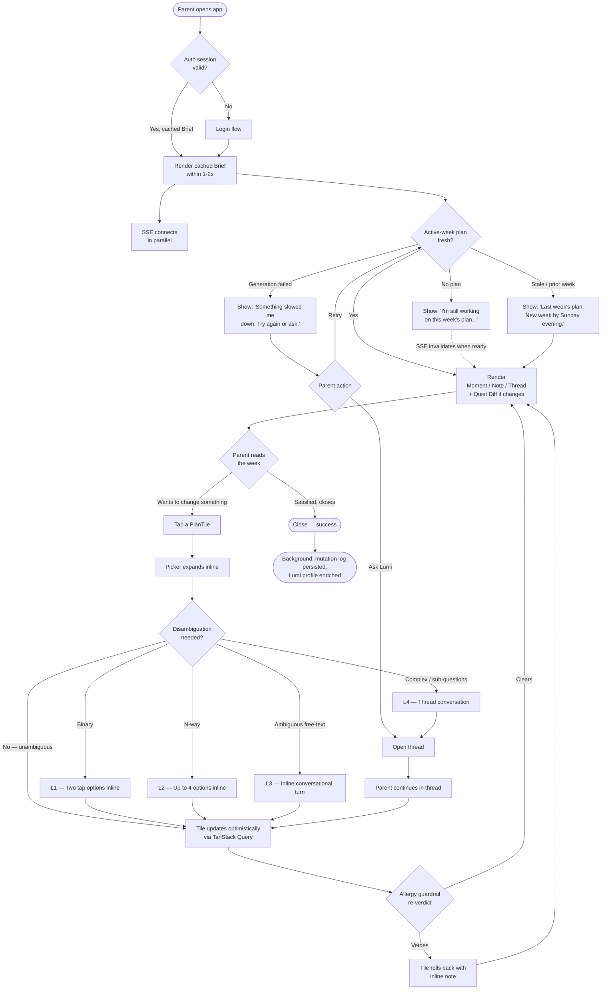
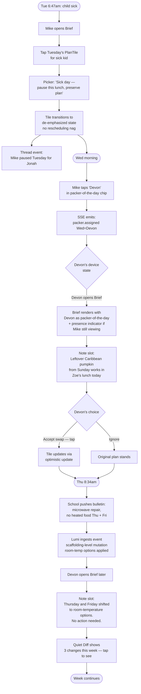
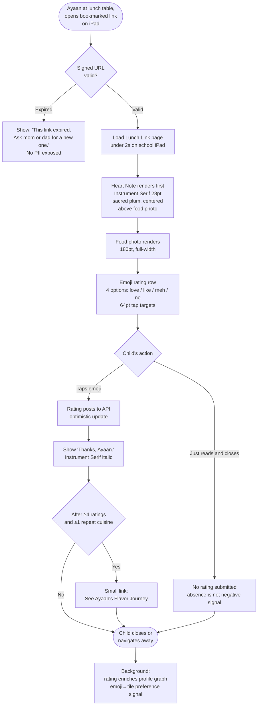
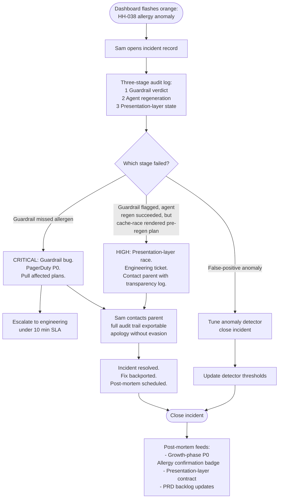
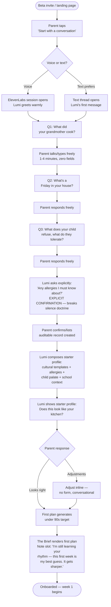

# UX Design Specification — HiveKitchen

**Author:** Menon
**Date:** 2026-04-21
**Status:** Complete (workflow finalized 2026-04-22)

**Strategic framing.** UI/UX is a primary differentiator and USP vs. horizontal AI competitors (ChatGPT with Memory+Projects, Claude Projects) and vertical category tools (Mealime, Samsung Food, Paprika). The UX is not a wrapper over an LLM — it is the product surface that *earns* the "knows your family" promise week by week.

> **Reframe (post–party-mode pressure test):** the UI is the *tell*, not the *moat*. The moat is the longitudinal, confidence-weighted family profile + Lumi's successful-plan track record. The UI's job is to *display* that moat so legibly that competitors cannot close the credibility gap without the substrate they don't have. We do not sell execution quality as defensibility.

## Executive Summary

### Project Vision

HiveKitchen is a **standing relationship** with Lumi — an AI companion who learns the family week by week and has next week's plan ready before the week begins. The product is **system-led**: reasoning happens in Lumi; the frontend's job is to present a finished answer, not provide controls to build one.

The UX is not a chatbot and not a dashboard. It is a deliberately thin, presentation-first surface whose success is measured by the *absence* of user work — time-to-first-approval, not time-on-task.

**Non-goals for the UX layer:**

- Treating UI/UX as a structural moat (it is not; the profile is)
- Building a features inventory the user navigates
- Filling silence with notifications, streaks, or prompts (Principle 1, Corollary 3b)
- Relying on the Heart Note as the retention engine (it is a delight moment, measured honestly)

### Target Users

**Primary — authenticated parent (28–55, time-poor, managing ≥1 non-trivial constraint).**
Sub-segments:

- **Priya archetype** — Premium, voice-comfortable, culturally-identified, emotionally-invested. Buys the Sunday-9:47pm moment.
- **Mike/Devon archetype** — Standard, text-only, blended-heritage, chaos-absorbing. Buys partner-handoff and sick-day pause.

**Second parent / caregiver** — shared thread, packer-of-the-day, partner handoff without re-planning tax.

**Grandparent (gift + guest Heart Note author)** — low tech tolerance, high emotional stakes, potential Hindi-first surface. Rate-limited to preserve sacredness, never for commercial expansion.

**Culturally-identified households** — Halal, Kosher, Hindu-vegetarian, South Asian, East African, Caribbean, and **blended multi-cultural** (first-class from day 1 — blended families are more sensitive, not less). Cultural fidelity is a wedge and a retention engine; the *revealed-surprise* moments are the delight expression of a deeper profile-driven capability.

**Child (signal source, Boundary 1)** — 4–17 years, no account, no settings, no-install web link, 4-emoji tap, view-only flavor passport. COPPA/AADC locked. **Age-band tension flagged for Step 3** — whether one visual grammar survives a 4-year-old pre-reader and a 15-year-old teen is unresolved; the visual grammar must be image-first, word-optional, and restrained-to-almost-empty to have any chance, and COPPA under-13 is a hard wall regardless.

**Internal ops (Sam archetype)** — allergy anomaly dashboard, three-stage plan audit log, incident-response workflow. A first-class UX surface, not a back-office afterthought — Journey 5 proved presentation-layer bugs can invalidate guardrail correctness.

### Key Design Challenges

Thirteen challenges, prioritized by load-bearing risk to the beta validation signal (≥40% week-4 retention; <50% week-1 plan rejection). Challenges 1, 2, 10, and 11 are expected to drive most MVP design cost.

1. **System-led UI without a UI skeleton to lean on.** The visual grammar must be committed to at the atomic level, not the posture level. The Brief (home) composes from three object types: **the Moment** (what's now — today's lunches, tonight's dinner), **the Note** (what Lumi noticed — one line, scroll-dismissable, no X), **the Thread** (the open conversation if any). Any drift into "cards-with-metrics" is the product failing into a dashboard while calling itself a brief.

2. **Silent plan mutation without trust loss.** "Plans mutate silently" is beautiful and terrifying. A Tuesday lunch that changed overnight and the parent didn't notice is a trust-destroying moment. Required: a **quiet diff pattern** — what changed, when, why, undoable — present but never demanding. No modal, no toast, but also not invisible.

3. **Unified voice ↔ text thread with zero re-orientation mid-task.** The conversation thread is the spine. Tap actions are *emissions into the thread*, not a parallel state. One state, taps are a dialect of it. This is an architectural stance as much as a UX one (see Winston's `brief_state` projection concept) — without it, two reconcilers ship and diverge.

4. **"Lumi leads" without nudging — the silence problem.** No proactive prompts, no streaks, no Heart-Note-absence pressure. But absence of notification creates a new UX void: how does a parent know Lumi is working when Lumi is quiet? The Brief must *show presence without demanding attention*.

5. **Dual-audience surface split** — authenticated parent product vs. no-install child Lunch Link (signed, short-TTL, capability-not-identity URL). These are functionally different products sharing a thread model; they cannot share a layout system without leaking capability.

6. **Cultural + family-pattern recognition as layered, composable, first-class.** Reframed from "cultural recognition" alone — every family has patterns (leftover-rotation, Friday exhale, repeat-hit, current-obsession-food, cultural-calendar observance) and Lumi must reveal that it has noticed them *in sentences, not ornament*. Cultural observance (Diwali, Shabbat, Ramadan) is the high-emotion wedge; weekly pattern-recognition is the every-household engine.

7. **Safety UX that reassures without alarming.** Allergy is the single surface where "silence is trust" breaks (Doctrine). The affirmative *"cleared by allergy check for Maya against peanuts"* badge must feel like reassurance, not warning — destructive-red will be wrong for everyday. **The Journey 5 lesson is binding: presentation layer is contractually bound to the guardrail's verdict — no pre-guardrail plan is ever renderable.** This is the highest-consequence UX surface in the MVP.

8. **Visible Memory as authored prose, not a panel.** Must read like Lumi writing about the family ("Maya stopped eating cucumber in February. I've kept it out of lunches since.") rather than a searchable list of preference records. Two forget semantics: **soft forget** (inactive, retained in provenance ledger, reversible) and **hard forget** (tombstone + purge, irreversible) — both required. **Scope honesty:** this is a *crisis-and-trust surface*, not an everyday-open surface; usage in weeks 2–4 absent an error is expected to be low. Designed for the crisis moment (Journey 5), not the Tuesday moment.

9. **Onboarding in <10 minutes, voice-first, with no 20-field form.** Conversation *is* the configuration. Three-signal-question paragraph-dump pattern. First plan must ship within 90 seconds of profile completion, feel "competent and honest about its blanks," and not over-claim.

10. **Allergy-safety confirmation architecture (promoted to P0-adjacent for MVP).** Journey 5 surfaced that a 94-second cache-invalidation race showed a pre-guardrail plan. The MVP's visible-confirmation pattern for allergy-relevant plans is the load-bearing wall on which beta credibility sits. This is the MVP's most likely blocker.

11. **Child surface age-band tension.** A 4-year-old pre-reader and a 15-year-old share one Lunch Link layout only if the grammar is image-first, word-optional, and emotionally neutral — restrained to the point of looking almost empty. The 15-year-old's dealbreaker is *cringe*; the 4-year-old's is *unreadable copy*. Mascots, confetti, "yay!" microcopy fail both. **Open question for Step 3:** does the Lunch Link resolve into one restrained grammar, or do we commit to age bands now? Not deferred; decided in Step 3.

12. **Tap→conversation handoff without modal interrupt.** A tap on "swap Tuesday" may need Lumi to disambiguate ("the whole day or just Maya's?"). The design pattern for *"taps initiate, conversation resolves ambiguity, taps confirm"* — without a modal, without losing the transactional flow — is the seam where the voice/text/tap model either holds or collapses. (Internal design discipline; not a user-facing value prop.)

13. **"Beats PB&J on a Tuesday" — minimum value-per-week bar.** The true daily substitute is a 3-minute pantry-scavenged peanut-butter-and-jelly. Every design decision has to pass this test. If the ready-answer home requires three taps to reach dinner-tonight, we've lost to a jar of Skippy.

### Design Opportunities

Eight opportunities the UX can execute against. Numbered separately from challenges. These are not moats — they are durable-execution surfaces that compound with the profile.

1. **The "ready answer" home as category frame.** Plan is visible on open; no inbox, no chat prompt, no launcher. Reframes the category away from chatbot and away from dashboard. (Defensible for ~9–12 months against horizontal LLMs; the substrate is the lock, not the surface.)

2. **Sacred-channel design primitives.** Heart Note has its own typography, color, rhythm, and spatial authority — *visibly different* from Lumi's voice and system messaging. Protects the channel at the design-system level, not just in copy. **Treat as delight moment, not retention engine** — measure honestly; the primary retention engines are plan quality, cultural recognition, and pantry loop.

3. **Family-pattern recognition as weekly revealed surprise.** The weekly engine behind the seasonal/cultural wedge. Leftover-rotation ("Monday's roast becomes Wednesday's wrap"), repeat-hit recall ("you loved the chicken-rice bowl three weeks ago"), current-obsession detection, Friday-exhale accommodation. Expressed in sentences in the Note slot — **never in ornament, never in iconography**. Cultural observance is the high-emotion expression of the same capability.

4. **Ambient presence ("corner of the counter").** Lumi available as a persistent low-presence surface — not a floating FAB, not a modal. Addresses the silence problem (Challenge 4) without inverting into notification density.

5. **Transaction-vs-conversation as internal design discipline (not user-facing value prop).** Tap-to-do surfaces and conversational surfaces maintain distinct visual languages so users learn the difference implicitly. Reframed from a user-value claim to an internal coherence discipline — the user never reads this in marketing copy.

6. **Flavor passport as quiet identity, not gamification.** A growing artifact of becoming — earned through eating, never through tapping. Children see it; parents treasure it. No points, streaks, leaderboards. Competitors cannot copy the principle without inverting their monetization.

7. **"I'm at the store" mode.** Store-layout-aware sort, large text, tap-to-check, multi-store splits routing atta to Haji's and milk to Kroger. A physical-world surface with zero cognitive load — near-category-redefining for the grocery step.

8. **Visible Memory as authored family document.** Warm, human-feeling prose — what Lumi knows, written in Lumi's voice, organized by facet (tastes, rhythms, cultural rhythms, allergies). Structurally misaligned with ChatGPT's chatbot thesis (they won't copy it quickly — it fights their brand). Defensible on positioning grounds for 18–24 months *if* the surface reflects non-trivial inferences, not just stored preferences.

### Pressure-Test Outcomes (Party Mode — 2026-04-20)

Four independent perspectives (Sally UX, Winston Architect, Mary Analyst, John PM) converged on the following refinements, now integrated above:

- **Sharpen "ready answer home"** into concrete atomic units (Moment / Note / Thread) and a server-materialized `brief_state` projection — posture ≠ grammar.
- **Reframe transaction-vs-conversation grammar** from user-facing USP to internal design discipline; make the conversation thread the spine so taps are emissions, not a parallel state.
- **Reframe "cultural recognition"** as **family-pattern recognition** with cultural observance as the high-emotion sub-case — makes the capability every-household, not just Priya-household.
- **Reframe Visible Memory** from "everyday UX" to crisis-and-trust surface; build as authored prose, not a searchable panel; commit to soft-forget vs. hard-forget semantics day 1.
- **Down-weight Heart Note** as a retention engine; keep as a delight moment and measure honestly.
- **Elevate** the silence problem, the silent-mutation quiet-diff pattern, the allergy-confirmation architecture (Journey 5), the voice-to-text visual continuity seam, and the "beats PB&J on Tuesday" minimum-value bar — now integrated into the challenges list.
- **Do not sell execution quality as a moat.** The UI is the tell; the profile is the lock.

**Open tensions resolved in Step 3:**

- Child surface — single visual grammar vs. explicit age bands (Sally vs. John). Must be decided in the Core Experience step, not deferred.
- Voice-turn rendering inside the written thread (transcript / summary / waveform-as-artifact) — addressed in Component Strategy / Voice Pattern steps.

## Core User Experience

### Defining Experience

The product has **one primary interaction** that defines whether the thesis works, and every other surface serves it:

**The Sunday-evening open.** Parent opens HiveKitchen on a laptop or phone around 8–10pm Sunday. The Brief shows next week's plan, already composed. Zero prompts, zero "start here," no empty state. The parent scrolls, sees Monday through Friday resolved, makes zero to two adjustments via tap or one sentence to Lumi, and closes. Duration: 90 seconds or less for a returning user. This is the moment that either replaces the weekly puzzle or doesn't.

Every secondary interaction — Evening Check-in, swap-Tuesday, grocery run, Heart Note authoring, profile enrichment — is supporting infrastructure for the Sunday open landing cleanly.

**The design corollary:** if the Sunday open requires typing, choosing, or navigating to get to the plan, the product has failed its central promise regardless of everything else working. Time-to-first-approval for a returning user is the single most important UX metric.

### Platform Strategy

**Locked to web-only for this release** (per PRD §6). React/Vite SPA on the parent side; no-install web page on the child side. No native mobile, no PWA-push.

- **Primary device: mobile web.** Most Sunday-evening opens, Evening Check-ins, partner-handoff taps, and in-store grocery sessions happen on a phone.
- **Secondary device: desktop web.** Profile-editing moments, Visible Memory authoring review, longer planning conversations.
- **Child device: whatever the parent opens or forwards.** iPad, phone, Chromebook. The Lunch Link page must render at small sizes, offline-tolerant after first load, and degrade gracefully on old devices.
- **Interaction model: touch-first, keyboard-accessible.** Every surface must work by thumb. No hover-only affordances. Right-click menus are never load-bearing.
- **Connectivity-loss posture:** Brief and today's lunch remain visible from cache when offline; Lunch Link remains readable once loaded; Evening Check-in voice sessions surface graceful degradation to text on drop.
- **Accessibility: WCAG 2.2 AA non-negotiable** (per PRD §8). Keyboard navigation, visible focus, semantic HTML, ARIA where visual context is insufficient. Screen reader support across all parent surfaces. Child Lunch Link accessible for screen-readers where a child uses assistive tech.
- **Dark mode from day 1** where practical, but not blocking.
- **Browser support:** latest 2 versions of Safari, Chrome, Firefox, Edge; iOS Safari 16+; Android Chrome 2-versions-back.

### Effortless Interactions

Seven interactions that **must** feel effortless — where any friction is a design failure.

1. **Opening the app.** The Brief renders the answer. No prompt, no launcher, no "get started." Seen in under 3 seconds.
2. **Voice-interview onboarding.** User talks; zero form fields. <10 minutes to first plan.
3. **Pantry-Plan-List loop.** Parent never opens a pantry surface. The tap-to-purchase action at the store IS the pantry update.
4. **Silent plan mutation with quiet diff.** Changes happen without demanding attention. The quiet-diff pattern surfaces what changed, undoably, without interrupting.
5. **Partner handoff.** The packer-of-the-day is visible on open. No re-plan tax. No "I was waiting for you to do it."
6. **Child Lunch Link tap.** One emoji tap. No login, no profile, no settings. Page renders in under 2 seconds on a school-issued iPad.
7. **Tap-to-voice handoff mid-transaction.** A tap on "swap Tuesday" that needs disambiguation flows into a single conversational turn without a modal; the tap context is preserved in the thread.

### Critical Success Moments

**Make-or-break moments.** These are the interactions whose failure invalidates the thesis:

- **M1 — First-plan-opened (week 1).** Parent opens the first Lumi-generated plan. Target: ≥75% rate it "fits our family" (4-or-5 on 5-point). Failure here makes no retention number meaningful.
- **M2 — Revealed recognition (weeks 2–3).** Lumi reflects something the parent never configured — a cultural observance, a leftover rotation, a repeat-hit recall, a current-obsession detection. Must land as *seen*, never *smug*. Expressed in a single sentence in the Note slot.
- **M3 — The Sunday no-thought return (weeks 4+).** Parent opens, sees next week, closes. Under 90 seconds. Zero adjustments on a good week.
- **M4 — Partner handoff without call-to-coordinate.** Second parent opens on their phone; they're named as packer; the plan is there. No text, no call, no re-plan.
- **M5 — The child emoji tap.** Child opens Lunch Link, sees the Heart Note, taps one emoji. Total interaction: under 10 seconds. No onboarding, no instruction.
- **M6 — Allergy confirmation badge.** Parent opens a plan for a household with a declared allergy and sees affirmative "cleared by allergy check for Maya against peanuts." Reassurance, not alarm.

**Failure moments (design must engineer against):**

- Confident-wrong first plan (week-1 rejection rate >50%) — the category-redefining home becomes a category-invalidating one.
- A silent mutation noticed only when the child opens a lunch they hate.
- Allergy confirmation ambiguous or missing on an allergy-relevant plan.
- Lunch Link undelivered or un-openable by 7:30am local.
- Onboarding stalling past 10 minutes.

### Experience Principles

Seven principles that govern every downstream UX decision. These inherit from the PRD's product principles and extend them into UX-specific constraints.

1. **Presentational silence is a primitive.** Empty space, unexplained completeness, no toast notifications, no confirmation modals, no nudges, no streaks. The absence of UI noise is itself the product. *(Inherits Principle 1 + Corollary 3b.)*
2. **Visibility is the only requirement; confirmation is not.** Plans never require explicit approval. They are present and mutable. Silence is trust. *(Inherits Principle 2. Explicit carve-out: allergy surfaces break this — see Principle 7.)*
3. **One state, many modalities.** The conversation thread is the spine. Voice turns, text turns, and tap actions are all emissions into one state. There is no separate "transaction state." Switching modalities never resets context. *(Architectural commitment, not just UX.)*
4. **Recognition in language, never in ornament.** When Lumi notices — a cultural observance, a leftover, a repeat hit — it speaks in one sentence in the Note slot. No banners, no stickers, no color shifts, no celebratory micro-interactions. The surprise is in being *seen*, not *decorated*.
5. **"Beats PB&J on a Tuesday" — the minimum-value-per-week bar.** Every design decision has to beat the 3-minute pantry-scavenged lunch. If it requires three taps to reach dinner-tonight, it's failed.
6. **The UI is the tell, not the moat.** The surface displays the profile; the profile is the defensibility. Design choices never over-sell the surface as the reason to subscribe; they let the substrate be the reason and the surface be the honest expression.
7. **Safety surfaces are loud by design.** Allergy-relevant confirmations are the one place the silence doctrine inverts. Affirmative "cleared-by" patterns must feel like reassurance at a glance, never warning. Destructive-red is the wrong palette here; the pattern belongs to sage or an earned variant, not alarm.

## Desired Emotional Response

### Primary Emotional Goals

**For the parent — relief, seen, in control.**

- **Relief** is the dominant feeling. The weekly puzzle is off the mental plate. Sunday-evening nausea about the week gives way to, *"oh — it's already done."* Not delight, not surprise — relief. This is the emotional state that converts beta users to paid.
- **Seen.** Over weeks 2–8, the parent begins to feel that Lumi *knows* them — not in a surveillance sense, in a *"my grandmother knew me"* sense. Cultural identity is reflected back; the child's current obsession is remembered; the partner's rhythm is accommodated. Being seen is what makes the product feel non-substitutable.
- **In control.** Never out-voiced by the AI. Every plan is a proposal; every memory is editable; every adjustment is a sentence away. The parent is the author of the family's food life — Lumi is the scribe and the help.

**For the child — feeling cared for, feeling known.**

- **Cared for.** The Heart Note on the Lunch Link page says *this was made for me by someone who loves me.* The lunch itself says the same. No mediation between parent's love and child's experience.
- **Known.** Over weeks, the child's flavor passport accretes. They don't see it as a score; they see it as *becoming* — a small map of their own tastes filling in. Identity-forming, not achievement-counting.

**For the grandparent (gift + guest author) — included.**

- **Included.** The generational distance shortens. Nani's note lands unmodified in her grandson's lunchbox. She is *in* the day, even if she is four hours away.

**For the ops team (Sam) — equipped.**

- **Equipped.** When something goes wrong at the allergy-safety layer, Sam sees the full three-stage audit instantly, acts within minutes, and emerges from the incident with trust preserved. The dashboard earns his calm.

### Emotional Journey Mapping

The parent's emotional arc across their lifecycle with the product.

**Pre-install — skeptical, tired.**
"I've tried Mealime. I've tried prompting ChatGPT. Neither stuck." Skepticism tempered by exhaustion. The landing page's job is to move the parent from skepticism to curious willingness-to-try — not from skepticism to excited.

**Onboarding (first 10 minutes) — lowered guard, permission to be real.**
The voice-interview earns warmth not through chirpiness but through the quality of its questions. *"What did your grandmother cook?"* lowers the guard in a way a preference form cannot. The parent feels they are in a conversation, not a configurator. By the end of onboarding they feel: *someone is listening.*

**First-plan view (week 1) — relief, tested.**
Relief at the plan being there. Tested because week 1 is honest-about-blanks; Lumi says *"Give me a week — I'll learn the rhythm."* The goal is not awe; it is *credibility-under-constraint*. The parent thinks: *this is competent, and it is not pretending to know me yet.*

**Weeks 2–3 — the recognition moment.**
Lumi reflects something the parent never configured: a cultural observance, a leftover rotation, a child's current obsession. One sentence in the Note slot. The parent's eyes well up (Journey 1 Priya). This is the high-amplitude emotional moment of the product. It cannot be marketed; it can only be engineered.

**Weeks 4–12 — quieting, compounding trust.**
The Sunday open becomes a 90-second interaction. The parent stops thinking about lunch between Sundays. The emotional state is *quiet confidence* — the product has receded into infrastructure. This is the state that correlates with long-term retention.

**When something goes wrong — seen-through, not abandoned.**
A wrong plan, a missed Lunch Link, an allergy-adjacent anomaly. The emotional requirement: the parent feels the system saw what went wrong, named it honestly, and is correcting. No performative apology; no evasive copy. Errors must feel accountable, not apologetic.

**Return visits (Sunday after Sunday) — relaxed recognition.**
The app is familiar. The Brief is where it was. Lumi's voice is the same. Returning to the product feels like opening a drawer that has its things in their place.

### Micro-Emotions

The seven micro-emotions the UX must actively engineer — and the four it must actively prevent.

**Engineer for:**

1. **Trust over skepticism** — built by: honest-about-learning copy, Visible Memory authored prose, affirmative allergy "cleared-by" badges, source-traceable provenance when asked.
2. **Calm over anxiety** — built by: no notification density, no streaks, no nudges, empty space, soft typography, warm palette, quiet diffs in place of alerts.
3. **Seen over performed-at** — built by: recognition in language not ornament, Lumi speaking in sentences not microcopy celebrations, cultural observance offered not assumed.
4. **Competent-partner over controlling-authority** — built by: "proposal not approval" language, editability everywhere, no accept-buttons, visible undo.
5. **Included-across-generations over excluding-grandparent** — built by: rate-limited guest authorship, unmodified Heart Note delivery, accessible gift-purchase flow at a grandparent's reading level.
6. **Warm over clinical** — built by: Lumi's voice character (per AI Principles — warm, never chirpy; calm evening energy), sage and honey palette, soft rounded iconography, never destructive-red except where safety demands it.
7. **Becoming over scoring (child only)** — built by: passive accretion, no points/streaks/leaderboards, flavor passport as identity not metric.

**Prevent:**

1. **Surveillance creep.** Lumi knowing things must never feel like being watched. Prevented by: Visible Memory as the parent's document (not Lumi's), explicit editability, source ledger on request, no "insights" surface that performs its own knowingness.
2. **Guilt engineering.** Heart Note absence must never be surfaced. Streak-like pressure is forbidden. Prevented by: explicit no-nudge doctrine (PRD Corollary 3b).
3. **Performed cuteness / infantilizing tone.** Lumi is warm, never chirpy. Mascots, confetti, "yay!" microcopy, exclamation marks stacking are prohibited. Prevented by: voice-character rules + adult-child-shared typography restraint.
4. **Cultural performance / smugness.** *"Happy Diwali! Try these festive recipes!"* is the anti-pattern. Prevented by: recognition-in-language-not-ornament principle; cultural iconography is forbidden in recognition moments.

### Design Implications

Each emotional goal maps to concrete UX commitments. These are not decorative; they will be enforced in component design in later steps.

- **Relief → The Brief is the home.** No launcher, no inbox, no empty state. Plan visible on open, in under 3 seconds. Every additional tap before the answer is relief deferred.
- **Seen → Recognition in language, never in ornament.** The Note slot is the only place "Lumi noticed this" appears. One sentence. Scroll-dismissable. No icon, no color shift, no banner.
- **In control → Editability is ambient, not modal.** Every plan tile, every memory sentence, every preference edit is a tap-to-author moment. No settings pages for content; only for account-level concerns.
- **Cared-for (child) → Heart Note visual authority.** Distinct typography, scale, spatial placement on Lunch Link. Larger than the food photo's caption; first in reading order; unmodified by Lumi; never shares a container with system messaging.
- **Known (child) → Flavor passport as quiet artifact.** View-only, passively populated, no numbers, no achievements. Grid of foods the child has eaten, grouped by cuisine, with cultural lineage where applicable.
- **Included (grandparent) → Guest-author low-friction surface.** Sign-in flow designed for someone who does not use apps daily. Large type. One clear action per screen. Hindi/Spanish/other localization where launched.
- **Equipped (ops) → Audit log as a first-class surface.** Three-stage plan-generation timeline (guardrail verdict, agent response, presentation-cache state) with timestamps per action. Keyboard-driven navigation. Export on demand.
- **Calm over anxiety → No toasts, ever.** System feedback appears inline at the point of action, then fades. No global notification tray. No badge counts. No unread markers.
- **Trust over skepticism → Honest-about-blanks copy.** Week 1 language acknowledges Lumi is still learning. Source ledger ("you told me this in Tuesday's check-in") available on any memory node. No over-claiming in onboarding.
- **Prevent surveillance creep → No "insights" performance surface.** Lumi does not show off what she knows. Knowledge is expressed only when acting on it (the plan, the recognition sentence, the memory page the parent opens).

### Emotional Design Principles

Five principles that sit above the Experience Principles from Step 3 and govern the *emotional* quality of every surface.

1. **Relief is the dominant feeling. Delight is the rare accent.** We engineer for the Sunday-evening exhale, not for novelty. Delight belongs only in the recognition moments (M2) and in the Heart Note channel — never in system surfaces.
2. **Lumi is a conduit, not a personality.** She carries the parent's voice to the child, the family's intelligence to the plan, the safety layer's verdict to the screen. She does not perform her own warmth; warmth is an emergent property of competent quiet.
3. **Being seen is a product capability, not a UI flourish.** Recognition is earned through substrate (the profile), expressed in language (one sentence), and never decorated. The day we add a rangoli SVG to the Diwali plan is the day we have failed the principle.
4. **Errors are accountable, not apologetic.** When something breaks, the system names what happened, what it is doing about it, and what the user can do. Zero performative *"oops!"* copy. Zero evasive *"something went wrong"* boilerplate. The parent must feel the system is on their side of the failure, not managing them through it.
5. **Emotion must survive A/B testing.** The Heart Note, the flavor passport, and the recognition moments are load-bearing emotionally but measured honestly. If cohort data at week 6 shows an engineered emotional moment flattening, we redesign or retire it — we do not let emotional ambition outlive its evidence.

## UX Pattern Analysis & Inspiration

### Inspiring Products Analysis

A curated set of references, grouped by the UX lesson each contributes. The set was pressure-tested in party mode (2026-04-21) against three biases: over-weighting quiet/minimalist references at the expense of warmth, skewing North-American individualist product archetypes against a multi-generational culturally-plural user base, and transferring architecturally incompatible state models from reference to implementation. Refinements from that review are integrated here.

**Craft and restraint — how the product holds its posture:**

- **Linear (project management).** Presentational silence, inline editing, quiet activity log, keyboard-first parity with touch. The baseline aesthetic discipline. **Craft reference, not user-empathy reference** — Linear's audience tolerates systems; our parent does not. Borrow restraint, not product.
- **Things 3 (personal tasks).** Refusal-to-gamify posture. No streaks, no counts, no celebration microcopy. Emptiness as a feature. **Craft reference only** — Things' audience is individual GTD devotees; our household is a collective planning unit.
- **Notion Calendar (fka Cron).** Ambient week view, graceful change handling, opinions without shouting. Informs the Brief's ambient-calendar surface. **Craft reference only** — same caveat as Linear and Things.
- **iA Writer (writing tool).** Typography-first, prose as authored-not-listed. Anchors Visible Memory as written prose instead of a panel. Safe to adopt — it's a rendering stance with no state implications.

**Thread and multi-client coherence — how one state carries voice, text, and tap:**

- **iMessage / Signal (messaging).** Thread-as-spine grammar: mixed-modality turns in one timeline, reactions as signal not celebration, opt-in read receipts. **Grammar adopted; sync model rejected.** iMessage is CRDT-ish client-local with lazy sync; HiveKitchen is server-authoritative with multi-client fan-out and an ElevenLabs WebSocket emitting transcript events the user did not type. Specific mismatches: voice STT lands late (requires server-assigned monotonic sequence IDs, not client timestamps); voice turns have no local draft to echo (iMessage's "sent → delivered" affordance is absent); two parents concurrently on one thread has no iMessage analog. Build on server-authored append-only log with SSE fan-out and per-client resume tokens.
- **Figma (collaborative design tool).** Presence signal ("someone else is editing this") and concurrent-intent affordances. Direct pattern for "your partner is mid-turn" in the shared family thread. Adopted for multi-parent coherence.
- **Linear's sync engine (not just the activity log).** Append-only mutation log with projection read-models. The architectural pattern HiveKitchen's Brief and plan surfaces are converging on. Adopted.
- **Superhuman (email).** Optimistic UI with server reconciliation on a thread surface. Closer structural analog to HiveKitchen's parent-side thread than iMessage. Added as a secondary reference.
- **WhatsApp — family-group cadence and voice-note culture.** Non-negotiable reference. The actual operating system of South Asian, East African, Caribbean, and Arab diaspora family life. Voice notes in mixed languages, forwarded recipes from elders, group threads where grandmothers and teenagers coexist. Study the tonal register, voice-note ergonomics (hold-a-button, no typing), and multi-generational thread coexistence. A grandparent who cannot type can hold a button.

**Narrative recognition without surveillance — how "seen, not watched" reads on screen:**

- **Oura (wellness ring).** Narrative-explanation pattern — prose like *"you slept lightly last night, likely because…"* — over metric display. Informs the Note slot and Visible Memory voice. **Pattern adopted with a binding constraint:** Oura pre-computes narratives on nightly batch windows with cached phrasings and heavy templating. HiveKitchen's narrative prose must be authored upstream at plan-compose time (in the agent orchestrator) and cached on the plan record. The view never calls an LLM on scroll. Standard-tier economics survive upstream-and-cached generation; they do not survive LLM-on-scroll.
- **NYT Cooking — headnote register (Genevieve Ko, Eric Kim, Yewande Komolafe).** The prose register for cultural recognition and Heart Note-adjacent moments. Warm without Hallmark; specific without exoticism; a grandmother's kimchi treated with care, not decoration. **The second warmth anchor** the set was missing; Headspace (previously carrying all the warmth) is now narrowed to voice-character only.
- **Kindle (reading device) and Nest thermostat (pre-learning era).** Devices that disappear into the moment of use. The actual "seen, not measured" reference — because our parent is fleeing attention debt, not seeking it. Added as the mass-warm, low-chrome anchor the set was missing.

**Accretion as identity — the child's flavor passport and the parent's year-in-review moments:**

- **Spotify Wrapped / Pocket Casts listening stats.** Rear-view-mirror accretion. No goal-state, no empty slots screaming to be filled, no completion mechanic. The correct aesthetic anchor for the flavor passport. **Replaced Apple Fitness rings entirely** — rings are a scoreboard with a halo that mourns when you don't close them; the moment we borrow the visual grammar of "progress toward completion," a parent reads the passport as *"my kid is 6/12 cuisines, we're behind"* — exactly the guilt Principle 5 exists to prevent.
- **Letterboxd (film-tracking).** Taste-as-identity log. **Parent-side flavor passport only.** Explicitly pulled from the child surface — transferring adult-cinephile aesthete psychology onto a 7-year-old risks making the Lunch Link feel like homework and inviting parents to read the child's log as a verdict on their cooking.
- **Apple Fitness rings.** **Rejected outright.** Previously considered; the ring metaphor is both a guilt trojan horse (Sally) and an architecturally misleading state model (Winston — rings are a single-writer local-sensor accumulator, while the flavor passport has three distributed writers: child via Lunch Link, parent via plan, parent via rating).

**Child-facing surfaces — the Lunch Link's closest structural neighbors:**

- **Messenger Kids (Meta).** Thread-with-a-trusted-adult pattern — the closest structural analog to the Lunch Link's parent↔child channel through Lumi. Studied for thread scoping, delivery-channel abstraction, and the social-surface absence HiveKitchen requires. **Added to the set** — it was missing in the original draft.
- **Toca Boca (kids' apps).** Child agency without gamification scaffolding. Kids drive; the app does not reward. Informs the emoji-tap's non-rewarding feedback.
- **Khan Academy Kids.** Read-aloud-first, low-literacy-safe. Informs Lunch Link accessibility for pre-readers without adaptive child modes (Boundary 1).
- **Pinna (kids' audio) and Duolingo Stories (cultural-scene-rendering specifically).** How to render a Diwali scene, a Shabbat Friday, or a Caribbean Pepperpot dinner with care, no exoticism, no mascoted cultural ornament. Narrow positive references within otherwise-rejected brands.

**Warmth, tone, and mass accessibility — how Lumi speaks and how the product reaches parents who don't read design blogs:**

- **Headspace (meditation).** Voice character anchor only — warm, adult-serious, calm-without-performing-calm. **Narrowed from the original role**; it was previously doing all the warmth work alone and carried a coastal-wellness aesthetic that reads as subcultural to much of HiveKitchen's cultural wedge. Now one of several warmth references.
- **Diaspora YouTube cooking channels** (Madeeha's Kitchen, Food Fusion, Shireen Anwar, Hebbar's Kitchen, Caribbean Pot, Caribbean Green Living). Where HiveKitchen's wedge user *actually* gets meal inspiration today. Warm, human, unpolished, generational. Tonal register reference for Lumi's cultural-recognition prose.
- **Jitterbug / GrandPad and BBC Sounds.** Huge tap targets, no modal dead-ends, radio-simple mental model. Informs the grandparent guest-author flow and accessibility floor.
- **AARP / Facebook (yes, Facebook).** Ugly to designers, beloved by grandmothers. If three generations touch the product, we cannot optimize only for the one that reads Fast Company. Noted as a humility reference, not an aesthetic reference.

**Trust chips and safety badges — how reassurance-without-alarm looks:**

- **Airbnb — trust-chip / verified-profile pattern.** *"Superhost since 2019," "Identity verified,"* the quiet-badge grammar. **Pattern kept; cultural imagery rejected.** The direct reference for the allergy *"cleared by allergy check for Maya against peanuts"* badge. Previously rejected wholesale; revised to a pattern-keep / aesthetic-reject after review.

**Anti-patterns — explicit references for what HiveKitchen refuses to be:**

- **Duolingo — gamification playbook.** Streak-shame, broken-streak animations, push notifications simulating relationship, performed cuteness. Directly rejected by Principle 5 and Corollary 3b.
- **ChatGPT / Claude / Character.ai — chat-as-primary-surface and performed-personality AI.** The category frame HiveKitchen is displacing. Opening into a text input is the wrong home; the Brief is.
- **Mealime / Samsung Food / Paprika — dashboard-of-meal-cards.** The category incumbent frame HiveKitchen is displacing.
- **Generic meal apps during heritage months.** Rangoli SVGs during Diwali, shamrock overlays on St. Patrick's Day. Cultural performance in ornament is the failure mode Principle 4 of the Emotional Design Principles explicitly prevents.

### Transferable UX Patterns

Patterns extracted from the set, mapped to specific HiveKitchen surfaces.

**Home-as-answer (Linear, Things, Notion Calendar, Kindle):**

- Open → today's state is visible in the top third of the viewport. No empty states, no "get started" scaffolding after onboarding. The device/surface disappears into the moment of use.
- **Adoption:** The Brief opens directly into Moment / Note / Thread. No inbox. No launcher.

**Thread-as-spine with mixed modalities (iMessage grammar + server-authoritative state):**

- One chronological stream; voice, text, and system actions share one timeline. Server-assigned monotonic sequence IDs for ordering. Append-only mutation log with SSE fan-out. Turn-in-flight signal for multi-parent concurrency.
- **Adoption:** Evening Check-in thread carries voice turns, text turns, and tap-initiated system events as peer-level entries. One SSE channel per session for the thread; every other surface pulls on invalidate-hint.

**Presence and concurrent-intent affordance (Figma):**

- Ambient visibility of another user editing the same state. Not intrusive; gives enough signal to avoid collision.
- **Adoption:** "Partner is writing a Heart Note," "Partner is in the Evening Check-in," "Partner just moved Thursday's lunch" — surfaced as a single line in the thread, never as a modal.

**Narrative explanation, upstream-generated and cached (Oura, with economics constraint):**

- Prose like "Monday's roast works in Wednesday's wrap if you want the swap." Authored at plan-compose time by the agent; cached on the plan record; rendered as a string.
- **Adoption:** Note slot on the Brief. Visible Memory prose. Cultural and family-pattern recognition. Never LLM-on-scroll.

**Warm prose register (NYT Cooking headnotes + diaspora YouTube cooking):**

- Specific over generic. Cultural lineage treated with care, not decoration. First-person where appropriate. Grandmother-authored, not marketing-authored.
- **Adoption:** All Lumi prose across the Note slot, Visible Memory, cultural-recognition moments, and onboarding voice interview.

**Rear-view-mirror accretion (Spotify Wrapped, Pocket Casts, Letterboxd for the parent):**

- State accumulates visibly but with no goal-state. No empty slots. No progress bar.
- **Adoption:** Child flavor passport (no cuisine count, no completion), parent's end-of-year flavor letter, cultural-calendar companion.

**Trust-chip quiet badges (Airbnb):**

- Small, low-saturation, factually-grounded reassurance chips. Non-alarming color palette. Tap-for-detail.
- **Adoption:** Allergy "cleared by allergy check for Maya against peanuts" badge. Provenance tags on Visible Memory sentences ("you told me this in Tuesday's check-in"). Cultural-template active chip.

**Inline editing, no settings drilldown (Linear, iA Writer):**

- Any content a user authored or the system surfaced is tap-to-edit in place.
- **Adoption:** Plan tiles, memory prose, Heart Notes, preferences — all inline. Settings pages only for account-level concerns (billing, auth, notifications).

**Thread-with-a-trusted-adult (Messenger Kids):**

- Scoped communication between a child and a pre-approved adult set. No open social surface.
- **Adoption:** Lunch Link as a scoped one-way channel with optional text-only child reply (MVP). No open child-to-child surface. Ever.

**Hold-to-talk voice-note ergonomics (WhatsApp):**

- A grandparent who cannot type can hold a button.
- **Adoption:** Heart Note voice capture (free on all tiers). Evening Check-in voice entry.

**Quiet activity log / diff (Linear, on demand):**

- Changes are present on demand, never in the user's face. One-line surface at the bottom of the plan.
- **Adoption:** Silent-mutation quiet-diff pattern — "3 changes this week, tap to see" in a de-emphasized line on the Brief.

**Keyboard-and-thumb parity (Linear):**

- Every action has a keyboard shortcut; touch targets >44pt.
- **Adoption:** Parent-side surfaces on desktop get keyboard affordances (cmd-K for Evening Check-in, arrow-keys in The Brief); mobile remains thumb-native.

### Anti-Patterns to Avoid

Patterns that would actively harm HiveKitchen's emotional or experiential goals.

1. **Streak-shame / gamification loops (Duolingo).** Daily streak counts, broken-streak animations, loss-aversion pressure. Violates Principle 5 and Corollary 3b.
2. **Chat-as-primary-surface (ChatGPT, Claude, Character.ai).** Opening into a text input is the wrong frame. The Brief is the home.
3. **Dashboard-of-metrics (Mealime, MyFitnessPal, most wellness apps).** Cards-with-numbers aesthetic performs busyness. HiveKitchen's home is composition — Moment / Note / Thread — not a metrics wall.
4. **Scoreboard-with-halo accretion (Apple Fitness rings).** Any visual grammar that implies progress toward completion on the child's flavor passport. Guilt trojan horse.
5. **Performative cultural decoration.** Rangoli SVGs during Diwali, shamrock overlays on St. Patrick's Day. Cultural recognition is in language only; ornament is forbidden.
6. **Toast-notification pollution (Slack, most consumer SaaS).** Ephemeral popups stacking in the corner. HiveKitchen uses inline, at-point-of-action feedback.
7. **Badge counts as engagement bait (email apps, social apps).** Unread markers as pressure. No unread Heart Notes, no unread memory entries, no unread plans.
8. **"Something went wrong" evasive error copy.** Generic apologies that hide what happened. Errors are accountable: what happened, what we're doing, what you can do.
9. **Over-hedged AI disclaimers ("I'm just an AI and can't…").** Lumi does not hedge into uselessness.
10. **Onboarding as a 12-screen tour.** Slideshow of features before the user has done anything. Onboarding is a conversation that produces a plan.
11. **Feature-discovery nudges ("did you know you can…?").** Coachmarks, spotlights, "new!" badges. Violates no-nudge doctrine.
12. **"Share to earn" social-graph hooks.** Referral streaks, share-to-unlock. Heart Note and flavor passport are sacred-channel content; never social currency.
13. **Dark patterns in billing / cancellation.** Cancellation is as easy as subscription. "Visible Memory supersedes moat" applies here too — trust is the precondition.
14. **Wellness-industrial aesthetic as the warmth default.** Pastel gradients, whisper-voice copy, and ambient nature imagery read as a subculture, not as neutral warmth. HiveKitchen's warmth must survive the Dearborn-10pm test, not just the Portland-yoga-studio test.
15. **LLM-on-scroll narrative generation.** Any pattern that calls an LLM at view time for a phrase the user is reading. Narrative prose is authored upstream, at plan-compose time, and cached.

### Design Inspiration Strategy

**Adopt wholesale — these are the baseline:**

- Linear's presentational silence and inline-editing grammar (as craft reference, not user-empathy reference).
- iMessage's thread-as-spine *grammar* — paired with server-authoritative append-only log state (Linear sync engine, Figma presence).
- Oura's narrative-explanation pattern — with the binding constraint that prose is authored upstream and cached, never generated on view.
- NYT Cooking and diaspora YouTube cooking as the prose-register anchor for all Lumi-authored copy.
- iA Writer's authored-prose typography for Visible Memory.
- Things 3's refusal-to-gamify posture as a governing constraint.
- Airbnb's trust-chip pattern for the allergy cleared-by badge and provenance tags.

**Adopt for specific surfaces:**

- Spotify Wrapped / Pocket Casts rear-view accretion → child flavor passport, parent year-in-review.
- Messenger Kids thread-with-trusted-adult → Lunch Link scoping and delivery-channel abstraction.
- WhatsApp voice-note culture → Heart Note voice capture and multi-generational accessibility.
- Figma presence affordances → multi-parent concurrent thread.
- Kindle / pre-learning Nest → disappearing-device aesthetic for The Brief.
- Letterboxd taste-as-identity → parent-side flavor passport only.
- Jitterbug / GrandPad / BBC Sounds → grandparent guest-author accessibility floor.
- Superhuman optimistic-UI-with-reconciliation → parent-side thread UI.

**Narrow positive references inside otherwise-rejected brands:**

- Headspace → voice character only (narrowed from previous role as general warmth anchor).
- Duolingo Stories → cultural-scene rendering only (not the broader Duolingo gamification apparatus).
- Apple Fitness → rejected outright; no salvageable pattern after review.

**Explicit anti-references (study to avoid):**

- Duolingo's streak apparatus, ChatGPT's chat-as-home, Mealime's dashboard-of-cards, generic meal apps' heritage-month decoration, wellness-industrial aesthetic as default warmth.

**Invent from scratch — no clean precedent exists:**

- **The Lunch Link child-facing surface.** No-install, single-page, multi-age (4–17, Boundary 1), emoji-ratable, Heart-Note-first web page tied to an authenticated parent thread. Messenger Kids is the closest structural analog but not a visual or interaction reference.
- **The cultural / family-pattern recognition moment in prose.** Oura's narrative-explanation is the closest pattern; no product has done cultural-identity-aware recognition at the sentence level without iconography. Prose register is NYT Cooking; delivery is Oura-like; ornament is forbidden.
- **The allergy "cleared-by" badge.** Airbnb's trust-chip is the pattern base; the specific semantics of *"passed an independent guardrail check for this household's declared allergies"* and the non-alarming palette are original.
- **The silent-mutation quiet-diff pattern.** Linear's activity log is the closest, but it is a separate surface; our pattern must live in-line with the plan and feel ambient rather than log-like.
- **Multi-generational, culturally-plural, collectivist-household UX grammar at mass-adoption scale.** No single reference delivers this. The set provides craft scaffolding; the architecture of a product that lands equally well in San Francisco and Dearborn is HiveKitchen's to invent.

**Strategic posture:** borrow aesthetic discipline and interaction grammar from the craft set; anchor warmth and cultural register in NYT Cooking + diaspora cooking + WhatsApp voice-note culture; borrow state and multi-client coherence patterns from Linear's sync engine + Figma + Superhuman; invent the novel child-facing, cultural-recognition, safety-badge, and quiet-diff surfaces from first principles against the Step 2–4 specification. The set is a compass, not a blueprint.

## Design System Foundation

### Design System Choice

**Locked stack (inherited from `docs/Design System.md` v1.0, PRD §6, and CLAUDE.md; amended 2026-04-21 to include TanStack Query):**

- **Component library:** Shadcn/UI (copy-in components, Radix primitives, full ownership)
- **Styling:** Tailwind CSS with utility classes; no CSS modules, no styled-components, no arbitrary values without rationale
- **Typography:** Inter (UI text, forms, buttons, labels) + Sora (headlines, brand, section headers)
- **Iconography:** Outline-only, rounded corners, consistent stroke width
- **Client UI state:** Zustand — ephemeral UI state only (voice overlay open/closed, active modality, draft form state, scroll positions, UI preferences)
- **Server state, caching, and invalidation:** **TanStack Query (`@tanstack/react-query`)** — all server-authoritative data (plans, thread turns, Visible Memory nodes, allergy verdicts, family profile, pantry state, Lunch Link records). Request deduplication, stale-while-revalidate, optimistic updates with rollback, retry with exponential backoff.
- **Real-time transport:** SSE for server→client push, scoped as an **invalidation bus**, not a raw-data channel. Event schema lives in `packages/contracts`; a single client-side handler routes events to `queryClient.invalidateQueries()` or `queryClient.setQueryData()`. One live SSE channel per session; every other surface pulls on invalidate-hint (Winston's architectural pattern, Step 5).
- **Voice transport:** ElevenLabs WebSocket for audio only; webhook fires into the Fastify API, which writes the turn to the thread and emits an SSE event that TanStack Query consumes.
- **Framework:** React + Vite + TypeScript strict mode
- **Package management:** pnpm, Turborepo monorepo

This stack was substantially selected before the UX spec began. The TanStack Query addition here is the only change, and it is load-bearing for the UX commitments in Steps 2–5 (see rationale below). The Shadcn + Tailwind + Radix combination is **architecturally correct** for HiveKitchen's posture:

- **Shadcn's "copy components into your repo" model** gives us the full ownership needed to build the novel surfaces we have to invent (Lunch Link, cultural recognition moment, allergy cleared-by badge, silent-mutation quiet diff). We are not renting components from a design-system vendor; we own them.
- **Tailwind's utility model** matches the Linear/iA Writer craft references — compositional, low-ceremony, easy to audit for presentational silence.
- **Radix primitives under Shadcn** gives us WCAG 2.2 AA accessibility as a floor, which the PRD requires non-negotiably.

### State-Layer Contract

The state architecture is load-bearing for several UX commitments; making it explicit avoids a future split-brain between push and pull, or between client UI state and server-authoritative state.

**Zustand owns:** ephemeral client state that does not persist across sessions and has no server analog. Voice overlay open/closed. Current active modality. Active thread ID being viewed. Scroll positions. Form drafts before submission. UI preferences (dark mode override, transcript panel expanded).

**TanStack Query owns:** every piece of server-authoritative state. Plans, plan tiles, thread turns (infinite query), Visible Memory graph nodes, allergy guardrail verdicts, family profile, pantry state, Lunch Link delivery records, packer-of-the-day assignment, cultural calendar observances, confirmation-badge verdicts.

**SSE owns:** invalidation signals — not data. Each SSE event carries a typed event discriminator and the minimum identifiers needed to invalidate or patch a query cache entry. Example contract in `packages/contracts`:

```ts
export type InvalidationEvent =
  | { type: 'plan.updated'; weekId: string }
  | { type: 'memory.updated'; nodeId: string }
  | { type: 'thread.turn'; threadId: string; turn: Turn }
  | { type: 'packer.assigned'; date: string; packerId: string }
  | { type: 'pantry.delta'; delta: PantryDelta }
  | { type: 'allergy.verdict'; planId: string; verdict: AllergyVerdict };
```

A single client-side SSE handler dispatches these to `queryClient.invalidateQueries()` (for refetch) or `queryClient.setQueryData()` (for surgical cache append, e.g., thread turns). No feature team writes custom SSE wiring; all push-to-query routing is centralized.

**The one streaming exception:** thread turns append directly to the cached `['thread', threadId]` query data via `setQueryData`. This is still inside TanStack Query's model, but bypasses HTTP refetch for the one surface that is genuinely always-live.

**Why this combination specifically:**

1. **Matches Winston's pull-on-invalidate-hint architecture 1:1.** Step 5's state pattern from the Linear sync engine + Figma + Superhuman references is literally the TanStack Query + SSE pattern. No impedance mismatch.
2. **Stale-while-revalidate fits "presentational silence + ready answer."** Cached Brief renders instantly on open (Critical Success Moment M3); fresh data arrives without a spinner flash.
3. **Optimistic updates with rollback** via `onMutate`/`onError`/`onSettled` — essential for silent plan mutation, tap-initiated swaps, and the Journey 5 lesson (tap-initiated actions that must reconcile against the allergy guardrail's verdict).
4. **Request deduplication** — multiple components (Brief + PlanTile + QuietDiff) reading the same plan object issue one network call.
5. **Retry with exponential backoff** — satisfies PRD connectivity-loss UX requirements (Brief remains visible from cache when offline; queries retry gracefully on reconnect).
6. **End-to-end type safety with the existing `packages/contracts` Zod schemas** — `useQuery<z.infer<typeof PlanSchema>>()` without adopting tRPC.
7. **Zustand's maintainer explicitly recommends this split.** Official Zustand docs direct users to React Query / SWR for server state. This is not a controversial architectural call.

**Rejected alternatives:**

- **SWR** — similar philosophy, less mature mutation story, weaker TypeScript inference. TanStack wins on optimistic update primitives.
- **Manual fetch + Zustand for server state** — anti-pattern. Reinvents caching, staleness, dedup, refetch-on-mount, window-focus refetch, request coalescing. All of that is why TanStack Query exists.
- **tRPC** — compelling for typesafety, but would require retiring Fastify's REST contract and rewriting `packages/contracts`. Not worth the upheaval for equivalent typesafety that Zod-inferred TanStack Query already gives.
- **Redux Toolkit Query (RTK Query)** — pulls in Redux, heavier baseline, no material advantage over TanStack Query for this shape.

### Rationale — Why This Stack Holds for the UX Targets

Mapping each Step 2–5 commitment to the stack:

- **Presentational silence (Principle 1)** → Tailwind's whitespace-first default and Shadcn's restrained component set actively support it; TanStack's stale-while-revalidate eliminates loading spinners on returning views.
- **Thread-as-spine with multi-modality (Principle 3)** → Radix primitives + custom composition give us the control needed; TanStack Query's infinite-query + `setQueryData` gives us the cache model for append-only thread state with streaming turn insertion.
- **Silent plan mutation with quiet diff (Challenge 2)** → TanStack Query optimistic updates + SSE invalidation + queryClient's background refetch give us the exact machinery for "plans change without modals."
- **Recognition-in-language (Principle 4)** → The stack imposes no decorative defaults; narrative prose is served as pre-computed strings from the server (per Step 5's Oura-with-upstream-generation constraint) and cached by TanStack Query.
- **Inline editing everywhere (Emotional Design Implication)** → Shadcn + Radix handle the primitives; TanStack Query mutations with optimistic updates handle the server round-trip silently.
- **Novel inventions (Lunch Link, cultural recognition, allergy badge, quiet diff)** → Copy-component ownership model is essential. These cannot be solved with a rented component library.
- **Accessibility WCAG 2.2 AA (PRD §8)** → Radix primitives meet this out of the box; Shadcn extends without regression.
- **Dark mode day-1** → Tailwind `dark:` variant and CSS custom properties on Shadcn tokens; TanStack Query is presentation-agnostic.
- **Multi-parent concurrent thread coherence (Figma presence pattern)** → TanStack Query + SSE invalidation handles the data layer; Figma's affordance pattern informs the UI layer.

### Required Evolution of `docs/Design System.md` v1.0

The current design system document is a **v1.0 starter** — it defines palette, typography, iconography, and basic interaction states. Five areas need concrete evolution to meet the Step 2–5 commitments. These are proposed edits to the design system, not overrides of the stack.

**Evolution 1 — Semantic token system expansion.**

Current tokens (`honey-*`, `sage-*`, `coral-*`, `destructive-*`, `surface-*`) are the foundation but incomplete for HiveKitchen's posture. Additions required:

- **`sacred-*`** — a restricted token group used exclusively for the Heart Note and Lunch Link Heart Note rendering. Distinct from `coral-*`. Never used for system messaging, CTAs, or engagement copy. The token system itself enforces Principle 3 — an engineer who reaches for `sacred-*` outside the Heart Note is doing something wrong by the token's semantics. Proposed palette direction: a warm, unsaturated plum or ochre distinct from the honey/coral warmth family.
- **`lumi-*`** — a restricted token group for Lumi's Voice to the Child channel only (e.g., end-of-year flavor letter, cultural acknowledgements). Never used for the Heart Note. The two channels must be visually distinguishable at a glance so the child always knows whose voice they are reading.
- **`safety-cleared-*`** — a dedicated non-alarming palette for the allergy "cleared by" badge. NOT `sage-*` (used for secondary actions — overloading creates ambiguity). NOT `honey-*` (commercial primary). NOT `destructive-*` (wrong valence — alarm, not reassurance). Proposed palette: a calm, confident teal or deep-green at low saturation. Airbnb's verified-profile chips are the pattern anchor (Step 5).
- **`memory-provenance-*`** — a subtle token for Visible Memory provenance chips ("you told me this in Tuesday's check-in"). Low chroma, designed to recede.
- **`recognition-*`** — intentionally *absent*. Cultural and family-pattern recognition uses body text only, no color accent. Principle 4 enforced at the token level: there is no token for "Lumi noticed this" because there cannot be one.

**Evolution 2 — Typography scale refinements.**

Current scale (Sora 28–32 / 20–24, Inter 14–16 / 14 / 12) is adequate for the parent-side product. Needed additions:

- **Heart Note display type** — a distinct, larger, softer display face (or Sora heavily tracked) for rendering Heart Notes on the Lunch Link. Must visually outweigh the food photo's caption and precede it in reading order. Must not read as decorative or greeting-card-like.
- **Lunch Link pre-reader accommodations** — body copy at 18–20pt minimum on mobile (above the current Inter 14–16 default) to support 4–7yo readers. Paired with image-first grammar so copy is supplementary.
- **Grandparent guest-author flow** — body copy at 18pt minimum, single column, short line length (45–55 characters), generous line-height (1.6+). Applied to `/gift` and `/guest-author` routes via a `.grandparent-scope` utility class.
- **Diaspora/multilingual type consideration** — Inter covers Latin extended well but needs validation against Hindi/Gujarati/Urdu/Bengali/Arabic/Swahili rendering for Lumi's Voice to the Child and Visible Memory. Flag for technical validation in implementation.

**Evolution 3 — Spatial and chrome discipline.**

Current doc does not codify the presentational-silence principle. Additions required:

- **Empty-space as primitive** — spacing scale anchored to 8pt with **no compression below 16pt between adjacent content groups**. The Brief breathes.
- **No elevation/shadow for enclosure** — remove default Shadcn Card shadow; use border + surface-50 background only. Depth via typography hierarchy, not shadow.
- **No global notification tray** — explicit rejection of toast containers. `useToast()` from Shadcn is **banned** for HiveKitchen's parent-side surfaces. Inline, at-point-of-action feedback only. Documented as an anti-pattern in the design system itself.
- **No badge counts** — unread badges, count indicators, and "N new" affordances are banned from the product.

**Evolution 4 — Component deltas (what we add, what we reject).**

HiveKitchen ships with a *smaller* component inventory than Shadcn's default, not larger. Additions and rejections:

**Add (novel, HiveKitchen-specific):**

- `<BriefCanvas>` — the Moment / Note / Thread composition primitive.
- `<LumiNote>` — the single-sentence recognition surface (maps to Principle 4).
- `<PlanTile>` — the Lunch Bag daily unit.
- `<QuietDiff>` — the one-line in-line change-summary pattern.
- `<VisibleMemorySentence>` — an editable prose line with provenance chip and soft/hard forget menu.
- `<AllergyClearedBadge>` — the trust-chip reassurance surface.
- `<LunchLinkPage>` — the entire no-install child surface as a single composition primitive.
- `<HeartNoteComposer>` — the sacred-channel authoring surface (text + hold-to-talk voice).
- `<ThreadTurn>` — the polymorphic peer-rendering primitive for voice / text / system / tap events.
- `<PackerOfTheDay>` — the partner-handoff ownership chip.
- `<PresenceIndicator>` — Figma-style "partner is writing" signal.
- `<FlavorPassport>` — Spotify-Wrapped-style child accretion surface.

**Reject from Shadcn defaults (actively do not ship):**

- `Toast`, `Sonner` — banned. See Evolution 3.
- `Dialog` for anything resembling a confirmation gate — banned. See Principle 2.
- `AlertDialog` — reserved exclusively for genuinely destructive operations (account deletion). Never for plan changes, memory edits, or Heart Notes.
- Default `Badge` variant for counts — repurposed as trust-chip only (allergy cleared-by, cultural template active). Number-badge pattern banned.
- `Command` palette as a primary navigation — banned on Lunch Link and grandparent surfaces (accessibility floor); reserved for power-user desktop Evening Check-in.

**Evolution 5 — Scoped design-system variants.**

The dual-audience surface split (Challenge 5) is enforced at the design-system level, not left to convention:

- **`.app-scope` (default)** — authenticated parent surfaces. Full component inventory. Standard Inter/Sora typography. All semantic tokens available.
- **`.child-scope`** — Lunch Link only. Reduced component inventory (no nav chrome, no app shell, no settings affordances). Larger type minimums. No `<Command>`, no keyboard shortcut affordances. Image-first layout primitive. Heart Note and `<FlavorPassport>` are the only app-specific components available.
- **`.grandparent-scope`** — `/gift` and `/guest-author` routes. Larger type, simplified flow primitives, no command-palette, no voice-beyond-hold-to-talk. Applied at the route layout level.
- **`.ops-scope`** — internal ops dashboard (Journey 5). Keyboard-first navigation, dense tables, audit-log primitives, three-stage plan-generation timeline component. Intentionally utilitarian; breaks presentational-silence rules where operational efficiency demands it.

Each scope is a Tailwind plugin variant + component allowlist, not a theme switcher. Enforced by lint rules that fail CI if a child-scope route imports a non-allowed component.

### Implementation Approach

**Phase — Beta (April–September 2026):**

1. Inherit the Shadcn + Tailwind + Radix baseline (already in `apps/web`).
2. Add TanStack Query as the server-state layer. Establish the central SSE → queryClient dispatcher. Write the `InvalidationEvent` contract in `packages/contracts`.
3. Implement Evolution 1 (token additions — `sacred-*`, `lumi-*`, `safety-cleared-*`, `memory-provenance-*`) as CSS custom properties in the Tailwind config; version and document in `docs/Design System.md` as v1.1.
4. Implement Evolution 3 (spatial/chrome discipline) — delete Toast provider, remove default Card shadows, document no-badge-count rule.
5. Build Evolution 4 novel components as they are needed by the Epic stories, not speculatively. Start with `<BriefCanvas>`, `<PlanTile>`, `<LumiNote>`, `<ThreadTurn>`, `<HeartNoteComposer>`, `<LunchLinkPage>`, `<AllergyClearedBadge>`.
6. Implement Evolution 5 (scoped variants) at the route layout level in the SPA router as routes are built.
7. Evolution 2 typography refinements land alongside the first Lunch Link and first `/gift` implementations.

**Phase — Public Launch (October 1, 2026):**

8. Publish `docs/Design System.md` v2.0 reflecting all learnings.
9. Run an accessibility audit across all scopes (Playwright a11y + Lighthouse CI — both flagged as required test infrastructure in PRD §10).
10. Lock the component allowlist per scope into ESLint rules.

**Phase — Post-launch:**

11. Cultural-template visual deltas (if needed) — e.g., does a Halal-identified household benefit from any scope-level variant? Research-driven, not speculative.
12. Component inventory pruning — every six months, identify components that have not been used in three months and delete them.

### Customization Strategy

**What we customize heavily:**

- Semantic tokens (all five evolutions).
- Component composition — we own the novel components outright.
- Typography scale and line-length discipline.
- Scoped variants enforced by routing and lint.
- TanStack Query defaults — staleTime, gcTime, retry, refetchOnWindowFocus — tuned per query key family (plans are moderately stale-tolerant; allergy verdicts refetch aggressively; thread turns never refetch — they stream).

**What we leave as Shadcn / TanStack / Zustand default:**

- Form primitives (Input, Textarea, Select) — accessibility is solved.
- Radix primitives (Popover, Tooltip, Dialog-for-destructive-only) — no reason to rebuild.
- Focus-ring implementation — sage-300 outline per current design system; keep.
- Dark mode mechanism — `dark:` variant, CSS custom properties; keep.
- TanStack Query's optimistic-update / rollback machinery — use as-shipped; don't reinvent.
- Zustand's store creation API — no middleware wrappers needed for MVP.

**What we do not ship at all (from Shadcn default set):**

- Toast / Sonner providers.
- Count-style Badge variants.
- Confirmation-gate Dialogs (reserved for destructive ops only).

**Brand evolution discipline:**

- Design system is a **living document** (`docs/Design System.md`). Every merge that touches tokens, typography, component inventory, scope variants, or the state-layer contract must update the design system doc in the same PR. Enforced by a checklist in the PR template.
- Visual regression testing via Chromatic or Playwright screenshots on the component library, gated in CI.
- A "design system change" is a P1 review — requires explicit sign-off, not a rubber stamp.

## Core User Experience — Defining Experience Deep Dive

### Defining Experience — the Ready-Answer Open

**The one-sentence description the user tells a friend:**

> *"It's weird — I open it and the whole week is already planned. I change one thing, maybe. And I'm done."*

That sentence is the product. Everything else in the UX serves it. The defining experience is the **Ready-Answer Open** — a 30-to-90-second interaction in which a parent opens HiveKitchen on a phone or laptop, finds the active week's plan already composed, makes zero-to-two adjustments, and closes.

Priya's Sunday-evening planning moment is the **paradigm instance** used throughout journey narration. But the defining experience is *the ready answer itself*, not the day of the week. Mike and Devon's Tuesday-morning open at 6:47am (Journey 2) is the same defining experience in a different temporal wrapper. The mechanics here apply to any open; the success criteria apply to any open. Decoupling the framing from Sunday-evening specifically eliminates a privilege toward a single persona's lifestyle.

This is not "the user opens a chatbot and asks for a plan." It is not "the user browses recipes." It is not "the user fills out a form." It is: **the plan is there; the parent confirms by not changing it.** Silence is trust. Visibility is the only requirement.

If a competitor observes HiveKitchen and says *"it's like Mealime but with an AI chatbot"* — they've missed it. The defining experience is the *absence* of work. The AI isn't a feature; it's the precondition. The UI's entire job is to render a ready answer and get out of the way.

### User Mental Model

**What the parent thinks they are doing:** "Checking the week." Not "approving a plan." Not "using an AI." Not "reviewing Lumi's suggestions." Checking. Like looking at the weather.

**What the parent is actually doing:** confirming, by their silence and their light touch, that Lumi's understanding of the family is correct — and lightly correcting it where it isn't.

**What makes the mental model work:**

- The plan is framed as *this week's lunches* or *next week's lunches*, not *Lumi's proposal*. No "here's what I made for you" framing; no presentational ceremony. The week is simply there.
- Adjustments are inline, not modal. Tap a tile, pick an alternative, done. No "are you sure?" No "saving…". No confirmation screen.
- Silence is the primary action. The parent's default behavior — scrolling, reading, closing — is a complete answer. No "I approve" button exists because approval is not a concept in this mental model.

**Competing mental models we reject:**

- *Inbox / queue* — "Lumi has proposals for me to review." No. The plan isn't pending.
- *Chat / ask* — "I need to describe what I want." No. The description was the onboarding conversation.
- *Form / configurator* — "I have to set preferences every week." No. Preferences accrete passively.
- *Dashboard / metrics* — "I should be monitoring something." No. Nothing needs monitoring.

**Where parents are likely to get confused (and how we disarm it):**

- *"Is it done? Have I approved it?"* — The first-week parent will look for a button. Onboarding copy carries one sentence: **"The plan is always ready. Change anything, anytime. You don't need to approve it."** Said once. Never repeated. No coachmarks, no tooltips.
- *"Did my change save?"* — Anxiety engineered by removing the save-button affordance. Answered structurally by the tile's **state-change on edit as the intended confirmation signal** — the tile visibly reflects the new state instantly (via TanStack Query optimistic update). Onboarding copy reinforces with a second short sentence: *"Changes save as you go. No button needed."* If week-1–2 telemetry shows repeated retries of the same edit (anxiety leakage), a graceful escalation is available: a **ghost timestamp** under the tile (*"saved just now"*) that renders for 3 seconds after an edit and fades. This escalation is on-demand from evidence, not shipped by default.
- *"How does Lumi know this?"* — Anxiety that the system knows too much. Answered by the Visible Memory prose surface (sentences authored in Lumi's voice, tap-to-edit-or-forget) reachable from any plan tile.
- *"What if I don't like it?"* — Answered by ambient editability. Every plan tile is tap-to-replace. No confirmation modal. No penalty for changing.
- *"What changed since last time I looked?"* — Answered by the Quiet Diff surface at the bottom of The Brief ("3 changes this week, tap to see"), scoped to low-stakes scaffolding-level changes only (see Silent-Mutation Carve-out below).

**Current solutions the parent compares against (implicitly):**

- *ChatGPT with Memory* — requires typing a prompt. HiveKitchen doesn't require the parent to start the conversation.
- *Mealime* — requires choosing recipes every week. HiveKitchen's choice was made Friday–Sunday while the parent slept.
- *Pantry scavenge (the PB&J baseline)* — zero seconds of planning, zero nutritional optimization. HiveKitchen's bar: competitive with PB&J on speed, better on everything else.
- *Sticky notes on the fridge* — lightweight, reliable, dumb. HiveKitchen's bar: lighter than a sticky note *and* smart.

### Success Criteria for the Ready-Answer Open

The Ready-Answer Open succeeds when all four of these are true:

- **S1 — Time-to-answer < 3 seconds.** The plan is visible in the top third of the viewport within three seconds of open. No loading spinner, no splash, no "getting things ready" state. TanStack Query's stale-while-revalidate serves the cached Brief instantly; fresh data arrives in the background without a flash.
- **S2 — Zero-to-two adjustments per week, paired with plan-satisfaction ≥4/5.** Adjustments alone are a weak signal — a parent making zero adjustments could be satisfied OR resigned. The real success signal is zero-to-two adjustments *paired with* qualitative satisfaction (survey rating or positive "Lumi got better" mentions). A household trending toward zero adjustments while plan-satisfaction declines is a **resignation tripwire** — a failure signal, not a success signal. The ops dashboard (Journey 5 surface) must flag this cohort for outreach.
- **S3 — Time-to-close < 90 seconds for a returning user.** Open, scroll, adjust zero-to-two things, close. More than 90 seconds usually means the parent is troubleshooting, not checking.
- **S4 — No buttons pressed that say "approve," "confirm," "save," or "done."** Because those buttons do not exist. Success is measured by absence.

**Success indicators (qualitative, from beta interviews):**

- *"I didn't really do anything. It was just there."* — This is the highest-amplitude positive signal. If parents describe the Ready-Answer Open as *doing something*, we have failed.
- *"I stopped thinking about lunch on Sunday nights."* — The compound-interest signal. Emerges at week 4–8.
- *"I changed Tuesday to something Maya would eat. That was it."* — The modal success description: one specific, small edit.

**Failure indicators:**

- *"I reviewed Lumi's suggestions."* — Wrong mental model has formed; the UI has leaked an inbox/queue frame.
- *"I looked for a save button."* — The UI is implying a gate that doesn't exist. Check retry-telemetry trigger for ghost-timestamp escalation.
- *"I re-planned Tuesday and Wednesday and Thursday."* — The first plan was confident-wrong; retention risk rising.
- *"I'm not sure if it's working."* — Silence doctrine has failed to communicate presence. Diagnose: copy, cadence, freshness state, or Quiet Diff?
- *"I stopped changing things because it didn't matter."* — Resignation tripwire. High-priority intervention.

### Novel vs. Established Patterns

The Ready-Answer Open is **a novel composition of established patterns**. No single piece is unprecedented; the combination is.

**Established patterns we inherit:**

- Calendar/agenda week view (Google Calendar, Notion Calendar, Fantastical) — users know how to read a week of tiles.
- Inline edit with no save button (Google Docs, Notion) — users know that "nothing happens when I leave" means "my changes were saved." Note: Google Docs *does* reassure ("All changes saved in Drive") — we replace that with the tile's state-change affordance and the one onboarding sentence.
- Cached-first, refresh-in-background (Superhuman, modern inbox apps) — users know that the first render is cached and fresh data will quietly land.
- Tap-to-replace on a tile (streaming service tiles, Spotify playlist editing) — users know that a tile is the unit of selection.

**Novel compositions HiveKitchen introduces:**

- **Ambient readiness without a prompt.** The app opens to a resolved state, not an empty chat, not a launcher, not an onboarding nag. Closest precedents are Notion Calendar and Kindle (where the book picks up where you left off) — neither is a direct analog.
- **Silent plan mutation with a Quiet Diff rear-view, scoped to scaffolding-level changes only.** The plan changes between visits on low-stakes fields; the parent learns what changed by consulting a low-emphasis line at the bottom of the Brief. Safety-critical changes are loud, not silent (see Silent-Mutation Carve-out).
- **Tap-to-conversation handoff with a promotion ladder.** A tap on "swap Tuesday" may flow into one conversational turn resolved in-line, or escalate to a multi-turn conversation that continues in the thread — with four explicit levels defined below.
- **Proposal framing without a proposal UI, with a mutability-freeze on grocery commit.** Plans are mutable until the day, but once the parent commits to shopping, mutations become loud and explicit.

**How users learn the novel patterns:**

- **Onboarding copy, twice, once each.** Last step of voice-interview onboarding carries two sentences: *"The plan is always ready. Change anything, anytime. You don't need to approve it."* and *"Changes save as you go. No button needed."* Said once each. Never repeated. No coachmarks, no tooltips.
- **By discovering ambient editability.** Tap → inline picker → pick → tile updates. The tap itself teaches.
- **By the absence of buttons that don't exist.** Absence is the lesson. Principle 1 of the Emotional Design Principles is load-bearing here.

### The Freshness Contract (load-bearing)

Presentational silence cannot become evasive silence. The Brief must tell the truth about its own state.

- **The plan query carries a `generatedAt` timestamp.** Staleness is a function of `activeWeek vs generatedAt`: if no plan exists for the active week, OR the last generation attempt for the active week failed, OR the plan is older than the expected generation cadence for that week, the Brief renders an explicit single-line freshness state, never a silently-served stale plan.
- **Freshness states (rendered in-line, low-emphasis, never a modal):**
  - *"I'm still working on this week's plan — it'll be ready by [time]."* — generation in-flight.
  - *"Something slowed me down generating this week's plan. Try again in a few minutes, or ask me about it."* — generation failed; surfaces a retry affordance and a Lumi entry point.
  - *"This is last week's plan. The new week will be ready by Sunday evening."* — deliberate transitional state during the Fri–Sun generation window.
- **The Brief never renders a plan from a prior week as if it were the active week.** Week identity is explicit in the header line.
- **Silent mutation is not the same as silent staleness.** Silent mutation corrects a fresh plan; silent staleness hides the absence of a fresh plan. The first is trust-preserving; the second is trust-destroying. The freshness contract enforces the distinction.

### Silent-Mutation Carve-out (safety-critical)

Silent plan mutations are allowed only on **scaffolding-level fields**. They are forbidden on safety-, dietary-, and trust-critical fields.

**Allowed silent mutations (scaffolding layer):**

- Swap an ingredient for an equivalent one within the same constraint profile (e.g., green beans for snap peas).
- Apply a pantry-aware substitution using ingredients already owned.
- Apply a school-policy diff silently (microwave repair → room-temperature options across the affected days).
- Apply a leftover-rotation swap (Monday's roast → Wednesday's wrap, if cultural/nutritional fit is equivalent).

**Forbidden silent mutations (explicit and loud, or deferred):**

- Any change that introduces an allergen declared for any child in the household — forbidden absolutely by the allergy-safety guardrail; plan is non-renderable until cleared.
- Any change that violates a declared dietary rule (Halal, Kosher, Hindu-vegetarian, vegetarian, etc.) — forbidden; loud correction required.
- Any change that conflicts with a parent-explicitly-rejected item (the parent has said "no more salmon" in Visible Memory or thread).
- Any change to a day the parent is currently shopping for (see Mutability-Freeze State).
- Any change with high predicted probability of child rejection (learned from the child's flavor profile trending-no signals) — not silent; Lumi flags it in the thread: *"I had to swap Thursday — the sesame option won't work with Maya's allergy. I used hummus instead."*

**The Quiet Diff surface reports only the allowed layer.** The forbidden layer is reported loudly in the thread or as affirmative allergy-cleared-by badges on the affected days.

### Mutability-Freeze State (grocery commit)

Plans have two lifecycle states with different mutation rules:

- **Pre-commit state (default).** The parent has not yet initiated a grocery run. Silent mutations allowed per the scaffolding carve-out above. Mutations rendered retrospectively in the Quiet Diff.
- **Post-commit state (frozen).** The parent enters "I'm at the store" mode, or taps "I'm shopping for this plan." Silent mutations are **suspended** for the shopped-for date range. Any mutation that would have been silent is now deferred or explicit:
  - Deferred mutations queue until the shopped-for range has passed, then apply silently to future days only.
  - Explicit mutations required by safety, policy, or child rejection surface loudly: *"I noticed the school changed the policy for Thursday — keep your shopping plan and I'll adjust lunchbox composition day-of, or want me to re-check now?"*

**Why the freeze matters:** the parent's shopping cart is a commitment device. Any silent mutation after that commitment contradicts the grocery list in the parent's hand. The product must not engineer that contradiction. The freeze holds until the plan exits its shopped-for window.

### Tap-to-Conversation Promotion Ladder

Disambiguation after a tap follows an explicit four-level ladder. Each level has a clear trigger to the next.

**Level 1 — Binary tap.**
Two options, inline in the tile's expanded area. No modal.
*Example:* Tile shows "Swap this lunch for Maya only, or for both kids?" — two tap targets. 80% of disambiguation cases terminate here.

**Level 2 — N-way tap.**
Up to four options, still inline in the tile. Beyond four, promote to level 3.
*Example:* "Which snack are we swapping to — hummus, sunbutter, string cheese, or something else?" — four options plus an "or something else" escalation target.

**Level 3 — Inline conversational turn.**
Single-line text input or tap-to-talk button within the tile's expanded area. Triggered by "or something else" or by ambiguous free-text intent. One turn, resolved, tile updates.
*Example:* Parent taps "or something else" → a one-line input appears in the tile: *"Tell me what you're thinking."* Parent types "Maya saw the chickpea stew on TikTok and wants that." → tile updates with the stew option and a short note in the Thread.

**Level 4 — Thread conversation.**
If the parent's input opens sub-questions Lumi cannot resolve in one turn, the conversation leaves the tile and continues in the Thread. The tile marks itself: *"We're figuring this out — check back in a few minutes."* Resolution posts back to the tile silently; thread remains for transparency.
*Example:* Parent's free-text says "we're doing a big dinner Wednesday night so Thursday's lunch should be something light and Maya still won't eat okra but she said she'd try the new curry you mentioned last week." → Lumi needs to clarify two or three things; the disambiguation is non-trivial; the tile steps back and Lumi continues in the Thread.

**Rules for the ladder:**

- Every level is inline where possible. Modals are forbidden at every level.
- The promotion is always explicit — a level never silently transitions while the parent is mid-interaction with the previous level.
- At any level, the parent can type/say "never mind" and the tile closes without change.
- The thread-as-spine principle (Experience Principle 3) holds at all levels — every disambiguation turn is recorded as an append to the thread, even if the parent never visits the thread.

### Experience Mechanics — the Ready-Answer Open, Step by Step

Designing the defining interaction turn by turn. This is the blueprint `<BriefCanvas>` and adjacent components are built against.

---

**Turn 0 — The arrival.**

*The parent taps the HiveKitchen icon on their phone home-screen / types the URL / clicks the PWA-installed web-app from their dock.*

- The URL resolves. Last-authenticated session restored from a long-lived secure cookie. No login screen on a returning device.
- TanStack Query serves the cached Brief for the active week from `['brief', weekId]`. Renders within 1–2 seconds from cache; no spinner.
- In parallel: SSE connects; `queryClient` issues a background refetch of the Brief query; fresh data overlays cached data quietly if it differs.
- **Freshness check:** if the active week has no plan, or the plan is older than the expected generation cadence, or the last generation attempt failed, the Brief renders the appropriate freshness state (in-line, low-emphasis) instead of a stale plan.

---

**Turn 1 — The glance (0–3 seconds).**

*The parent sees The Brief.*

- **Moment** (top of viewport): today or tomorrow's named context — e.g., *"Tomorrow — Monday. Maya: sunbutter wrap, cucumber, apple. Ayaan: dal-rice bowl, carrot sticks, mango."* Rendered in body type, not card chrome. First thing the eye lands on.
- **Note** (below Moment, de-emphasized): at most one sentence from Lumi if there's something to say. Scroll-dismissable. If there's nothing to note, the slot is blank — not "no updates today," just absent.
- **Thread** (below Note, scrollable): the week's five Lunch Bags as `<PlanTile>` units, stacked Mon–Fri. Each shows the day, the child, the Main / Snack / Extra. Compact enough that Mon–Fri fits in two viewport heights on a phone.
- **Quiet Diff** (bottom, very low emphasis, body type): *"3 changes this week. Tap to see."* — present when there are post-generation scaffolding-layer mutations; absent otherwise. Never renders safety-, dietary-, or rejection-critical changes — those are in the thread or on the tile's affirmative badge.
- **No top nav, no tab bar, no sidebar.** A single tap-target on the top-right opens Lumi (voice or text); a single tap-target on the top-left reveals the thin drawer (Visible Memory, settings, Evening Check-in history, grocery list, billing).

**Success criterion at this turn:** the parent knows the week is resolved. The exhale happens here.

---

**Turn 2 — The skim (3–30 seconds).**

*The parent reads down the five Lunch Bags.*

- Tiles render the food name and a small photo. No nutrition data inline — nutrition is an optional expand.
- Per-child composition is rendered by the tile layout, not by a filter toggle. Each tile shows all children packing that day.
- Allergy Cleared Badge renders on days with allergy-relevant items: low-saturation teal/green chip reading *"Cleared by allergy check for Maya against peanuts."* No alarm valence; present only when safety-relevant.
- Cultural recognition, if earned, appears in the Note slot above the Thread — never as ornament on a tile.

**Success criterion at this turn:** the parent has read the week. No confusion about what's on any day. The plan feels finished.

---

**Turn 3 — The adjustment (optional, 30–90 seconds).**

*If the parent wants to change something, they tap a tile.*

- Tap on `<PlanTile>` → inline picker expands in place (not a modal, not a drawer). Picker shows: alternatives from the Seed Library matching the same constraint profile, plus a "say it to Lumi" affordance.
- If the adjustment is unambiguous, the parent picks an alternative → tile updates in place via TanStack Query optimistic update. The **visible state change IS the confirmation.** Backend reconciles silently; allergy guardrail re-runs; SSE emits `plan.updated`.
- If the optimistic update is rejected (allergy guardrail vetoes), the tile rolls back with a low-emphasis inline note: *"That one has sesame — swapped for the hummus version instead."* No modal. No "operation failed." Accountable, not apologetic.
- If the adjustment requires disambiguation, the tap enters the **Tap-to-Conversation Promotion Ladder** (Level 1–4 as defined above). Most disambiguations terminate at Level 1 or 2.

**Success criterion at this turn:** the adjustment feels like editing a document. Zero ceremony, zero "are you sure," zero loading states. The visible tile update is the affirmation — no save confirmation needed.

---

**Turn 4 — The close (at any moment).**

*The parent closes the tab / backgrounds the app.*

- No session-end action. No "are you finished?" prompt. No explicit save.
- TanStack Query persists the cache to memory for the session; on next open, the cached Brief serves again.
- Background: mutation log has persisted all edits server-side; Lumi's profile graph updates with implicit signals.

**Success criterion at this turn:** the parent doesn't think about whether their work was saved. They stopped thinking about lunch, and that is the product.

---

### Edge-case mechanics

- **First-time open (week 1).** Same flow, but the Note slot carries honest-about-learning copy: *"I'm still learning your rhythm — this first week is my best guess. It gets sharper from week 2."* The cultural-recognition moment (M2) is explicitly absent in week 1 and begins in weeks 2–3.
- **Freshness failure — plan missing.** Turn 1 renders the freshness state instead of the plan. *"I'm still working on this week's plan — it'll be ready by Sunday 9pm."* Turn 2 is deferred until the plan arrives (SSE ping invalidates the query; Brief re-renders).
- **Freshness failure — generation error.** Turn 1 renders the retry affordance: *"Something slowed me down generating this week's plan. Try again in a few minutes, or ask me about it."* Tap opens Lumi with pre-populated context.
- **Sick day / school-policy exception.** Tap a tile → inline picker includes *"Sick day — pause this lunch, preserve the plan"*. Tile transitions to a de-emphasized state; no rescheduling nag.
- **Partner is mid-turn.** If the second parent is editing the Brief concurrently, a single-line `<PresenceIndicator>` ("Raj is in Tuesday's tile") renders in-line near the affected tile. Figma-style. No interruption.
- **Connectivity loss.** Cached Brief remains visible. Edits queue locally; TanStack Query retries with exponential backoff on reconnect. A low-emphasis status chip ("Offline — changes will save when reconnected") renders only if the parent attempts an edit while offline; otherwise invisible.
- **Allergy cleared-by badge is missing from a plan that should have one.** Plan is non-renderable — the Brief surfaces a single-line state: *"Checking Maya's plan for peanut safety — this should take a few seconds."* Never shows the plan until the guardrail has cleared it.
- **Parent is mid-shopping (mutability-freeze state).** Any silent mutation that would have applied to the shopped-for range is deferred; any safety/policy-critical mutation is surfaced loudly in the thread before the plan changes.
- **Anxiety leakage (week-1–2).** If retry-telemetry on tile edits exceeds a threshold in a user's first two weeks, ghost-timestamp affordance ("saved just now") enables automatically for that user; never ships to all users by default.

## Visual Design Foundation

**Note on versioning.** This foundation is a deliberate departure from `docs/Design System.md` v1.0 — a **v1.0 → v2.0 jump**, not a v1.1 extension. v1.0 was written before this UX spec existed; several of its commitments (Sora display face, cyan-teal sage, marigold-yellow honey, coral as a primary token group, light-mode-first dark-mode-later) were pressure-tested against Steps 2–7 and found to pull the product toward a tech-startup-modern / wellness-industrial aesthetic that the cultural wedge, multi-generational reach, and Sunday-9:47pm dim-kitchen context all reject. What follows is re-derived from first principles against the Experience Principles and Emotional Design targets, not inherited from v1.0.

### Color System

**Design philosophy.**

HiveKitchen uses a **semantic color system** — tokens named by intent, not appearance. The palette is tuned to pass three specific tests:

- **The Dearborn-10pm test.** A tired Halal mother on a mid-range Android in a dimly lit kitchen. No coastal-wellness palette; no tech-startup-vibrant; no clinical cool tones. Warm, grounded, calm.
- **The Sunday-9:47pm dim-room test.** The product's highest-amplitude moment happens in low light. Dark mode is the dominant rendering context, not the secondary one. Dark-mode-first design process; light mode as the reciprocal.
- **The cultural-neutrality test.** No color carries cultural ownership. The palette must not read as belonging to any one tradition (no saffron-gold as primary, no spa-teal as primary, no Mediterranean-terracotta as primary). Every token is culturally portable.

**Semantic token groups (direction, not final hex — values resolved in `docs/Design System.md` v2.0 with dark-mode-first contrast audit):**

| Token group | Role | Character | Direction |
|---|---|---|---|
| `honey-*` | Primary CTA, core food flows | Warm honey-amber; paper-ink adjacent; never marigold-bright | ~`#D98F3C` primary, stepped down from v1.0's `#F6BB39` |
| `sage-*` | Secondary actions, support, focus ring | Grey-green foliage (kitchen-herb, not spa-pool) | ~`#7A9681` primary, shifted from v1.0's cyan `#67C6CC` |
| `surface-*` | Structural, text, backgrounds | **Warm** neutrals — not cold grey / pure white | `surface-0` ~`#FAF7F2` warm off-white; `surface-900` ~`#2A2724` warm charcoal; never `#FFFFFF` / `#000000` |
| `sacred-*` | **Heart Note channel only (restricted)** | Plum-ink, unsaturated, intimate, letter/ink register | ~`#6B4A5A` range at low saturation |
| `lumi-*` | **Lumi→Child channel only (restricted)** | Muted terracotta or dusty rose; distinct from sacred plum and honey amber | ~`#B46A4E` range at low saturation |
| `safety-cleared-*` | Affirmative allergy/safety reassurance | Deep forest-teal — confident, quiet, **never alarming** | ~`#3D6B5F` range |
| `memory-provenance-*` | Source chips on Visible Memory | Near-neutral with warm tint; designed to recede | ~`#8A7D70` low-chroma |
| `destructive-*` | **Genuine destructive ops only** — narrowed | Deep wine-red, not fire-red | ~`#8C2E2E` range, less alarmist than v1.0's `#C8372D` |
| ~~`coral-*`~~ | **RETIRED** | — | Retired — three warm-registers (honey/coral/sacred) was one too many; also color-blind adjacency to destructive |
| ~~`recognition-*`~~ | **INTENTIONALLY ABSENT** | — | Recognition in language, never in ornament (Experience Principle 4) — no token can exist |

Each group carries a scale (typically `-100, -300, -500, -700`). Sacred and Lumi use a shorter scale because usage is restricted and non-interactive. Safety-cleared has no high-intensity variants — reassurance does not escalate.

**Dark-mode-first rule.**

Every token pair is designed and contrast-verified in dark mode first, then the light-mode reciprocal is derived. This reverses v1.0's posture and reflects the Sunday-9:47pm dim-room primacy.

- Honey darkens and desaturates in dark mode (warmth preserved, brightness reduced) — a warmer honey in dark reads as aggressive.
- Sacred plum, Lumi terracotta, and Safety-cleared teal all have dark-tuned variants designed for fatigue-tolerance.
- Destructive red maintains perceptual urgency in both modes.
- Warm surface tokens in dark are *warm charcoal*, not near-black — OLED displays avoid the harsh switch between pitch-black UI chrome and content surfaces.

**Accessibility floor.**

- WCAG 2.2 AA contrast (4.5:1 body, 3:1 large text) for every text-over-background pair, verified in **both** modes.
- Color is never the sole carrier of meaning — allergy cleared-by badges carry the word "cleared," not just a color chip.
- Color-blind safety — sacred plum, lumi terracotta, safety-cleared teal, and destructive wine-red remain mutually distinguishable in protanopia, deuteranopia, and tritanopia simulation.
- All interactive states have distinguishable focus indication independent of color — form + outline (sage-300), not hue alone.

**Banned from the palette (documented exclusions):**

- **Rainbow gradients / multi-hue transitions.** Wellness-industrial anti-pattern (Step 5).
- **Progress-toward-goal chromatics** (red→yellow→green bars). Inherits scoreboard logic rejected in Step 5 (Apple Fitness rings exclusion).
- **Cultural-identity color motifs.** No saffron-for-Diwali, no green-for-Eid, no shamrock-for-March. Experience Principle 4 at palette level.
- **Glassmorphism / backdrop-blur effects.** Wellness-industrial aesthetic (Step 5).
- **Neon / saturated accents for celebration.** No dopamine-hacking colors. Principle 5 ("earned through eating, not tapping").
- **Pure `#FFFFFF` / `#000000`.** Warm neutrals only.

### Typography System

**Design philosophy.**

Type carries most of the product's emotional and structural weight — because color is restrained and ornament is forbidden. Typography has to distinguish system voice from Heart Note from Lumi's-voice-to-child without leaning on color or iconography. The v1.0 Sora + Inter pairing is replaced with a **warmer, less-techy, more editorial** system.

**Typefaces (two, not three — one retired):**

- **Instrument Serif** — brand moments, section headers, Heart Note rendering, Heart Note composer. One editorial-serif voice unifies warmth across the product's emotionally-weighted surfaces. Open-source variable font. Reads as letter / magazine / domestic — not startup-tech. Replaces v1.0's Sora.
- **Inter** — all UI. Body, buttons, labels, forms, plan tiles, prose. Variable font, deep script coverage, fatigue-tolerant. Inherited from v1.0 unchanged.
- ~~**Sora**~~ — **retired.** Too geometric-techy for HiveKitchen's cultural-warmth + multi-generational target. Sora's personality pulls toward Linear-and-JetBrains aesthetic; HiveKitchen pulls toward NYT-Cooking-and-grandmother-kitchen aesthetic.

**Typeface-as-identity rule.**

The child opening a Lunch Link must distinguish *whose voice they are reading* at a glance, before processing any word. Typeface carries identity:

- **Heart Note → Instrument Serif.** "This is from my mom/dad."
- **Lumi's Voice to the Child → Inter at larger size with tight tracking.** "This is from Lumi."
- The distinction is visual-first, tactile, pre-literate. A 4-year-old recognizes the shape before the word.

**Type scale (mobile / desktop — unified across scopes except where scope overrides apply):**

| Element | Font | Size | Weight | Line-height | Use |
|---|---|---|---|---|---|
| Brand / app title | Instrument Serif | 28 / 32 | 400 | 1.15 | Login moment; brand moments |
| Section header | Instrument Serif | 20 / 24 | 400 | 1.25 | "The Brief," "This Week" |
| Moment headline | Instrument Serif | 22 / 26 | 400 | 1.3 | Top of the Brief, e.g., "Tomorrow — Monday" |
| Note slot body | Inter Regular | 16 / 17 | 400 | 1.5 | Lumi's one-line notes, recognition moments |
| Plan tile primary | Inter Medium | 15 / 16 | 500 | 1.4 | Food names, child names |
| Plan tile secondary | Inter Regular | 13 / 14 | 400 | 1.5 | Tile details, annotations |
| Body (default) | Inter Regular | 15 / 16 | 400 | 1.55 | Visible Memory prose, settings copy |
| Button | Inter SemiBold | 14 / 14 | 600 | 1.2 | Interactive buttons |
| Caption | Inter Regular | 12 / 12 | 400 | 1.45 | Timestamps, provenance, micro-labels |
| Quiet Diff | Inter Regular | 13 / 13 | 400 | 1.5 | One-line rear-view surface |
| **Heart Note display** | **Instrument Serif** | **22 / 26** | **400** | **1.4** | **Lunch Link rendering — larger than food caption; first in reading order** |
| Heart Note composer | Instrument Serif | 18 / 20 | 400 | 1.5 | Parent authoring surface (mirrors delivery) |
| Lumi-voice-to-child | Inter Regular (tracked +20) | 18 / 20 | 400 | 1.45 | End-of-year letter, cultural acknowledgements |

**Scoped typography overrides** (per Step 6 Evolution 5):

- **`.child-scope` (Lunch Link)** — body minimum 18pt mobile / 20pt desktop. Single column. No caption-size text for core content. Image-first: food photos outweigh all text except the Heart Note.
- **`.grandparent-scope` (`/gift`, `/guest-author`)** — body minimum 18pt. Line-length 45–55 characters. Line-height 1.6+. One primary action visible per screen. Buttons 56pt minimum touch target.
- **`.ops-scope` (Journey 5 internal surfaces)** — compact, dense. Body at 13pt. Tabular density acceptable. Breaks presentational-silence rules where operational efficiency demands.

**Script coverage (explicit, not deferred):**

- **Inter** covers Latin, Cyrillic, Greek well. Partial Vietnamese. Does not cover Devanagari, Arabic, etc.
- **Instrument Serif** is Latin-only.
- **Per-script fallback stack:**
  - Devanagari (Hindi) → Noto Sans Devanagari / Mukti; Heart Note Devanagari → Noto Serif Devanagari.
  - Gujarati → Noto Sans Gujarati; Heart Note → Noto Serif Gujarati.
  - Bengali → Noto Sans Bengali; Heart Note → Noto Serif Bengali.
  - Urdu / Arabic → Noto Naskh Arabic (both UI and Heart Note; Noto Naskh carries sufficient editorial warmth for the sacred channel register).
  - Swahili → Inter covers adequately with diacritic fallback.
  - Amharic → Noto Sans Ethiopic; Heart Note → Noto Serif Ethiopic.
- The visual-hierarchy commitment (Heart Note = editorial-serif register) is preserved across scripts; the literal typeface adapts.
- Server-side `lang` attribute set correctly on every rendered surface based on user language preference and content source language. A Hindi Heart Note inside an English-default product gets `lang="hi"`.
- RTL support for Arabic surfaces via Tailwind RTL variant. Layout primitives tested in RTL.
- **FOUT (flash of unstyled text) acceptable; FOIT (flash of invisible text) banned.** Legibility during font load is non-negotiable.

### Spacing & Layout Foundation

**Base unit: 8pt.** All spacing decisions are multiples of 8pt (or 4pt at icon-adjacent tightest scale).

**Spacing scale:**

| Token | Value | Use |
|---|---|---|
| `space-0` | 0 | Reset |
| `space-1` | 4pt | Icon-to-label, inline chip padding |
| `space-2` | 8pt | Minimum between related inline elements |
| `space-3` | 12pt | Secondary spacing |
| `space-4` | 16pt | **Minimum between content groups (enforced floor)** |
| `space-6` | 24pt | Between distinct sections on a single surface |
| `space-8` | 32pt | Between major surfaces |
| `space-12` | 48pt | Top-of-page breathing room |
| `space-16` | 64pt | Between narrative chapters (Lunch Link, grandparent flow) |

**The floor rule.**
No compression below `space-4` (16pt) between adjacent content groups. The Brief breathes. Enforced by design review.

**Layout primitives:**

- **Mobile-first.** Phone portrait is the primary device (Step 3).
- **Single-column default** — The Brief, Lunch Link, grandparent flow are single-column. Multi-column reserved for ops dashboard and desktop-wide Evening Check-in thread.
- **Maximum content width: 640pt (40rem)** on parent-side SPA. Prose line length capped.
- **Tile-based composition** for the Brief's Thread section — Mon–Fri plan tiles stacked vertically.
- **No persistent chrome beyond top bar.** One top-right tap-target (Lumi), one top-left tap-target (thin drawer).

**Grid:**

- No explicit grid on content surfaces — vertical rhythm carries composition.
- 12-column grid only on desktop-wide tabular surfaces (ops dashboard, billing, admin).
- Flavor passport uses 3-column mobile (up to 5 desktop) with irregular sizing to resist dashboard-like uniformity.

**Depth / elevation:**

- **No shadow for enclosure.** Cards use border + `surface-50` background.
- **One exception:** the Heart Note on the Lunch Link may have a very soft drop shadow (2px offset, 8px blur, 10% opacity) to lift it off the page. Documented as the only approved shadow.
- No glassmorphism, no neumorphism, no backdrop-blur effects.

**Corner radii:**

- `radius-sm` — 4pt — inputs, chips.
- `radius-md` — 8pt — cards, tiles.
- `radius-lg` — 16pt — Heart Note container, rare modal-adjacent surfaces.
- `radius-full` — pill/circle — avatars, some badges.

No sharp-angled corners anywhere.

### Iconography System

- **Outline icons only** — rounded corners, consistent 1.5pt stroke.
- **Library: Lucide** (Shadcn-default, open-source, consistent stroke).
- **No filled icons** — fills are decorative density, violating presentational silence.
- **No custom illustrations on parent-side surfaces.** Illustrations reserved for landing page, two onboarding moments, Lunch Link empty-state.
- **No cultural iconography anywhere.** No rangoli, no dreidel, no shamrock, no cornucopia. Experience Principle 4 enforced.
- **Emoji permitted only in:** child's Lunch Link emoji-rating (four specific emoji: 😍 🙂 😐 😕), casual user-authored text messages to Lumi. Never in system-authored copy.

### Motion & Animation

**Philosophy:** motion serves comprehension and presence. Never delight for its own sake.

**Motion tokens:**

- `motion-fast` — 120ms, ease-out. State changes on tap (tile update, picker expand).
- `motion-medium` — 220ms, ease-out. Route transitions, panel open/close.
- `motion-slow` — 360ms, ease-in-out. Reserved for first-load Brief fade-in.

**Banned motion patterns:**

- Spring/bounce physics — reads as Duolingo aesthetic.
- Confetti, particle effects — wellness/gamification territory.
- Loading spinners as primary content state — TanStack Query's stale-while-revalidate eliminates spinners on returning surfaces; spinners reserved for <3% of interactions.
- Shimmer/skeleton loaders on the Brief — cached Brief renders instantly; fresh data reconciles silently.
- Celebration animations on task completion, plan load, Heart Note save, or any other system event.

**Reduced-motion support:** `prefers-reduced-motion: reduce` disables all motion tokens except instant state changes (150ms maximum, no easing). Comprehension-critical transitions (the tile state-change replacing the save-button affordance) remain — but instant.

### Accessibility Considerations

Accessibility is a design foundation, not a layer on top. WCAG 2.2 AA is the floor (PRD §8); several product-specific requirements go beyond.

**Floor commitments:**

- WCAG 2.2 AA contrast on all text/background pairs, verified in both modes.
- All interactive elements keyboard-navigable on desktop; touch target minimum 44pt mobile (56pt grandparent-scope).
- All form elements labeled; all icons carrying meaning have accessible names; all states (selected, expanded, loading, disabled) have ARIA.
- Screen reader support across all parent-side surfaces and the Lunch Link.
- Focus-visible indicator on every interactive element — sage-300 outline — never removed.

**Product-specific accessibility commitments:**

- **Allergy cleared-by badge** is screen-reader-readable with full semantics ("Cleared by allergy check for Maya against peanuts"), not decorative chip content only. Safety information is never visual-only.
- **Heart Note** is screen-reader-readable on the Lunch Link for children using assistive tech.
- **Visible Memory prose** is screen-reader navigable — provenance chips included, tap-to-edit surfaces keyboard-accessible.
- **Quiet Diff surface** is reachable by screen reader users.
- **Ops dashboard** is keyboard-first (Journey 5) — Sam navigates audit logs without a mouse.
- **`prefers-reduced-motion`** — all motion respected; critical state changes remain but instant.
- **Color-blind safety** — sacred, lumi, safety-cleared, and destructive tokens distinguishable under all three color-blindness simulations.

**Multilingual accessibility:**

- `lang` attribute set correctly per surface.
- RTL support for Arabic; layout primitives tested.
- Read-aloud on Lunch Link not in MVP but architecture permits it (per Step 5 Khan Academy Kids reference).

**Testing commitments:**

- **Playwright a11y + Lighthouse CI** — required test infrastructure (PRD §10).
- Screen reader testing (NVDA, VoiceOver) on every surface once per release.
- Color-blind simulation on every design review.
- Keyboard-only navigation test on every parent-side flow before PR merge.
- Grandparent-scope usability testing with real users ≥60 before `/gift` flow ships.

### Departures from `docs/Design System.md` v1.0 (concrete list)

For the design-system maintainer inheriting this spec:

1. **Primary (`honey-500`) moves from marigold `#F6BB39` → amber ~`#D98F3C`.** Lower saturation; warmer; less commercial-shout.
2. **Secondary (`sage-500`) moves from cyan-teal `#67C6CC` → foliage-green ~`#7A9681`.** Kitchen-herb, not spa-pool.
3. **Surface tokens warmed — `surface-0` ~`#FAF7F2` (warm off-white), `surface-900` ~`#2A2724` (warm charcoal).** Pure white/black banned.
4. **`coral-*` retired entirely.** Reactions use honey accents or body prose; community emphasis uses safety-cleared-300.
5. **`destructive-*` narrowed to true destructive ops only and softened to wine-red ~`#8C2E2E`.** Allergies move to `safety-cleared-*`.
6. **New token groups: `sacred-*`, `lumi-*`, `safety-cleared-*`, `memory-provenance-*`** per Step 6 Evolution 1.
7. **`recognition-*` intentionally absent.** Experience Principle 4 enforced at token level.
8. **Sora typeface retired.** Replaced with **Instrument Serif** for brand and Heart Note. Inter retained for all UI.
9. **Dark mode commitment inverted** — dark-mode-first design process; light mode as reciprocal.
10. **Script coverage (Noto Sans / Noto Serif per script) formalized** with per-script fallback stack, FOUT-over-FOIT, `lang` attribute discipline.
11. **No-cultural-iconography rule** formalized — was implicit in v1.0, now explicit and documented.
12. **Banned visual patterns documented** — rainbow gradients, progress chromatics, glassmorphism, shimmer loaders on returning surfaces, spring-bounce motion, cultural color motifs, celebration animations.

These changes are substantial enough to constitute v2.0. The `docs/Design System.md` migration from v1.0 to v2.0 is tracked as a design-system-level work item in the beta phase (Step 6 Implementation Approach).

## Design Direction Decision

**Artifact:** `_bmad-output/planning-artifacts/ux-design-directions.html` — interactive three-direction visualizer with light/dark toggle, generated 2026-04-21, refined 2026-04-22 post-party-mode-review.

### Design Directions Explored

Three focused directions built on the Step 1–8 locked foundation — not six-to-eight wildly divergent options, because the foundation deliberately narrows the design space. The directions differ on three remaining-open variables: compositional rhythm, warmth-versus-restraint balance, and Heart Note presentation hierarchy.

**D1 — "The Letter."** Editorial, heavy Instrument Serif, no tile borders, warm-paper Heart Note composer, inline-text Allergy Cleared Badge. Maximum warmth. Excels at Heart Note / cultural recognition / grandparent. Strains at ops and dense prose.

**D2 — "The Kitchen Counter."** Balanced; bordered tiles; sacred-100 Heart Note card with soft shadow; pill-chip Allergy Cleared Badge with checkmark. Direct expression of Step 8 as drafted. Balances emotional warmth and practical utility.

**D3 — "The Notebook."** Restrained, Inter-dominant, list-like rows, text-only Allergy Cleared Badge as italic footnote. Cool but still warm. Excels at ops, Visible Memory dense-prose, power-user surfaces. Strains at Lunch Link child surface and grandparent flow.

### Chosen Direction

**D2 — "The Kitchen Counter" is the product chassis for all primary parent-side surfaces and the ops dashboard (with `.ops-scope` density overrides).** D1 is reserved as a brand-voice register for three specific sacred/cultural surfaces. D3 is reserved for `.ops-scope` only. This is **two registers, not three flavors** — D2 is the product, D1 is the sacred-voice, D3 is the ops-voice.

**The three D1 borrows (exclusive, written discipline rule):**

1. **Lunch Link Heart Note delivery.** No card, no shadow. Full-width, centered, **Instrument Serif 28pt** (bumped from the draft's 22pt), sacred plum, positioned above the food photo in first reading order. *"Love is not an affordance"* (Sally): cards and shadows are system affordances; shadowing the Heart Note re-presents it as a system artifact rather than letting it read as a direct parent-to-child letter. The 28pt type weight is required so the sacred channel out-weights the 180pt food photo — hierarchy must not lie about what matters.

2. **Heart Note composer.** Warm-paper (`honey-100`) background. Instrument Serif 18pt composer field. Hold-to-talk pill button in sacred plum. Authoring feels like stationery. *Composition register ≠ consumption register* (Mary) — the composer is warm-paper; the delivered note on the Lunch Link is presented quietly with 28pt serif hierarchy, not a card.

3. **Cultural-recognition moment in the Note slot.** Borderless, whitespace-only prose treatment. One sentence, body-text color, no accent. *"Recognition in language, never in ornament"* (Experience Principle 4) enforced at rendering-pattern level.

**Written discipline rule (enforced in code review):** D1 patterns are allowed in exactly those three surfaces and nowhere else. A reviewer owns this rule. Without explicit enforcement, D1 patterns drift into general UI because they are prettier, and in six months the product becomes "three flavors" — diluting the register shift that gives the sacred surfaces their authority. The rule is the load-bearing control.

**D2 refinements applied (from party-mode pressure test):**

- **Tile borders retained**, but the Moment-referenced tile — today's tile, or the tile the headline directly narrates — **breaks out of the border grid.** Narrative-tile-breathes pattern. Prevents dashboard drift (the risk Sally flagged in Step 2: "tiles imply parity; dashboards imply five equal things to audit"). One tile without a border reframes the rest as *days of a letter*, not *widgets*.
- **Allergy Cleared Badge = D2's pill-chip with checkmark.** Non-negotiable. A tired parent at 6:47am needs a *shape* the eye can find in 200ms while half-dressed and holding a backpack. D1's inline-text-plus-dot is elegant-and-wrong; D3's italic footnote is actively dangerous — safety information must never whisper. The pill-chip (`safety-cleared-100` background, `safety-cleared-700` text, Inter Medium 13pt, checkmark prefix) is the one place in the entire product where shape-based recognition beats typography.
- **New token `honey-accent` at +6% saturation** (light: `~#E69A3D`; dark: `~#D89857`) reserved for hover/active states on primary-amber interactive surfaces. Sally-identified: the stepped-down amber primary sings at rest but loses pulse at interaction; hover energy is recoverable with a saturation bump on the interaction state only. Added to `honey-*` token group in v2.0.
- **Heart Note display size** bumped to **26–28pt** across all rendering contexts (previously 22pt). Type hierarchy commitment: the Heart Note must out-weight the food photo.

### Design Rationale

**Why D2 as the chassis:**

- **Mass-adoption visual grammar.** Bordered cards with clear edges are the Facebook / WhatsApp / Pinterest vocabulary a 55-year-old grandmother already knows. D1's borderless editorial flow is beautiful and will lose first-time users who cannot parse where one thing ends and the next begins (Mary's concern — "don't ship Linear for mothers").
- **Ports cleanly to scoped variants.** D2's balanced chrome works in `.app-scope` natively, extends into `.grandparent-scope` with typography scale overrides, and compresses into `.ops-scope` with density overrides. D1 does not port to ops. D3 does not port to grandparent.
- **Warm-amber + Instrument Serif moment headline + foliage-sage secondary.** Survives the Dearborn-10pm test (Mary, leaning passes — contingent on $180-Samsung-A-series contrast validation; flagged as a v2.0 test requirement).
- **Sunday 9:47pm dim-kitchen test passes in dark mode** — the warm-amber primary reads as lamplight, the warm charcoal surface absorbs glare, the sacred plum Heart Note glows quietly. Light mode requires the `honey-accent` hover state to avoid the beige-sigh problem Sally flagged.

**Why D1 for the three sacred/cultural surfaces specifically:**

- **Authoring a Heart Note is a different register than reading the weekly plan.** The product should feel slightly different when a parent is speaking to their child (warm-paper composer) than when the system is showing them the week (bordered tiles). This is *appropriate register shift*, not inconsistency.
- **A shadowed card for the delivered Heart Note fails the sacred channel.** Shadows are system affordances; the Heart Note is a person's voice. Removing the card on delivery preserves "Lumi carries the parent's voice unmodified" (Principle 3).
- **Cultural recognition in prose-without-ornament is the whole point** (Experience Principle 4). Rendering it in the Note slot with borderless typography enforces the principle at the rendering-pattern level.

**Why D3 for ops only:**

- List-like row compression with Inter-dominant typography matches Sam's audit-log-scanning needs (Journey 5).
- Text-only safety treatments are wrong for parents but right for an operator already trained on the audit-log contract.
- D3's aesthetic discipline ports cleanly to dense Visible Memory views and power-user Evening Check-in modes if those become needed post-MVP.

### Implementation Approach

**Phase — Beta (April–September 2026):**

1. `_bmad-output/planning-artifacts/ux-design-directions.html` remains as the artifact reference until `docs/Design System.md` v2.0 codifies the decisions.
2. Update v2.0 with: the honey-accent interaction-state token; the Heart Note 26–28pt type scale bump; the pill-chip Allergy Cleared Badge pattern; the `narrative-tile-breaks-grid` pattern for the Brief's Moment-referenced tile; the three-surface D1-borrow allowlist as a written discipline rule.
3. Build the `<BriefCanvas>`, `<PlanTile>`, `<LunchLinkPage>`, `<HeartNoteComposer>`, `<AllergyClearedBadge>` components against D2 chassis + D1 borrows. Lint rule enforces D1-token usage inside the three allowed component surfaces only.
4. Code-review discipline rule: any PR that imports D1 patterns into a non-allowed surface fails review. Reviewer-owned; not delegated to automated lint alone.

**Phase — Public Launch (October 1, 2026):**

5. Contrast audit on real low-end hardware — Samsung A-series under fluorescent kitchen light. Mary-requested validation. If off-white + charcoal drops below WCAG AAA on that device, adjust surface tokens upward before launch.
6. Cultural-neutrality audit separate from visual design (see unresolved work below).

### Unresolved Work Flagged by the Pressure Test

**Cultural neutrality is a content-and-ontology problem, not a visual-chrome problem** (Mary, structural read). v2.0 gives a fighting chance on the aesthetic wedge by removing actively-signaling-coastal-tech elements. It does NOT constitute a solved cultural-neutrality posture. The structural work that remains:

- **Script coverage — partial, in progress.** Noto Sans / Noto Serif per-script fallback stack is formalized in Step 8 but not yet implemented.
- **Name handling.** Fatima, Ayesha, Muhammad, Aarav, Okonkwo — must not be truncated, mis-capitalized, or visually abbreviated anywhere in the product. Requires an internationalization review of every string template.
- **Food ontology as first-class, not "international."** Dal, injera, biryani, ugali, pepperpot, rugelach, challah are peer-level to "pasta" and "sandwich" in the seed library, UI categorization, voice-agent recognition, and plan composition. There is no "international" folder. Fixed in data, not in chrome.
- **Honorifics and voice tone.** Lumi's copy default is casual-American-friendly. Cultural segments may prefer different honorific registers (Aunty / Uncle / Mama / Baba / Beta). Voice-character evolution flagged for post-MVP; copy-review discipline needed immediately.
- **Voice-agent accent tolerance.** ElevenLabs speech-to-text for South Asian English, East African English, Caribbean English, MENA English accents — untested. Flag for voice-pipeline validation.
- **Dietary law as first-class, not filter.** Halal and Kosher rule systems are first-class plan-composition inputs, not post-hoc "dietary restriction" toggles applied to a Western-default ontology. Architectural commitment, not a UX one — flagged here for cross-reference.

These items are deferred from Step 9 (visual design direction) but are load-bearing for the cultural wedge. They belong in **Step 12 (UX Patterns) or the cross-cutting Architecture phase** and must not be assumed-solved because the visual layer has been sharpened. *"They cleared the room. They haven't done the actual work."* (Mary)

### Summary of Changes Versus the Original Step 9 Draft

Nine refinements integrated from party-mode pressure test (2026-04-22):

1. Heart Note on Lunch Link — D1 treatment (no card, no shadow, Instrument Serif 28pt centered).
2. Heart Note composer — D1 warm-paper (`honey-100`) background.
3. Allergy Cleared Badge — D2 pill-chip with checkmark (unanimous).
4. Tile borders — D2 bordered-tile pattern, with narrative-tile-break-out.
5. Heart Note display size — bumped 22pt → 26–28pt.
6. New `honey-accent` interaction-state token at +6% saturation.
7. Written discipline rule: D1 patterns in exactly three allowlisted surfaces.
8. Re-framed no-cultural-iconography rule: "we refuse to tokenize; neutrality work lives in content and ontology, not chrome."
9. Cultural-ontology-and-content work stream flagged as unresolved, load-bearing for the cultural wedge, deferred to Step 12 or Architecture phase.

## User Journey Flows

Tiered treatment: four deep-flow journeys with Mermaid diagrams, edge cases, and recovery paths; two medium-flow journeys; cross-cutting patterns extracted for Step 11 component work.

### J1 — Priya's Ready-Answer Open (deep flow)

The defining interaction per Step 7. Parent opens HiveKitchen; The Brief renders the active week already composed; zero-to-two adjustments; close. Flow diagram formalizes the Step 7 turn-by-turn mechanics.



**Edge cases & recovery:**

- **Offline edit queued.** TanStack Query retries with exponential backoff on reconnect. Low-emphasis chip "Offline — changes will save when reconnected" only when the parent attempts an edit while offline.
- **Mutability-freeze (mid-shopping).** If parent has entered "I'm at the store," silent mutations pause; explicit changes surface loudly in thread.
- **Anxiety leakage.** If retry-telemetry on same edit exceeds threshold in weeks 1–2, ghost-timestamp ("saved just now") affordance enables for that user.

### J2 — Mike + Devon's Partner-Handoff Week (deep flow)

High-mechanics, under-specified elsewhere. Sick day on Tuesday, handoff to second parent on Wednesday, silent school-policy diff on Thursday. Two parents, one shared thread, no re-planning tax.



**Edge cases & recovery:**

- **Concurrent edit** — Mike and Devon in the same tile at the same time: `<PresenceIndicator>` renders "Devon is in Tuesday's tile" near the affected tile; last-write-wins with server reconciliation; thread records both attempts.
- **Partner hasn't opened the app all week** — packer-of-the-day assignment carries an optional out-of-band ping (SMS/email) if the partner has not acknowledged by T-12h. Not a nag; informational.
- **Allergy-relevant school-policy shift** — silent-mutation carve-out holds; the mutation is loud ("I noticed the school changed the policy — re-check?"), never silent.
- **Standard-tier voice cap collision** — if Mike tries to continue in voice past the 10-min Standard weekly allowance, the surface gracefully degrades to text without losing thread state.

### J3 — Ayaan's Lunch Link Open (deep flow)

Short journey, high-stakes. No-install child web page. Interaction must complete in under 10 seconds, accommodate ages 4–17 on a shared school-issued device, and carry the Heart Note before anything else.



**Edge cases & recovery:**

- **Delivery channel failure (email/WhatsApp/SMS).** Parent app shows delivery receipt: "Lunch Link sent to Ayaan — delivered 7:31am." If undelivered, surfaces as a failure item in the parent's Brief with retry option.
- **URL shared in WhatsApp family group (leakage).** Signed URL has short TTL (hours, not days) and minimal page-render (no PII beyond first name on the page itself). URL-as-capability model, not identity.
- **4-year-old pre-reader.** Image-first grammar: food photo + Heart Note visual weight > text detail. No copy required to tap an emoji.
- **Child rates wrong item by accident.** Rating is editable by re-tapping; parent can override in the thread.
- **Screen reader / assistive tech.** All content ARIA-semantic; Heart Note readable; emoji buttons have accessible names ("Loved it," "Liked it," "It was okay," "Didn't love it").

### J5 — Sam's Allergy-Incident Response (deep flow)

Ops journey. Load-bearing for MVP safety posture. The `.ops-scope` dashboard flow triggered by an anomaly detector flagging a safety-relevant event.



**Edge cases & recovery:**

- **Incident during off-hours** — on-call rotation picks up via PagerDuty integration; dashboard accessible from any operator device.
- **Multiple concurrent incidents** — incidents queue by severity; P0 always first; `.ops-scope` supports dense list with keyboard-first navigation.
- **Parent-initiated complaint before anomaly detection** — parent can request the audit log export directly from Visible Memory; ops receives a notification and triages.
- **Audit log export format** — machine-readable JSON + human-readable markdown; both exportable; covers COPPA/AADC audit-readiness requirement.

### Onboarding Voice Interview (medium flow — the fourth defining moment)

First 10 minutes decide whether the parent stays. Three-signal-question paragraph-dump pattern; first plan in under 90 seconds of profile completion.



**Key mechanics:**

- **Voice or text — user's choice.** Voice is not mandatory.
- **Allergy declaration is the ONE explicit confirmation step.** Breaks the "silence is trust" doctrine per the allergy-safety carve-out. Every allergy declared is logged as an auditable record from the first interaction.
- **Honest-about-learning copy.** Week 1 message sets expectation — Lumi does not over-claim. Cold-start credibility.
- **No form fields.** The interview IS the configuration.
- **Time budget.** ≤10 minutes of conversation + ≤90 seconds of plan generation = user is on the Brief by minute 12.
- **Scope:** `.app-scope`. Grandparent guest-author onboarding has a different flow — see J4.

### J4 — Nani's Gift + Guest Heart Note Authorship (medium flow)

Grandparent-scope flow. Larger type, simpler flow primitives, single primary action per screen.

```mermaid
flowchart TD
    InstagramAd([Nani sees HiveKitchen ad<br/>Instagram, Hindi-first]) --> Click[Nani clicks]
    Click --> GiftPage[/gift — grandparent-scope applied/]
    GiftPage --> GiftOffer[Offer: 1 year Premium<br/>for Priya's family — $129<br/>+ Guest Heart Note — $24/yr<br/>Large type, 1 action per screen]

    GiftOffer --> EnableBoth[Nani enables both]
    EnableBoth --> PaymentFlow[Payment — grandparent-scope<br/>large fields, simple form]
    PaymentFlow --> GiftScheduled[Gift scheduled to land<br/>day before Diwali]

    GiftScheduled --> NaniAccount[Guest-author account created<br/>rate-limited: 2 notes per month]
    NaniAccount --> FirstNote([Diwali week — Nani composes first note])
    FirstNote --> ComposerOpen[/guest-author — Heart Note composer/<br/>warm-paper background<br/>Instrument Serif 18pt]
    ComposerOpen --> ComposeNote[Nani types in English<br/>or uses hold-to-talk]
    ComposeNote --> Submit[Submit — unmodified<br/>no Lumi shaping<br/>no suggestion]

    Submit --> DeliveryQueue[Queued for next<br/>Lunch Link delivery window]
    DeliveryQueue --> DeliveredToAyaan[Ayaan's Lunch Link<br/>carries Nani's note]
    DeliveredToAyaan --> ParentNotify[Priya's parent app<br/>shows: Nani wrote a Heart Note<br/>for Ayaan's Friday lunch.]

    ParentNotify --> MonthlyCap{2-per-month cap<br/>reached?}
    MonthlyCap -->|No| NaniAccount
    MonthlyCap -->|Yes| CapQuiet[Capped quietly —<br/>no guilt copy<br/>no 'upgrade for more']
    CapQuiet --> NextMonth([Resets next month])
```

**Key mechanics:**

- **Grandparent scope applied from first click.** Larger type (18pt minimum body), 56pt touch targets, one primary action per screen, Hindi-first localization where applicable.
- **Rate limit is a sacredness guardrail, not a revenue lever.** 2 Heart Notes per month per guest. Frequency dilutes meaning. No "upgrade to unlock more" path.
- **Unmodified delivery enforcement.** Guest Heart Note, like parent Heart Note, bypasses Lumi's voice entirely. Principle 3 applies regardless of author.
- **Parent-app notification is informational, not gating.** Priya sees that Nani wrote a note; Priya cannot edit, approve, or reject it. Sacred channel is not mediated by another family member.

### Journey Patterns (cross-cutting)

Patterns that recur across the six flows and should be standardized as reusable primitives in Step 11:

- **Entry-and-load pattern.** Session check → cached render (≤2s) → background freshness check → SSE invalidation if stale. Used by: Ready-Answer Open, Partner-Handoff, any return visit. Underlying tech: TanStack Query `staleWhileRevalidate` + SSE invalidation bus.
- **Inline disambiguation ladder.** L1 binary-tap → L2 N-way-tap → L3 inline-conversation → L4 thread-handoff. Used by: Plan tile adjustments, Evening Check-in requests, any action that might need clarification. Component: `<DisambiguationPicker>`.
- **Thread-as-spine event model.** Every tap, voice turn, text turn, and system action emits a typed event into the thread. Used by: partner coordination, audit trail, transparency logs, multi-parent presence. Component: `<ThreadTurn>` polymorphic rendering.
- **Optimistic update + rollback pattern.** Tile updates instantly via TanStack Query `onMutate`; server reconciles; guardrail verdict either confirms or triggers in-line rollback note. Used by: plan edits, memory edits, profile adjustments. Never uses confirmation modals.
- **Freshness state pattern.** Surface renders an honest single-line state when backing data is stale, missing, or failing — never silently serves prior data. Component: `<FreshnessState>`.
- **Presence indicator pattern.** Figma-style "someone else is here" single-line affordance, not a modal, not a collision-prevention dialog. Component: `<PresenceIndicator>`.
- **Scope-variant pattern.** `.app-scope` / `.child-scope` / `.grandparent-scope` / `.ops-scope` applied at route layout level. Enforced by lint rule + component allowlist per scope.
- **Quiet Diff pattern.** Low-emphasis one-line rear-view summary of silent mutations; scoped to scaffolding-level changes only; safety/dietary mutations are loud not quiet. Component: `<QuietDiff>`.
- **Affirmative trust-chip pattern.** Safety-cleared pill-chip with checkmark at low saturation. NOT destructive-red. Used by: allergy cleared-by badge, provenance chips on Visible Memory, cultural-template active indicator. Component: `<TrustChip>` variant-based.
- **Honest-error pattern.** Errors name what happened, what the system is doing, what the user can do. No "Something went wrong." No "Oops!" Component: `<AccountableError>`.
- **Read-aloud-first pattern (child surface).** Content ordered by reading priority: Heart Note first, food photo second, emoji row third. Image-first grammar; word-optional accommodation. Used by: Lunch Link exclusively. Locked at scope-variant level.

### Flow Optimization Principles

1. **Time-to-answer is the primary success metric.** Every journey has a first meaningful moment. That moment happens within 3 seconds of entry for returning surfaces, 10 seconds for new surfaces.
2. **Optimistic update + graceful rollback over confirmation modal.** If a user action is generally safe, execute it immediately and reconcile silently. If it was wrong, say so honestly in-line. Modals are reserved for genuinely destructive operations.
3. **Branch for disambiguation, never for permission.** The disambiguation ladder exists because sometimes Lumi genuinely needs more information. It does not exist to ask "are you sure?" — that would violate Principle 2.
4. **Presence over nags.** Where multi-user coordination is needed, show presence (Figma-style) rather than nudge. Where a partner hasn't engaged, use informational signals rather than guilt-engineering.
5. **Every silent mutation has a Quiet Diff rear-view.** Any change the parent didn't initiate that mutated their plan must be discoverable in one low-emphasis surface. Silence is trust; silence is not evasion.

## Component Strategy

This step defines what we build, what we borrow, how it composes, and the foundation-gate contracts that must land before any Phase 1 UI work begins. The strategy integrates twelve convergent refinements from the party-mode review (Winston — architectural; Sally — design).

### Design System Coverage

We are building on Shadcn/UI + Radix Primitives + Tailwind — a headless, copy-in-source-tree design system rather than an imported dependency. This means **every Shadcn primitive we use becomes *our* code** and can be tuned to the v2.0 token system without forking a vendor library.

**Primitives available and directly usable (with v2.0 token restyling):**

- `Button`, `Input`, `Textarea`, `Select`, `Checkbox`, `RadioGroup`, `Switch`, `Slider`, `Toggle`
- `Dialog`, `Sheet`, `Popover`, `HoverCard`, `Tooltip`, `DropdownMenu`, `ContextMenu`, `Menubar`
- `Tabs`, `Accordion`, `Collapsible`, `ScrollArea`, `Separator`, `AspectRatio`, `Resizable`
- `Form` (react-hook-form wrapper), `Label`, `Command` (⌘K palette)
- `Avatar`, `Badge`, `Card`, `Skeleton`, `Progress`, `Sonner` (toast)
- `Calendar` (react-day-picker), `Table` (TanStack Table wrapper)

**Primitives we will *not* use, and why:**

- `Alert Dialog` — violates "no approvals, only proposals." Approvals modals contradict our optimistic-update-with-rollback principle.
- `Carousel` — contradicts presentational silence. If there's anything to carousel, there's too much on the surface.
- `NavigationMenu` mega-menu pattern — the app has a Brief, not a navigation tree.
- `Pagination` as a visible UI affordance — thread scroll uses virtualized infinite loading, not pages.
- `Toast` for safety-critical verdicts — Toasts are ephemeral; safety verdicts live on a persistent `<AllergyClearedBadge>` + Popover.

**Gap analysis — what Shadcn cannot give us, and we must build:**

The twelve flows in Step 10 surface recurring affordances that Shadcn primitives cannot compose cleanly. Each represents a genuine design primitive in the HiveKitchen system, not a one-off layout:

| Gap | Why Shadcn can't cover it |
|---|---|
| Polymorphic thread turn rendering | Shadcn is presentational; our turns carry semantic roles (user, lumi, system, diff, presence). |
| Per-surface freshness state (stale/offline/failed) | Shadcn gives loading skeletons, not stateful empty grammars. |
| Silent-mutation rear-view (Quiet Diff) | Novel pattern — no equivalent primitive exists. |
| Scope-variant trust chips with variant-locked palette | Tailwind can style; the enforcement is architectural, not presentational. |
| Heart Note composer with cap counter + grandparent rhythm copy | Cultural/relational primitive — not generalizable outside this app. |
| Disambiguation ladder (L1→L4) with bidirectional tether | Novel interaction pattern. |
| Visible Memory sentence with forget affordance | Governance primitive — not a design-system concern. |

### Foundation Gate (Phase 0 — Week 0-2, blocking)

Before *any* Phase 1 component lands, four architectural contracts must be authored, reviewed, and merged into `packages/contracts`. These contracts are not UX concerns — they are the substrate the UX components render over. **Without them, Phase 1 components will ship with subtle multi-writer, race, and governance bugs that are expensive to retrofit.**

This gate was surfaced by Winston in the Step 11 party-mode review and represents the single most important correction to the strategy.

**Gate 1 — Thread ordering & resync (`server_seq` + `thread.resync`).**

```ts
// packages/contracts/thread.ts
export interface Turn {
  id: string;
  thread_id: string;
  server_seq: bigint;           // monotonic server-side sequence; authoritative
  created_at: string;           // ISO; for display only
  role: 'user' | 'lumi' | 'system';
  body: TurnBody;               // discriminated union
}

export type TurnBody =
  | { kind: 'message'; text: string }
  | { kind: 'plan_diff'; diff: PlanDiff }
  | { kind: 'proposal'; proposal: Proposal }
  | { kind: 'system_event'; event: SystemEvent }
  | { kind: 'presence'; presence: PresenceEvent };

// SSE contract: when client's cached tail diverges from server (partner
// mutated, SSE dropped, reconnect), server emits a resync directive.
export type InvalidationEvent =
  // ...existing events from Step 6...
  | { type: 'thread.resync'; thread_id: string; from_seq: bigint };
```

Rationale: Two parents editing simultaneously will produce out-of-order turns on one client if ordering is `created_at`-based. `server_seq` guarantees total order; `thread.resync` gives the client a reliable recovery path.

**Gate 2 — Guardrail coupling (Option A, inline verdict).**

```ts
// packages/contracts/plan.ts
export interface PlanUpdatedEvent {
  type: 'plan.updated';
  weekId: string;
  planHash: string;
  guardrail_verdict: AllergyVerdict; // coupled inline; never a separate event
}

export type AllergyVerdict =
  | { status: 'cleared'; checked_at: string; allergens: string[] }
  | { status: 'blocked'; reason: string; conflicts: Conflict[] }
  | { status: 'pending'; estimated_at: string };
```

Rationale: A plan update and its guardrail verdict are atomic from the user's perspective — they must arrive together or not at all. Emitting them as separate SSE events creates a window where the UI shows a new plan with a *stale* allergy verdict. Option A couples them, at the cost of the API holding the plan write until the guardrail resolves (target: < 800ms p95).

**Gate 3 — Forget contract (soft + deferred hard).**

```ts
// packages/contracts/memory.ts
export interface ForgetRequest {
  node_id: string;
  mode: 'soft';           // Phase 1 only ships soft-forget
  reason?: string;
}

export interface ForgetCompletedEvent {
  type: 'forget.completed';
  node_id: string;
  mode: 'soft' | 'hard';
  completed_at: string;
}

// Phase 2+ only:
// mode: 'hard' — triggers backfill scrub, audit-log redaction,
// provenance chain truncation. Requires legal review before shipping.
```

Rationale: Soft-forget is a UI-layer affordance (node marked `forgotten=true`, no longer surfaces in Visible Memory, still retained in audit). Hard-forget is a data-governance commitment — it cannot ship until the backfill, audit, and legal flows are designed. Phase 1 ships soft only; the UI `⋯ → Forget this` explicitly says "Lumi won't use this anymore" (soft semantics), not "delete this" (hard).

**Gate 4 — Presence event shape (generic surface addressing).**

```ts
// packages/contracts/presence.ts
export interface PresenceEvent {
  type: 'presence.updated';
  user_id: string;
  display_name: string;
  surface: { kind: SurfaceKind; id: string };
  state: 'viewing' | 'editing' | 'idle';
  expires_at: string;  // TTL; client drops if exceeded
}

export type SurfaceKind =
  | 'brief'
  | 'plan_tile'
  | 'lunch_link'
  | 'heart_note_composer'
  | 'thread'
  | 'memory_node';
```

Rationale: A string-typed `location: 'brief'` will not scale. Generic `{ kind, id }` addressing lets `<PresenceIndicator>` render on any surface without per-surface component changes.

**Foundation gate exit criteria:** All four contracts merged, TanStack Query provider + SSE bridge in `apps/web/src/lib/realtime/` wired and unit-tested with fake SSE feed, scope-variant ESLint rule authored in `packages/eslint-config-hivekitchen`. Without these, Phase 1 does not start.

### Custom Components (specifications)

Thirteen primary components plus four cross-cutting primitives. Each is specified with purpose, anatomy, states, variants, accessibility, and scope-variant constraints.

#### `<BriefCanvas>`

- **Purpose.** The Ready-Answer Open landing surface. Renders Moment Headline + Lumi Note + PlanTile carousel in read-aloud-first order.
- **Anatomy.** `MomentHeadline` (top, Instrument Serif 32pt), `LumiNote` (Inter 17pt, terracotta indent), 5× `PlanTile` (horizontal stack on ≥768px, vertical on mobile), freshness strip (bottom, 13pt warm-neutral-400).
- **States.** `fresh` (default), `stale` (> 6h since last sync — inline freshness chip), `loading` (skeleton for tiles, real headline + note cached), `failed` (honest-error body; Brief is the one surface where failure must be loud, not silent).
- **Variants.** `app-scope` only. No child-scope or ops-scope Brief.
- **A11y.** Landmark `<main>`; MomentHeadline is `<h1>`; tiles are `<article>` with labelled actions.
- **Scope.** Locked to `.app-scope`. Rendering in any other scope throws a dev-mode assertion.

#### `<MomentHeadline>`

- **Purpose.** One-sentence rendering of what's decided and why, in warm human English.
- **Anatomy.** Single text node, Instrument Serif 32pt / line-height 1.15, color `warm-neutral-900`.
- **States.** `default`, `emphasized` (cultural moment active — honey-accent underline), `forecast-caveat` (Lumi flagged uncertainty — italics + cursive-soft note underneath).
- **A11y.** `<h1>`; announced on surface load; never auto-updated without aria-live polite region.

#### `<LumiNote>`

- **Purpose.** Lumi's voice on the Brief — one or two sentences naming the *why* behind the plan.
- **Anatomy.** Inter 17pt, terracotta left-indent (4px, `--lumi-terracotta`), color `warm-neutral-800`.
- **States.** `default`, `cultural-recognition` (contains a named family-pattern — sacred-plum italic phrase), `uncertainty` ("I'm not sure about Wed — can I check?" — soft foliage italic).
- **Content guidelines.** Never more than 2 sentences. Never names Lumi in third person. Never uses exclamation marks.
- **Scope.** Renders in `.app-scope` Brief, `.app-scope` PlanTile hover, `.grandparent-scope` context notes.

#### `<PlanTile>`

- **Purpose.** One day of the plan — what's decided, why, tap to promote to conversation.
- **Anatomy.** Card: day header (weekday + date), dish line (Inter 19pt semibold), method-of-preparation caption, optional `<TrustChip>` row (cultural template + allergy cleared), tap affordance.
- **States.** `decided` (default), `pending-input` (Lumi needs a data-point — dotted honey-accent border), `swap-in-progress` (optimistic update + spinner; rolls back if guardrail blocks), `locked` (partner is editing — shows `<PresenceIndicator>` inline), `mutability-frozen` (inside the Sunday 4hr lockdown window; tap → explain state).
- **Variants.** `today`, `upcoming`, `past`. `today` has a morning-only amber tint. `past` is low-saturation and non-interactive.
- **A11y.** `<article>` with labelled action; day header is `<h2>`; all trust chips have descriptive aria-labels ("Cultural template: Jollof Friday active", "Allergy cleared for Maya's peanut allergy").

#### `<QuietDiff>`

- **Purpose.** Rear-view one-line summary of silent scaffolding mutations Lumi made since last view.
- **Anatomy.** Inline banner above Brief, Inter 14pt warm-neutral-600, low contrast, persistent `⋯` for "why?".
- **States.** `hidden` (default — no silent mutations), `quiet` (scaffolding change — "Swapped Tuesday's protein to match pantry"), `loud` (dietary/allergy change — not rendered here; escalates to `<AccountableError>` or an explicit `<ThreadTurn role=system>`).
- **Never.** Renders allergy mutations, dietary-profile flips, or any safety-critical change. Those are loud by design.

#### `<ThreadTurn>` — envelope + dispatched bodies

Per Winston's refinement, `<ThreadTurn>` is a **polymorphic envelope**, not a monolithic component. It dispatches on `turn.body.kind` to one of five body components.

```tsx
// apps/web/src/components/thread/ThreadTurn.tsx
export function ThreadTurn({ turn }: { turn: Turn }) {
  return (
    <article data-role={turn.role} data-seq={turn.server_seq}>
      <ThreadTurnChrome turn={turn}>
        {turn.body.kind === 'message' && <TurnMessage body={turn.body} />}
        {turn.body.kind === 'plan_diff' && <TurnPlanDiff body={turn.body} />}
        {turn.body.kind === 'proposal' && <TurnProposal body={turn.body} />}
        {turn.body.kind === 'system_event' && <TurnSystemEvent body={turn.body} />}
        {turn.body.kind === 'presence' && <TurnPresence body={turn.body} />}
      </ThreadTurnChrome>
    </article>
  );
}
```

- **`ThreadTurnChrome`.** Provides role-colored indent, timestamp, author avatar or Lumi terracotta mark. Uniform across all turn bodies.
- **`TurnMessage`.** Prose from user, Lumi, or system. Inter 16pt; message role determines tint.
- **`TurnPlanDiff`.** Structured diff with strikethrough + additions; shows guardrail verdict inline.
- **`TurnProposal`.** Lumi offer with L1/L2 inline disambiguation affordances.
- **`TurnSystemEvent`.** System announcements (sprint boundary, scope-variant entry, ForgetCompleted).
- **`TurnPresence`.** Rendered *only* on stale session reload as a catch-up breadcrumb; live presence routes to `<PresenceIndicator>`.

- **States (envelope-level).** `incoming` (streaming from SSE — fade-in), `settled`, `rolled-back` (optimistic mutation reversed — strikethrough + note), `redacted` (soft-forget completed — content replaced with "Lumi won't use this anymore").
- **Ordering.** Rendered strictly by `server_seq`, not `created_at`. On `thread.resync` event, the client refetches from `from_seq` and re-sorts.

#### `<DisambiguationPicker>`

- **Purpose.** The L1→L4 promotion ladder in one component. Starts inline, escalates to thread if complexity demands it.
- **Anatomy.** L1: two-tap binary pills under the tile. L2: N-way pill row. L3: inline conversational input with Lumi's question. L4: tile goes into `pending-input` state and conversation continues in thread.
- **States.** `l1`, `l2`, `l3`, `l4`, `resolved`, `abandoned` (user tapped away without deciding — returns to default after 60s).
- **L3→L4 bidirectional tether (Sally's biggest-risk refinement).** When a picker escalates to L4, the source `<PlanTile>` enters `pending-input` state with a **plum-accent pulse** (sacred-plum 30% alpha, 1.6s breath loop) and a **thread breadcrumb** pinned at the top of the thread ("Continuing from Wednesday's dinner"). When the thread resolves, the tile pulse stops, the breadcrumb converts to a `<QuietDiff>`-style settled summary, and focus returns to the tile. This bidirectional tether is load-bearing — without it, users lose the mental link between "where I asked" and "where I'm answering."
- **A11y.** Each level changes focus target explicitly; L3→L4 transition announces "Moving this to the conversation" via aria-live polite.
- **Never.** Asks permission. The ladder exists to clarify *what*, never to confirm *whether*.

#### `<HeartNoteComposer>`

- **Purpose.** Composing a Heart Note for a Lunch Link. Warm, unhurried, rhythm-respecting.
- **Anatomy.** Textarea (Instrument Serif 26pt, warm-neutral-900 on warm-neutral-50), cap counter (bottom-right, 13pt), send affordance (labelled "Tuck into Ayaan's Thursday lunch", not "Send").
- **States.** `empty`, `writing`, `at-soft-cap` (approaching limit — cap counter warms to honey-amber), `at-hard-cap` (rendered composer + rhythm copy, per Sally's refinement), `sent`, `scheduled` (Heart Note queued for a future Lunch Link).
- **At-cap state (Sally's refinement — committed copy).** When a grandparent hits their monthly cap, the composer **fully renders** (not collapsed, not disabled-looking) with a soft foliage overlay and the copy:

  > *"Ayaan has both of your notes this month, Nani. The next one opens May 1."*

  The textarea is read-only; the send button is replaced with a "Save for May 1" affordance that schedules the note against next month's first Lunch Link. This is the *rhythm copy* — it frames the cap as a heartbeat, not a restriction.
- **Cultural recognition.** If the note contains a family-language word Lumi recognizes (Nani, Dadi, Lola, Bibi), a soft sacred-plum underline appears — recognition in language, never ornament.
- **A11y.** Textarea is labelled; cap counter is `aria-live=polite`; at-cap state is announced as "You've filled this month's notes for Ayaan. Next one opens May 1."
- **Scope.** Renders only in `.grandparent-scope`. Dev-mode assertion if rendered elsewhere.

#### `<LunchLinkPage>`

- **Purpose.** The child-facing Lunch Link surface — Heart Note first, food photo second, emoji row third.
- **Anatomy.** Heart Note (Instrument Serif 28pt, sacred-plum on warm-neutral-50, unmodified delivery), food photo (aspect-ratio 4:5, round-corner 16px), emoji row (three-tap response: 🧡 / 🤔 / 😋), "Tell [parent] back" voice affordance.
- **States.** `unread`, `read`, `responded`, `expired` (past day's Lunch Link — lower saturation, view-only).
- **Content guidelines.** Heart Note text is *never* edited, truncated, or summarized — it is delivered exactly as composed. Word-optional grammar: every surface usable without reading.
- **A11y.** Heart Note is `<blockquote>`; emoji row buttons have labelled aria-labels; voice affordance is a primary action.
- **Scope.** Locked to `.child-scope`.

#### `<AllergyClearedBadge>`

- **Purpose.** Affirmative trust signal that today's lunch was checked against child's allergy profile. Not destructive-red.
- **Anatomy.** Pill-chip: safety-cleared-teal fill (8% alpha), teal checkmark (12px), text "Cleared for [Name]'s [allergen]" (Inter 13pt medium). Tap → Popover with full context.
- **Popover copy (Sally's refinement — committed).**

  > *"We checked every ingredient against Maya's peanut allergy. Nothing in today's lunch contains peanuts or was made near them."*

  Below the copy: a small "View audit" link that opens the allergy-clearance audit trail in the thread.
- **States.** `cleared` (default), `re-checking` (verdict pending — foliage soft pulse), `blocked` (guardrail returned block — this badge is *replaced* by `<AccountableError>`, not changed in place).
- **Never.** Renders without a fresh guardrail verdict. Stale verdicts force the badge into `re-checking` state.
- **A11y.** Role `<button>`; Popover is labelled; full copy is announced on focus.

#### `<VisibleMemorySentence>`

- **Purpose.** The "Lumi remembers this" governance primitive. Every memory node that influenced the plan is rendered as a natural-language sentence with a forget affordance.
- **Anatomy.** Sentence (Inter 16pt, warm-neutral-800) + **always-visible `⋯` affordance** (Sally's refinement — not hover-only, not hidden).
- **States.** `default`, `first-time` (first render ever — `⋯` pulses honey-amber once to teach the affordance; dismissed after first interaction or 4s), `forgotten` (replaced with "Lumi won't use this anymore — [reason]"), `provenance-shown` (Popover open — shows memory node's source turn, confidence, last-used).
- **First-time reveal.** New users see a one-time inline helper under the first Visible Memory sentence: *"Tap ⋯ to see where this came from or ask Lumi to forget it."* Dismissed after first tap on any `⋯`.
- **Forget affordance (tied to Gate 3).** Tapping `⋯ → Forget this` triggers a soft-forget: node marked forgotten, sentence rendering updates within 300ms, `forget.completed` SSE event acknowledged. Copy is explicit: "Lumi won't use this anymore" — soft semantics, not hard-delete semantics.
- **A11y.** Sentence is a `<p>`; `⋯` is a labelled button; Popover is accessible.

#### `<PresenceIndicator>`

- **Purpose.** Figma-style "someone else is here" single-line affordance. Not a modal.
- **Anatomy.** Small avatar circle (20px) + name + state ("viewing" / "editing") in Inter 13pt warm-neutral-600. Positioned top-right of the addressed surface.
- **Generic surface addressing (Winston's refinement).** Receives a `surface: { kind: SurfaceKind; id: string }` prop, subscribes to `presence.updated` events matching that surface, renders current presence. No per-surface variants — scales to any surface by kind alone.
- **States.** `solo` (hidden), `one-other-viewing`, `one-other-editing`, `multi-other` ("2 others"), `stale` (presence TTL expired — fades out).
- **Never.** Blocks user interaction. Shows as a dialog. Says "locked by [Name]".
- **A11y.** `aria-live=polite` announcements on state change ("Priya is editing this tile").

#### `<FlavorPassport>` — sparse-page pattern (Sally's refinement)

- **Purpose.** A visible longitudinal artifact of the child's taste development — anchor moments only, not a grid-shaped scaffold.
- **Anatomy.** Vertical timeline: each moment is a stamp card with dish name, date, method-of-preparation caption, optional child's own voice quote. No empty slots, no "coming soon" placeholders.
- **States.** `empty` (first 4 weeks — renders only the header "Ayaan's taste is still forming. Lumi will notice and add it here." with *no* grid, no placeholders), `developing` (1-8 stamps — stamps render as discovered, chronological), `established` (9+ stamps — timeline view with filter by cuisine/texture/method).
- **Sparse-page rationale (Sally).** Rendering an 8-slot grid with 1 stamp makes the page feel incomplete. Rendering only what exists, in prose-narrative order, makes every stamp feel earned.
- **Variants.** `app-scope` (parent view), `child-scope` (child's own "my tastes" view — reordered: what the child liked first, read-aloud-ready).
- **A11y.** Timeline is an ordered list; each stamp is a labelled `<article>`; child-scope is fully image+voice usable.

### Cross-Cutting Primitives

Four utility components used across many surfaces.

#### `<FreshnessState>`

- Single-line honest state when backing data is stale, missing, or failing. Variants: `fresh` (hidden), `stale` ("Checking… last synced 4h ago"), `offline` ("You're offline. Yesterday's plan below."), `failed` ("Lumi couldn't reach the plan right now. Trying again in 30s."). Never replaces the surface — annotates it. Inter 13pt warm-neutral-500.

#### `<PackerOfTheDay>`

- Names which parent is packing tomorrow's lunch. Anatomy: "Tomorrow — Priya's packing" + `<PresenceIndicator>` if they're currently on the Brief. Variants: `assigned`, `open` ("Nobody's claimed tomorrow yet"), `handoff-in-progress` (optimistic update during a handoff).

#### `<AccountableError>`

- Honest-error presentation. Anatomy: What happened (one sentence) + What the system is doing (one sentence) + What the user can do (optional primary action). Never "Something went wrong." Never "Oops." Example: *"Lumi couldn't reach the pantry service. We're retrying for the next 30 seconds. You can refresh now if you'd rather not wait."*

#### `<TrustChip>`

- Affirmative pill-chip with variant-based tinting. Variants: `cultural-template` (sacred-plum), `allergy-cleared` (safety-cleared-teal), `pantry-fresh` (foliage), `memory-provenance` (warm-neutral), `lumi-proposed` (lumi-terracotta). Always checkmark-first or leaf-first, never cross-based. Low-saturation fills; text in neutral-900.

### Scope Charter (one-pager — Sally's refinement)

The four scope variants (`.app-scope` / `.child-scope` / `.grandparent-scope` / `.ops-scope`) are enforced at three layers. Sally's refinement surfaced that an ESLint rule without a human-readable charter leads to enforcement fights and scope leakage. The charter lives at `packages/design-system/SCOPE_CHARTER.md` and is the canonical spec for what renders where.

**Scope charter (abbreviated):**

| Scope | Surfaces | Allowed components | Forbidden components | Voice |
|---|---|---|---|---|
| `.app-scope` | Brief, Plan, Thread, Memory, Settings | All primary + cross-cutting | `<HeartNoteComposer>`, `<LunchLinkPage>` (child-side) | Adult parent; Instrument Serif + Inter; full palette |
| `.child-scope` | Lunch Link, Flavor Passport (child view) | `<LunchLinkPage>`, `<FlavorPassport variant=child>`, emoji row, voice-first controls | Everything `.app-scope` only; no Brief; no Plan edits; no thread | Read-aloud-first; image-first; word-optional |
| `.grandparent-scope` | Heart Note composer, Heart Note history | `<HeartNoteComposer>`, cultural-recognition chip, rhythm copy | Plan edits, allergy badges, memory forget | Unhurried; rhythm-respecting; no scoreboards |
| `.ops-scope` | Admin, audit, support | Tables, diagnostics, full audit trail | Everything parent/child/grandparent-facing | Neutral functional; no warmth styling; Inter only |

**Enforcement layers:**

1. **Route-level scope class.** Applied at layout level — `<html className="child-scope">` for child routes.
2. **ESLint rule** (`packages/eslint-config-hivekitchen/no-cross-scope-component`) — forbids imports of scope-locked components into the wrong scope's route tree.
3. **Dev-mode runtime assertion.** Each scope-locked component checks `document.documentElement.className` on mount and throws a helpful error in development.

### Component Implementation Strategy

**Build-from-primitives posture.** Every custom component composes from Shadcn/Radix primitives + v2.0 tokens. No custom component bypasses the primitive layer. Rationale: primitives give us accessibility, keyboard semantics, and focus management for free; token-based styling keeps the v2.0 design system enforceable.

**State management posture (per Step 6 contracts):**

- Server state → TanStack Query, hydrated by SSE `InvalidationEvent`s.
- Ephemeral UI state → Zustand (composer drafts, picker level, scope class).
- Form state → react-hook-form via Shadcn `Form`.
- Routing state → React Router v7 (file-based).

**Optimistic update posture.** Every mutation uses TanStack Query `onMutate` + `onError` rollback. Guardrail verdicts arrive coupled with `plan.updated` (Gate 2) — they never arrive late.

**Presentational silence posture.** No component uses loading spinners by default — components render cached state while revalidating. Only `<AccountableError>` shows failure loudly. Only `<FreshnessState variant=stale|failed>` surfaces staleness.

**Accessibility posture.** WCAG 2.2 AA minimum; dark-mode-first with contrast verified at 7:1 for body text; every interactive component keyboard-operable and screen-reader tested.

### Implementation Roadmap

**Phase 0 — Foundation Gate (Week 0-2, blocking).**

Per Winston, nothing in Phase 1 starts until these land:

- `packages/contracts`: Gate 1 (`Turn.server_seq`, `thread.resync`), Gate 2 (`PlanUpdatedEvent` with inline verdict), Gate 3 (`ForgetRequest` + `ForgetCompletedEvent` soft-only), Gate 4 (`PresenceEvent` with generic surface addressing).
- `apps/web/src/lib/realtime/`: TanStack Query provider + SSE bridge, unit-tested with fake SSE feed.
- `packages/eslint-config-hivekitchen`: `no-cross-scope-component` rule.
- `packages/design-system/SCOPE_CHARTER.md`: scope charter document.
- Token system migration: v1.0 → v2.0 tokens committed to `packages/design-system/tokens/`.

**Phase 1 — Core Components (Week 3-6).**

Critical for Ready-Answer Open, Partner-Handoff, and Evening Check-in flows:

- `<BriefCanvas>`, `<MomentHeadline>`, `<LumiNote>`, `<PlanTile>`, `<ThreadTurn>` envelope + 5 body components, `<AllergyClearedBadge>` + Popover, `<FreshnessState>`, `<AccountableError>`, `<TrustChip>`, `<PresenceIndicator>` (generic), `<QuietDiff>`.

**Phase 2 — Relational & Governance Components (Week 7-10).**

Required for Heart Note, Lunch Link, Visible Memory, Flavor Passport flows:

- `<HeartNoteComposer>` (with at-cap rhythm copy), `<LunchLinkPage>`, `<VisibleMemorySentence>` (with soft-forget), `<FlavorPassport>` (sparse-page pattern), `<PackerOfTheDay>`, `<DisambiguationPicker>` with bidirectional tether.

**Phase 2+ — Deferred.**

- Hard-forget (Gate 3 hard mode) — blocked on legal + data-governance review.
- `.ops-scope` components — blocked on admin tooling scope decision.
- Cultural-ontology content pipeline — flagged as Step 12 work-stream, not a Phase 2 dependency.

**Phase 3 — Enhancement (Week 11+).**

- Voice-first child surface refinements, multi-child Flavor Passport views, cross-household Heart Note patterns, cultural-template promotion/demotion UI.

### Success Metrics (component-level)

- Foundation Gate exit criteria met before Phase 1 starts — **blocking**.
- Every Phase 1 component has Storybook story, axe-core a11y pass, and unit tests for optimistic + rollback paths.
- `<ThreadTurn>` envelope+body dispatch keeps turn bodies independently testable.
- `<DisambiguationPicker>` L3→L4 tether measurable: ≥ 95% of promoted pickers resolve in thread without user losing the source tile.
- `<VisibleMemorySentence>` first-time reveal measured: ≥ 70% of new users interact with `⋯` within their first session.
- Zero scope-variant leakage in CI (ESLint rule passes; runtime assertions fire zero times in production).

### Architectural Risk Log

Surfaced by Winston + Sally in party-mode review; tracked for architecture phase:

1. **Contract drift between `apps/web` and `apps/api`.** Mitigation: `packages/contracts` is the single source; CI enforces no direct type duplication.
2. **SSE reconnection storms on mobile tab-switch.** Mitigation: client buffers `last_server_seq`; reconnect fetches missed events via `thread.resync`.
3. **Guardrail-coupling latency.** If plan-write p95 > 800ms due to guardrail coupling, degrade to Option B (separate event) with a visible `<FreshnessState>` chip during the window.
4. **Cultural-ontology content pipeline.** Not a component problem — a content problem. Flagged for Step 12.
5. **Hard-forget legal dependency.** Will appear in architecture as a separate workstream; not on Phase 1 critical path.

## UX Consistency Patterns

These patterns codify how HiveKitchen behaves in common situations. They extend the component strategy in Step 11 and the cross-cutting primitives. Two design principles govern all of them:

1. **Honesty over politeness.** Every copy string, every error, every empty state names what's true. No "Oops." No "Invalid input." No "Coming soon."
2. **Recognition in language, never ornament.** Cultural, relational, and family-pattern recognition appears in prose, in timing, and in phrasing — never in flag emojis, never in border flourishes, never in theme-swapping.

> **Party-mode correction (this section).** The original draft of §12.8 put a template-picker surface between families and being seen. Mary, John, and Sally independently flagged this as a contradiction of the USP: a tired Halal-observant parent in Dearborn at 10pm does not want to complete a composition-weight slider — she wants Lumi to recognize. §12.8 is now rewritten as **recognition-inference, not template-selection**. Templates become internal priors the agent uses; the only user-visible affordance is conversational ratification.

### §12.1 Button & Action Taxonomy

HiveKitchen uses **five** button variants. Shadcn ships three by default — we extend with `proposal` (constrained) and narrow `destructive`.

| Variant | Visual | When to use | Copy grammar |
|---|---|---|---|
| **primary** | Warm-neutral-900 fill, warm-neutral-50 text | One per surface. The forward action. | Verb + object, specific ("Tuck into Ayaan's Thursday lunch", not "Send") |
| **secondary** | Warm-neutral-200 fill, warm-neutral-900 text | Alternate action, same surface. | Verb + object, specific |
| **tertiary** | No fill, warm-neutral-700 text + underline on hover | Escape hatches, low-weight actions. | Verb-first, casual ("Skip for now", "Change my mind") |
| **proposal** | No fill, lumi-terracotta 1.5px border, lumi-terracotta text; **warmed-terracotta hover fill (terracotta at 85% lightness) — NOT honey-amber** | **Lumi-initiated offers only.** Must render inside a Lumi-authored surface (thread turn, tile `pending-input`, Proposal card). Render-guard enforced via dev-mode assertion. | First-person, offer-grammar ("Can I try something?", "Want me to check the pantry?") |
| **destructive** | Warm-neutral-700 outline, warm-neutral-800 text; red reserved for *safety* only | Soft-forget, handoff-reclaim, scope exit. Never uses safety-red. | Explicit semantics ("Forget this — Lumi won't use it anymore") |

**Token rule (Sally's correction).** The `proposal` variant must **not** use `--honey-accent` on hover. Honey-amber is reserved for recognition moments (per Step 8 v2.0 token system). Proposal hover uses `--lumi-terracotta-warmed` — a new token at terracotta hue, 85% lightness. Without this separation, users cannot visually distinguish "Lumi is recognizing something" from "I'm hovering a button."

**Banned:**

- Ghost buttons that look like text. Every interactive button has a hover state.
- Icon-only buttons without aria-label and ≥ 44px tap target.
- "OK" / "Cancel" / "Confirm" / "Yes" / "No" copy. Every button names what it *does*.
- Red buttons for non-safety actions. Red is reserved for allergy-blocked, dietary-conflict, and ingestion-risk verdicts.
- `proposal` variant rendered outside a Lumi-authored surface. Dev-mode assertion fires.

### §12.2 Form & Validation Grammar

**Form composition.** All forms use Shadcn `Form` + react-hook-form + Zod schemas from `packages/contracts`. No custom form state. No uncontrolled inputs outside of search.

**Validation voice (honest-error extended to fields):**

- **Never** "Invalid input." / "This field is required." / "Please enter a valid…" — these are uninformative.
- **Always** name the constraint + what would satisfy it, in one sentence.

| Situation | Banned copy | Required copy pattern |
|---|---|---|
| Empty required field | "This field is required." | *"We need [thing] to [do the work]."* e.g. "We need a lunch date so Lumi knows when this goes." |
| Format mismatch | "Invalid email." | *"That doesn't look like an email address. Try name@example.com."* |
| Out-of-range | "Value must be between 1 and 5." | *"Pick a number between 1 and 5."* |
| Server rejection | "Error." | Full `<AccountableError>` pattern: what happened / what the system is doing / what the user can do |

**Validation timing.** On-blur for single-field, on-submit for cross-field, **never on-change** — it feels accusatory.

**Error shape (Winston's Phase 0 gate — W1).** All validation surfaces render errors from `packages/contracts/errors.ts`:

```ts
// packages/contracts/errors.ts — PHASE 0 BLOCKING
export const ErrorCode = z.enum([
  'VALIDATION_FAILED', 'UNAUTHORIZED', 'FORBIDDEN', 'NOT_FOUND',
  'CONFLICT', 'RATE_LIMITED', 'AGENT_UNAVAILABLE', 'GUARDRAIL_BLOCKED',
  'CULTURAL_INTERSECTION_EMPTY', 'SCOPE_FORBIDDEN',
]);
export const FieldError = z.object({ path: z.string(), code: ErrorCode, message: z.string() });
export const ApiError = z.object({
  code: ErrorCode,
  message: z.string(),
  fields: FieldError.array().optional(),
  trace_id: z.string(),
});
```

This contract must land in Phase 0 alongside the four gates from Step 11 — every Phase 0 gate returns errors today with no shared shape, and that's a contract debt.

**Inline helpers.** Every non-obvious field has a one-line helper under the label, Inter 13pt warm-neutral-500. Helpers are not tooltips.

**Password / auth fields.** Supabase Auth manages these. If Supabase rejects, surface via `<AccountableError>`, not a form-level error.

### §12.3 Navigation Model (locked)

HiveKitchen has **no navigation tree**. The app is structured around three anchor surfaces with a scope-variant routing layer.

**Anchor surfaces (parent scope):**

1. **Brief** — `/` — home. Ready-Answer Open lands here.
2. **Thread** — `/thread` — the conversation spine.
3. **Memory** — `/memory` — Visible Memory surface. Search-enabled.

**Reserved fourth anchor (John's refinement — pre-authorized, not Phase 1).**
A **People** anchor (`/people`) is reserved for Phase 2+ to handle: households with kids on different school calendars, shared-custody weeks, scoped caregiver access, multi-child lens. Pre-authorizing this slot prevents ad-hoc cracking of the nav model under user pressure. Phase 1 ships without it; Phase 2 can light it up without a routing refactor.

**Contextual surfaces:** Plan detail (`/plan/:weekId`), Settings (`/settings`), Scope entries — `/lunch-link/:id` (`.child-scope`), `/heart-note` (`.grandparent-scope`), `/admin` (`.ops-scope`).

**Navigation chrome.**

- **No top bar menu.** Avatar cluster top-right (32px) shows current user + presence of others.
- **No bottom tab bar on mobile.** Explicit affordances ship as a Phase 1 component: `<MobileNavAnchor>` — a minimal single-row persistent anchor on mobile Brief/Thread/Memory only, showing the other two anchors as compact tap targets. This is load-bearing for first-time mobile users (flagged by John as a soft failure otherwise). Swipe gestures layer on top for discovered-behavior users.
- **No breadcrumbs.** Single "← Brief" affordance from contextual surfaces.

**Command palette (⌘K, Shadcn `Command`).**

```ts
// packages/contracts/palette.ts — PHASE 1
export const PaletteCommand = z.object({
  id: z.string(),
  label: z.string(),
  scope_requirement: z.enum(['app-scope', 'ops-scope']),
  handler_id: z.string(),
  keywords: z.array(z.string()),
});
```

Enforcement: route-level scope context → palette filters commands client-side → **API re-authorizes on execution (defense in depth)**. Never trust the client filter. Palette not mounted at all in `.child-scope` / `.grandparent-scope`.

**Keyboard.** `⌘K` palette; `G B/T/M` go-to anchors; `Esc` back to Brief; `?` shortcut cheatsheet.

### §12.4 Modal & Overlay Policy

Modals are **rare, allowlist-only**.

| Allowed modal | Component | Trigger | Why a modal and not inline |
|---|---|---|---|
| Safety-block explainer | `<Dialog>` | Guardrail returns `blocked` verdict | Dietary/allergy conflict must be acknowledged before Lumi proceeds. |
| Command palette | `<Command>` | ⌘K | Palette, not a confirm-modal. |
| Hard-forget confirmation (Phase 2+) | `<Dialog>` | User selects hard-forget in `.ops-scope` | Destructive data-governance action. |
| Auth re-entry | `<Dialog>` | Supabase session genuinely expired | Can't be inline — we need to re-establish identity. |

**Removed from allowlist (John's correction).** Scope-entry confirmation is **not** a modal. First-time teaching for `.child-scope` / `.grandparent-scope` is an **inline teaching surface** — a `<LumiNote>` variant pinned to the Brief on first entry and dismissable. Teaching is recurring across multiple children over time; modals are for destructive/irreversible confirmation, not onboarding.

**Banned modal patterns:** confirmation modals ("Are you sure?"), feature announcements, nags (ratings, sign-ups, incomplete profile), session-timeout modals (degrade to `<FreshnessState variant=stale>`).

**Overlay hierarchy.** Dialog z-50 (warm-neutral-900/60 scrim) → Sheet z-40 → Popover / HoverCard z-30 → Tooltip z-20.

### §12.5 Empty State Grammar (sparse-page generalization)

**Empty states render only real content + one honest sentence of what-happens-next. No placeholder grids. No illustrated characters. No "Coming soon."**

| Surface | Empty state |
|---|---|
| Flavor Passport (0 stamps) | "Ayaan's taste is still forming. Lumi will notice and add it here." |
| Visible Memory (0 nodes, week 1) | "Lumi is still learning about your family. Memory will show up here as patterns appear." |
| Thread (0 turns, first session) | *Renders nothing above the composer.* Composer is the empty state. |
| Memory search (no results) | "Nothing matches '[query]'. Try a person's name, a meal, or a week." |
| Lunch Link history (0 sent) | "No Heart Notes yet. You can tuck one into any upcoming lunch from the Brief." |
| PlanTile list (plan not yet generated) | Full-surface `<FreshnessState variant=pending>`: "Lumi is drafting this week's plan. About 30 seconds." |

**Rules:** name the state truthfully, name what will fill it, never render the grid/list/table scaffold when empty, no illustrated characters, **observational not imperative** ("No meals planned yet this week" beats "Start planning your week").

### §12.6 Search & Filtering (Memory-surface dedicated)

**Ranking (Winston's refinement — W6).** Executes in Postgres with `tsvector` + `ts_rank_cd`. Recency decay computed server-side: `score = bm25 * 0.5^(age_days / 14) * confidence`. No second search engine — dataset is per-household and small; Opensearch/Typesense would violate "API is sole DB orchestrator."

```ts
// packages/contracts/memory-search.ts — PHASE 2
export const MemorySearchRequest = z.object({
  q: z.string(),
  scope: z.enum(['all', 'people', 'meals', 'weeks', 'cultural', 'allergies']),
  limit: z.number().int().max(50),
  cursor: z.string().nullable(),
});
export const MemorySearchHit = z.object({
  memory_id: z.string(),
  snippet: z.string(),
  score: z.number(),
  score_breakdown: z.object({ bm25: z.number(), recency: z.number(), confidence: z.number() }),
  last_seen_at: z.string().datetime(),
  provenance: z.string(),
});
export const MemorySearchResponse = z.object({
  hits: MemorySearchHit.array(),
  next_cursor: z.string().nullable(),
});
```

`score_breakdown` is returned with every hit — ranking is auditable and reproducible within a day (modulo the recency term, computed server-side). Client never re-ranks.

**Tokens honored.** Person names, dish names (fuzzy), relative time, cultural templates, allergen names. **Tokens rejected:** internal IDs, SQL, regex.

**No filtering elsewhere.** Memory-surface-scoped only. `⌘K /memory <query>` jumps in pre-applied.

### §12.7 Feedback Patterns

| Situation | Surface | Component | Worked example |
|---|---|---|---|
| Ephemeral confirmation of a safe, reversible action | Toast | Shadcn `Sonner` | Priya tapped "Swap Wednesday's protein" — toast: *"Swapped. Undo?"* 4s dismiss. |
| Result of a silent scaffolding mutation | Inline rear-view | `<QuietDiff>` | Lumi swapped Tuesday's protein overnight to match pantry — rendered as one line above Brief: *"Swapped Tuesday's protein to match pantry."* |
| Optimistic mutation rolled back | In-place inline | Replaces optimistic state with rollback note | Parent tapped "add cashews" — guardrail blocks for Maya's allergy — tile reverts with note: *"That swap needs a pantry item we don't have. Lumi undid it."* |
| Safety-critical block | Loud in-place | `<AccountableError>` or modal escalation | Guardrail returns `blocked` on peanut exposure: *"Today's lunch has peanuts. Maya's allergic. Lumi paused packing."* |
| Asynchronous background completion | SSE-invalidated surface update | No dedicated feedback | Plan regenerated overnight → Brief re-renders fresh on next load. |
| Network/service failure | Surface-level honest state | `<FreshnessState>` or `<AccountableError>` | Pantry service unreachable → *"Lumi couldn't reach the pantry service. Retrying."* |
| Lumi-initiated proposal applied | Accountable | `AccountableFeedback` | Lumi proposed a swap, parent accepted → single turn in thread + `undo_token` valid for 4 hours. |

Contract:

```ts
// packages/contracts/feedback.ts — PHASE 1
export const AccountableFeedback = z.object({
  id: z.string(),
  actor: z.enum(['lumi', 'system']),
  kind: z.enum(['proposal.applied', 'memory.forgotten', 'cultural.opt_in']),
  undo_token: z.string().nullable(),
  expires_at: z.string().datetime(),
});
```

**Banned:** toasts for errors or safety events, global error banners, "Success!" confirmations for expected flows.

### §12.8 Cultural Recognition Pattern (inverted: inference, not selection)

**The structural move (Mary's recommendation, John + Sally concurred).** Culture is not a form field. It is a *noticing*. §12.8 does not expose a template picker, weight sliders, or composition bars to families. Templates become **internal priors Lumi uses to interpret signals**. The only user-visible affordance for invocation is **conversational ratification** ("Lumi noticed you mentioned halal three times — want me to keep that in mind?"). This protects the USP against the Dearborn-10pm failure mode and removes the "can't ship a picker without a catalog" content-pipeline blocker.

#### §12.8.1 Cultural Priors (internal, not user-visible)

```ts
// packages/contracts/cultural.ts — PHASE 1 skeleton; PHASE 2 full
export const Tier = z.enum(['L1', 'L2', 'L3']);
export const TemplateState = z.enum([
  'detected',          // agent inference, unsurfaced
  'suggested',         // Lumi has asked user to ratify
  'opt_in_confirmed',  // user said yes
  'active',            // currently informing recognition
  'dormant',           // no signal in 30 days
  'forgotten',         // soft-forgotten via Gate 3
]);

// Phase 2+ full shape:
export const CulturalPrior = z.object({
  id: z.string(),
  slug: z.string(),                // 'halal', 'jollof-friday', 'shabbat'
  display_name: z.string(),
  state: TemplateState,
  confidence: z.number().min(0).max(1),
  presence: z.number().min(0).max(100),  // independent 0-100; NOT zero-sum with other priors
  opt_in_confirmed_at: z.string().datetime().nullable(),
  opted_out_at: z.string().datetime().nullable(),
  detected_at: z.string().datetime(),
  last_signal_at: z.string().datetime(),
});

export const HouseholdProfile = z.object({
  household_id: z.string(),
  active_priors: z.array(CulturalPrior),
  interfaith_mode: z.object({
    enabled: z.boolean(),
    mode: z.enum(['honor_all', 'alternating_sovereignty']),
  }),
  cultural_calendar: z.object({
    observances: z.array(z.object({
      slug: z.string(),           // 'ramadan', 'yom-kippur', 'lent', 'navaratri'
      active_from: z.string().datetime(),
      active_to: z.string().datetime(),
      source: z.enum(['inferred', 'opted_in', 'manual']),
    })),
  }),
});

export const TemplateStateChangedEvent = z.object({
  type: z.literal('template.state_changed'),
  template_id: z.string(),
  from: TemplateState,
  to: TemplateState,
  server_seq: z.bigint(),
});
```

**Ontology corrections (Mary's refinements):**

- **Presence, not weight.** Two cultural priors can *both* be high-presence. A Caribbean-Gujarati household is not 60/40 split — they're *both* present, context-dependent. `presence` is independent 0-100 per prior, never zero-sum.
- **`alternating_sovereignty` is a first-class interfaith mode.** Not every interfaith household wants strict intersection (which collapses to "rice and steamed vegetables"). `alternating_sovereignty` rotates which prior is primary per meal/day; the other yields. Default: on first ratification of conflicting priors, Lumi proposes `alternating_sovereignty` rather than `strict_intersection`.
- **Cultural calendar is load-bearing.** Ramadan, Yom Kippur, Lent, Navaratri are time-variant. The priors model alone cannot represent fasting-month inversion. `cultural_calendar.observances` is the primitive.

#### §12.8.2 Recognition Tier Ladder (four tiers, not three)

**L0 — Preference memory (added per Mary).** Preference-only, no cultural inference. Available to all households including template-off. *"Maya doesn't eat bell peppers."* No opt-in required. Never culturally coded. This is what makes §12.8.5 substantive.

**L1 — Method / ingredient.** *"Tuesday's rice is pressure-cooked, not boiled."* Inferred from accepted plans. No opt-in. Method *is* often the cultural signal and the opt-in cost would silence it inappropriately.

**L2 — Meal-pattern.** *"Keeping Jollof Friday."* (not "going" — Sally's tightening). Requires: prior in `opt_in_confirmed` state AND user has used the pattern name first (language discovered, not assigned — Mary's correction). Recognition renders only after both conditions.

**L3 — Family-language / relational.** *"Nani's dal is on the week. Ayaan's pick."* (rewritten from *"Ayaan asked for Nani's dal this week"* per Sally — original read as surveillance cadence). Requires: prior in `active` state AND a linked memory-node citation. Sacred-plum tint on the family-language word; tap reveals provenance.

**Fall-back with explanation (Winston's W4).** When a tier falls back (L3 → L2, L2 → L1, L1 → silent), the thread turn carries the metadata so the UI can explain itself:

```ts
export const CulturalProposalBody = z.object({
  kind: z.literal('cultural.proposal'),
  rendered_tier: Tier,
  intended_tier: Tier,
  fallback_reason: z.enum([
    'confidence_below_threshold',
    'no_opt_in',
    'interfaith_conflict',
    'silent_mode',
  ]).nullable(),
  prior_refs: z.array(z.string()),
});
```

When `rendered_tier !== intended_tier`, UI renders a subtle `⋯` affordance near the copy that opens "Why this pick?" on tap.

#### §12.8.3 Ratification Surface (not a picker)

There is no template-picker UI. The only user-visible cultural affordance is a **ratification turn in Thread**, originated by Lumi when a prior reaches `suggested` state:

> *"I've noticed halal comes up a lot in our planning. Want me to keep that in mind?"* [Yes, keep it in mind] [Not quite — tell Lumi more] [Not for us]

Taps translate to `TemplateStateChangedEvent` transitions. No settings surface, no composition slider, no weight bar. The household never does ontology work.

**Correction affordance.** Every ratified prior in Memory shows:

- One-tap soft-forget from the recognition copy itself (long-press the *"Keeping Jollof Friday"* line → *"This isn't a thing for us."*). No Settings navigation required.
- A "This isn't quite us" link that opens a thread turn with Lumi to refine.

#### §12.8.4 Guardrails (non-stereotyping)

Runtime checks before any recognition invocation:

1. **Opt-in gate.** L2/L3 require `state ∈ { opt_in_confirmed, active }`.
2. **Provenance gate.** L3 requires a linked memory node. Fall back one tier if absent.
3. **Confidence gate.** Below threshold → fall back one tier.
4. **Language-discovered gate (L2).** User must have used the pattern name first. Never Lumi assigning.

**Banned patterns (expanded — Mary's additions):**

- Flag emojis next to prior names. Ever.
- "Celebrating [holiday]!" messaging.
- Theme-swapping ("Diwali mode"). Culture isn't a skin.
- Stereotype collocations ("Indian? You must love spicy!").
- **Heritage-month surfacing.** No "It's Black History Month — soul-food week!" — theme-swapping with a calendar.
- **Diaspora-flattening.** No "South Asian" as a single prior. Sylheti ≠ Punjabi. Priors are specific or they don't surface.
- **Authenticity policing.** Lumi never implies a dish is "more authentic" than the family's version. Mom's version is the reference.
- **Cross-household benchmarking.** "Other Gujarati families this week made…" — never. Recognition is N=1.
- **Unprompted festival menu injection.** Ramadan iftar suggestions pushed to a household Lumi *inferred* is Muslim = Dearborn-10pm failure mode. Cultural-calendar observances affect priors only for opted-in or manually-added cases.

**Enforcement reality (Winston's W7).** ESLint rules detect static literals (`OK`/`Cancel`, Dialog-outside-allowlist, flag emojis in static JSX). **Runtime assertions** are required for interpolated strings — `<CulturalBadge>` strips flag codepoints from dynamic `{name}` props at render time. Lint alone will leak.

#### §12.8.5 Non-Recognition as Non-Fallback (designed, not hand-waved)

A household that has opted out of all cultural priors (or never ratified any) runs in **silence-mode**. This is a *default branch*, not a fallback. Phase 1 ships with zero ratified priors for every household — silence-mode is the day-1 experience.

**What silence-mode affects, concretely (Sally's correction):**

- **Flavor Passport sparse-page** — no cultural-prior surfaces render. Not even an "add one" affordance.
- **Brief header** — no Celebrating-X strip ever renders.
- **Lumi opening line** — never references cultural context unprompted.
- **Ops-scope** — cultural-prior field reads **"withheld by household"**, not "none" (none implies data-missing; withheld implies data-respected).
- **L0 preference memory is still active.** *"Maya doesn't eat bell peppers"* works in silence-mode because it's relational, not cultural.

**Neutral-warm voice examples:**

- *"Thursday's lunch is packed. Maya's sandwich is the one without mayo, like always."*
- *"Ayaan asked for the noodles again this week. Lumi kept them in on Wednesday."*
- *"Tomorrow's plan is ready. You're packing Priya."*

Warmth comes from specificity and relational memory, not from cultural invocation.

#### §12.8.6 Family-Language Ratchet

**Rule:** family-language is *household-scoped on first-person surfaces* and *preserved-as-authored on provenance surfaces*.

- Household uses "Grandma" → Lumi says "Grandma" to them.
- Household says "Nani" even once → Lumi uses "Nani" and never retreats to "Grandma."
- Recipe provenance from another family is authored as "Nani's dal" → stays "Nani's dal" in the "Grandma" household (proper noun at that point, not a kinship term to swap).
- Family-language is a **ratchet**: forward only.

#### §12.8.7 Interfaith-Mode Copy

UI toggle copy: ***"Honor all rules in every meal."*** (replacing the draft's "Stricter: only propose meals respecting all rules" — "stricter" frames inclusion as restriction, which is exactly backwards).

Second option when `honor_all` collapses to near-empty-set intersection: ***"Alternate whose rules lead each day."*** Enables `alternating_sovereignty`.

#### §12.8.8 Degraded-Propose State

When `honor_all` intersection is empty (Kosher + Halal + Hindu-veg with no shared protein, for example), agent returns a `PlanUpdatedEvent` with:

```ts
guardrail_verdict: {
  status: 'degraded',
  reason: 'CULTURAL_INTERSECTION_EMPTY',
  priors_considered: [...],
  suggestion: 'try_alternating_sovereignty',
}
```

This rides on Gate 2's inline coupling (Option A). UI surfaces an inline (not toast, not modal) note on the Brief: *"This week's plan couldn't honor every rule strictly. Try alternating whose rules lead each day?"* with a one-tap toggle to switch modes.

### §12.9 Voice & Copy Register (cross-cutting)

- **Instrument Serif** for headlines, Heart Notes, cultural-recognition moments.
- **Inter** for everything else.
- **No exclamation marks.** Anywhere.
- **Contractions allowed.**
- **Second person when addressing the user.** ("You can refresh now.")
- **Third person for Lumi** in descriptive surfaces; **first person inside thread turns.**
- **Family-language preserved as-is** (per §12.8.6 ratchet).
- **No em-dashes in product copy.** Commas or sentence splits.

### §12.10 Pattern Integration with Design System

- Button variants → `<Button variant="primary|secondary|tertiary|proposal|destructive">` with `proposal` render-guarded to Lumi-authored surfaces only.
- Form errors → `packages/contracts/errors.ts` as canonical map (Phase 0 — W1).
- Modal allowlist → `no-dialog-outside-allowlist` ESLint rule + runtime assertion.
- Empty state grammar → `packages/design-system/EMPTY_STATES.md`.
- Cultural priors → `packages/contracts/cultural.ts` (skeleton Phase 1, full Phase 2).
- Palette → `packages/contracts/palette.ts` (Phase 1) with server-side re-authorization on every command execution.
- Feedback → `packages/contracts/feedback.ts` (Phase 1).
- Search → `packages/contracts/memory-search.ts` (Phase 2) + Postgres tsvector implementation (no second search engine).

### §12.11 Phase Discipline (John's scope reconciliation)

**Phase 0 (Week 0-2, blocking) — new obligations from Step 12:**

- `packages/contracts/errors.ts` — shared error envelope.
- `packages/contracts/cultural.ts` skeleton (`Tier`, `TemplateState` enums only — ThreadTurn envelope needs them).
- `--lumi-terracotta-warmed` design token.
- `<CulturalBadge>` runtime flag-codepoint stripper.
- ESLint rules: `no-ok-cancel-button-text`, `no-dialog-outside-allowlist`.

**Phase 1 (Week 3-6) — new obligations from Step 12:**

- `<MobileNavAnchor>` — minimal persistent mobile affordance (Brief/Thread/Memory).
- `<ScopeEntryTeaching>` — LumiNote variant for first-time `.child-scope` / `.grandparent-scope` entry (replaces the originally-modal scope-entry confirmation).
- `<L0PreferenceMemory>` — preference memory surfaces (non-cultural, available everywhere).
- Silence-mode is the **default** experience. All Phase 1 ships with zero ratified priors per household; cultural recognition surfaces render inert until Phase 2+ lights them up.
- `packages/contracts/palette.ts`, `packages/contracts/feedback.ts`.

**Phase 2 (Week 7-10) — cultural recognition ships:**

- `TemplateStateChangedEvent` + opt-in state machine.
- Ratification thread turn.
- L2 + L3 recognition rendering with fallback metadata.
- `<CulturalProposalBody>` in ThreadTurn dispatch.
- `packages/contracts/memory-search.ts` + Postgres ranking.
- Soft-forget from recognition copy.

**Phase 2+ (deferred):**

- Hard-forget (legal-reviewed).
- People anchor (reserved nav slot).
- Cultural-calendar inference (observances opted-in only; auto-inference deferred pending sensitivity review).
- Full `CulturalPrior` schema with `presence` values and `alternating_sovereignty` resolver.

**Content pipeline reality (John's honesty check).** Cultural recognition content (prior names, ratification copy variants, cultural-calendar observance data) is **editorial work** with **no current owner or budget**. Hard dependency for Phase 2. Flagged here, owned in Architecture phase.

### §12.12 New Architectural Risks (from party-mode review)

Extending Step 11's risk log:

- **Agent-layer cultural reasoning as covert persistence path (Winston's W8).** Agent must not cache household cultural state between turns. Every cultural decision input (`active_priors`, `interfaith_mode`, `cultural_calendar`, `opt_in_confirmed_at`) must be passed per-invocation by the API. Named invariant, not a convention.
- **Content-pipeline unfunded.** Cultural recognition copy + prior catalog + observance data is editorial work unbudgeted. Phase 2 blocker.
- **Palette re-authorization on execution.** Client-side scope filtering is not security. API re-authorizes on every palette command execution; defense-in-depth, not optional.
- **Runtime flag-codepoint stripping.** ESLint catches static cases; `<CulturalBadge>` must strip flag codepoints at render time for interpolated strings. Dual enforcement.
- **Cultural-calendar auto-inference deferred.** Auto-detecting Ramadan for inferred-Muslim households is the exact Dearborn-10pm failure mode. Phase 2+ only accepts opted-in or manual observances; auto-inference requires a sensitivity review.

## Responsive Design & Accessibility

HiveKitchen is web-only in v1 — no native mobile app. The web experience must work across phone, tablet, and desktop, across scope variants (`.app-scope` / `.child-scope` / `.grandparent-scope` / `.ops-scope`), and across an accessibility bar that varies by scope — because our youngest users are in `.child-scope` (ages 5-9) and our oldest users are in `.grandparent-scope`.

### §13.1 Device Target Matrix

Explicit targets — "runs acceptably on" means every primary flow from Step 10 completes within 1.5× the desktop baseline time and meets WCAG 2.2 AA.

| Device class | Primary scope | Screen | Anchor device | Browser | Ship bar |
|---|---|---|---|---|---|
| **Desktop / laptop** | `.app-scope`, `.ops-scope` | ≥ 1280px wide | MacBook Air M1, 16:10 Windows laptop | Chrome / Safari / Firefox / Edge latest 2 | Full experience, full density |
| **Tablet** | `.app-scope`, `.child-scope`, `.grandparent-scope` | 768–1279px | iPad 9th gen, Samsung Tab A | Safari iPadOS 16+, Chrome Android 12+ | Full experience, collapsed density |
| **Phone** | `.app-scope`, `.child-scope`, `.grandparent-scope` | 360–767px | iPhone 12/13, **Samsung Galaxy A13 (2022 Android, 4G)** | Safari iOS 16+, Chrome Android 12+ | Full experience, single-column, gesture-first |
| **Low-end Android (perf floor)** | `.app-scope`, `.grandparent-scope` | 360–414px | **Samsung Galaxy A13 on 4G** (anchor device per user decision) | Chrome Android 12+ | All Phase 1 flows complete within perf budget (§13.8) |

**Anchor-device commitment.** The 2022 Samsung Galaxy A13 on 4G is the **performance floor**. Every Phase 1 flow is tested against this anchor. If it doesn't complete on the anchor, it ships broken.

**Excluded from v1:**

- iOS 15 and below (< 3% of US iOS base as of 2026; upgrades within Phase 2)
- IE / legacy Edge (TanStack Query + SSE + ES2022 target rules these out)
- Watch / TV / kiosk form factors
- In-app browsers (Instagram, TikTok WebView) — degrade with a single-line honest banner pointing to the browser

### §13.2 Breakpoint Strategy (Tailwind-aligned + HiveKitchen-named)

Tailwind defaults plus named semantic breakpoints for layout logic:

```ts
// tailwind.config.ts
screens: {
  'sm':   '640px',   // small phone → larger phone
  'md':   '768px',   // phone → tablet
  'lg':   '1024px',  // tablet → laptop
  'xl':   '1280px',  // laptop → desktop
  '2xl':  '1536px',  // desktop → large desktop

  // HiveKitchen semantic breakpoints (use these in component code,
  // not the raw Tailwind scale — surfaces the *reason* for the break)
  'brief-stacked':    {'max': '767px'},    // Brief collapses to vertical
  'brief-row':        {'min': '768px'},    // PlanTile row becomes horizontal
  'thread-sidecar':   {'min': '1280px'},   // Thread can sit alongside Brief
  'ops-table-dense':  {'min': '1024px'},   // ops-scope enables dense tables
}
```

**Mobile-first.** All components author their mobile layout first; larger screens adopt extensions. Rationale: our grandparent-scope + child-scope users are predominantly mobile, and the anchor device is mobile.

**Never-used breakpoints:** landscape-specific, portrait-specific, retina-specific — unless a specific component genuinely requires it (none currently do).

### §13.3 Scope-Variant Responsive Rules

Each scope has a different primary device class. Responsive behavior is scope-specific.

**`.app-scope` (parent):** full responsive range. Brief stacks vertically at `<brief-stacked>`, horizontal PlanTile row at `>=brief-row`, optional Thread sidecar at `>=thread-sidecar` (desktop only). `<MobileNavAnchor>` renders `<brief-row`; invisible at `>=brief-row`.

**`.child-scope` (Lunch Link):** **single-column always**, regardless of viewport. No horizontal layouts. Text scale is larger across all breakpoints (+2pt minimum over app-scope). Image aspect ratio 4:5 locked. Emoji row minimum 72px tap target at *all* sizes (higher than the 44px WCAG floor — child users deserve larger).

**`.grandparent-scope` (Heart Note composer):** single-column always. Text scale +2pt over app-scope. Reduced-visual-density variant of the Inter type scale. Optional large-text toggle (one-tap at top of surface) that adds another +2pt step.

**`.ops-scope` (admin):** **desktop-required**. `<md` breakpoints render a single-line surface: *"Ops tools need a larger screen. Open on a laptop or tablet."* No responsive collapse of tables — we don't pretend a data-dense admin view works on a 375px phone.

### §13.4 Accessibility Compliance Floor

**Baseline: WCAG 2.2 AA across the entire product.** No exceptions for "internal" or "rarely-used" surfaces. Every page, every component, every state.

**Higher-bar carve-outs:**

| Surface / copy class | Bar | Reason |
|---|---|---|
| `.child-scope` entire surface | **WCAG 2.2 AAA** | Our youngest users, lowest reading-age; higher contrast and larger text serve them |
| Safety-critical copy: `<AllergyClearedBadge>`, guardrail-blocked states, `<AccountableError>` for dietary conflicts | **WCAG 2.2 AAA** for contrast (7:1); **AAA** for error identification; programmatically announced at `aria-live=assertive` | A screen-reader user must not miss an allergy verdict |
| Authentication surfaces | AA + explicit error identification at AAA | Locked out is as harmful as allergic reaction for the user's trust |
| Thread turn rendering | AA + `aria-live=polite` on incoming SSE turns | Multi-writer real-time needs screen-reader continuity |
| Form validation errors | AA + explicit programmatic association (`aria-describedby`) | Honest-error copy is useless if the screen reader doesn't link it to the field |

**Contrast commitments.**

- Dark-mode-first (per Step 8). Primary palette already hits **7:1 AAA** for body Inter 16pt on warm-neutral-900 background.
- Light mode must also meet AAA for body text. Verified per-token in `packages/design-system/contrast-audit.test.ts`.
- Non-text UI (borders, icons, focus indicators) meets AA floor of **3:1** minimum.
- **Trust chips** (`.safety-cleared`, `.cultural-template`, `.allergy-cleared`) meet 4.5:1 minimum on both modes — these are informational and must be readable at distance.

**Typography commitments.**

- Body text never below **15pt** in `.app-scope`, **17pt** in `.child-scope` / `.grandparent-scope`.
- Line-height minimum **1.5** for body; **1.15** for headlines.
- Never rely on color alone for meaning — every color-coded element has a text or icon redundancy.
- `prefers-reduced-transparency` respected: scrims drop to solid warm-neutral-900/100.

**Keyboard.**

- Every interactive element keyboard-reachable via Tab in logical order.
- Visible focus indicator: 2px foliage outline, 2px offset — 3:1 contrast against all backgrounds.
- Skip-to-main-content link on every route, visible on focus.
- No keyboard traps. Exits from every component, every modal, every surface.
- `⌘K`, `G B/T/M`, `Esc`, `?` committed from Step 12 — documented in the `?` cheatsheet.

**Screen readers.**

- Tested against **NVDA on Windows, VoiceOver on macOS + iOS, TalkBack on Android**. Minimum quarterly manual regression.
- Landmarks: `<header>`, `<main>`, `<nav>` (where applicable), `<footer>`.
- Every `<ThreadTurn>` announces role + author. Optimistic-then-reconciled mutations announce the reconciliation.
- `<AllergyClearedBadge>` Popover: `aria-live=polite` on the badge; full Popover copy read on focus.
- **Silent mutations are silent to screen readers too** — `<QuietDiff>` rendered via `role="status"` `aria-live=polite`, not assertive, matching the visual low-emphasis grammar.

**Touch targets.**

- Minimum **44×44 CSS pixels** for all tap targets in `.app-scope` / `.ops-scope` (WCAG 2.2 AA).
- Minimum **72×72 CSS pixels** for all tap targets in `.child-scope` (AAA + our own standard).
- Minimum **56×56 CSS pixels** for all tap targets in `.grandparent-scope` (between AA and AAA; respects potential motor-skill considerations).

### §13.5 Voice Accessibility Contract

Voice is a first-class modality via ElevenLabs. This creates specific accessibility obligations.

**Transcript-mandatory rule.** Every voice turn must have a synchronized transcript. No voice-only content, ever. The transcript is the *authoritative* representation for screen readers, search, and audit.

**Voice turn screen-reader contract:**

- Each voice turn in the thread renders as a `<ThreadTurn body.kind="message">` with the transcript as `text`.
- A small audio affordance (play, pause, scrub) is available but not required for comprehension.
- `aria-live=polite` announces transcripts as they arrive from ElevenLabs STT.
- Voice turns are keyboard-operable: Space to play/pause, arrows to scrub, Esc to cancel.

**Captions.** Any audio Lumi generates (TTS) is delivered with paired transcript in the thread. Users can mute audio and follow the thread without losing anything.

**Voice off / text-only mode.** Accessibility settings include a "Text only" toggle that disables all TTS output. ElevenLabs TTS is not synthesized; the thread still renders Lumi's turns as text. Voice capture (STT) remains available for input but output is silent. Critical: this must not degrade anyone's experience — the thread already carries everything.

**Non-native English and voice.** ElevenLabs STT accuracy on accented English is not uniform. When transcript confidence is low, the transcript UI shows an honest-error: *"Lumi didn't catch that clearly — could you type it or try again?"*. Never fake a confident transcript.

### §13.6 Motion & Transparency Fallbacks

Step 11 introduced several motion signals: plum-pulse on DisambiguationPicker tiles, honey-amber first-time reveal on `<VisibleMemorySentence>`, SSE incoming-turn fade-in, freshness-state foliage soft-pulse. Each has a reduced-motion fallback.

**`prefers-reduced-motion: reduce`:**

| Signal | Default | Reduced-motion fallback |
|---|---|---|
| Plum-pulse on pending-input tile (DisambiguationPicker bidirectional tether) | 1.6s breath loop, 30% plum alpha | Static plum dot (30% alpha), no animation — tether state still visible, just not animated |
| `<VisibleMemorySentence>` first-time honey-amber `⋯` reveal | 4s honey-amber pulse | Static honey-amber `⋯` + one-time helper text, no pulse |
| SSE incoming turn fade-in | 200ms fade + slide-up 8px | Instant render, no fade or slide |
| `<FreshnessState>` foliage soft-pulse during re-check | 1.2s loop | Static foliage chip, no pulse |
| Scope-entry `<ScopeEntryTeaching>` reveal | Slide-down from top 300ms | Instant render |

**Critical rule.** No information is *conveyed* by motion alone. If you turn motion off, you still know the tile is waiting, the memory sentence is first-time, the turn arrived, the freshness state is re-checking. Motion is amplification, never primary signal.

**`prefers-reduced-transparency`:** All scrims, blurs, and glass effects drop to solid warm-neutral backgrounds. Dialog backdrop goes from warm-neutral-900/60 blur to warm-neutral-900/100 solid.

**Color-scheme respect.** `prefers-color-scheme: light` respected; app defaults to dark-mode regardless of OS preference unless the user chooses auto-respect in settings (Phase 2).

### §13.7 Internationalization & RTL (phased)

**Phase 1 commitment (ship-gated):**

- **Language: English (US) only** for UI chrome and Lumi's copy.
- **Family-language preserved as-is** per §12.8.6 ratchet — Nani, Dadi, Tito, Bibi, abuela, lola, etc. flow through the thread, PlanTile, Heart Note, Memory without translation. This is not i18n, it's passage.
- **Unicode-safe everywhere.** All copy, search, memory, Heart Notes support the full BMP + astral planes. No ASCII-only validators, no regex that chokes on combining marks.
- **RTL-safe layout primitives**: logical CSS properties (`margin-inline-start` not `margin-left`), `dir="auto"` on all user-authored text nodes (Heart Notes, thread messages). This prevents layout breakage when Phase 2 lights up RTL.

**Phase 2 commitment:**

- **Arabic + Urdu UI.** Full RTL layout, Arabic/Urdu Noto Sans fallback already committed in Step 8 palette.
- **Localized cultural-recognition priors.** Jollof Friday → ሀዩያ Friday equivalents; ratification copy localized.
- **Localized empty-state grammar** per §12.5.

**Phase 2+ / deferred:**

- Other LTR languages (French, Spanish, Portuguese, Tagalog, Swahili) evaluated post-Phase-2 based on user demographic data.
- Translation of Lumi's warm voice requires cultural-voice consultation, not machine translation. Gated on editorial hiring.

**Commitment not-made (explicit):** HiveKitchen is *not* internationalized in Phase 1. Users outside English-speaking contexts are welcomed via family-language passage, but the app chrome is English. This is an honest commitment, not a gap to apologize for in onboarding copy.

### §13.8 Low-Bandwidth & Low-End Device Strategy

**Anchor: 2022 Samsung Galaxy A13 on 4G** — the performance floor.

**Perf budgets (at anchor device):**

| Flow | Target | Hard ceiling |
|---|---|---|
| Ready-Answer Open (cached Brief render) | ≤ 1.2s to first meaningful paint | ≤ 2.0s |
| SSE invalidation → surface update | ≤ 600ms end-to-end | ≤ 1.0s |
| Optimistic mutation visible | ≤ 100ms (feels instant) | ≤ 200ms |
| Guardrail verdict arrival (coupled with plan.updated per Gate 2) | ≤ 800ms p95 | ≤ 1.5s — degrade to Option B (separate event + FreshnessState chip) |
| Heart Note submission → child Lunch Link delivery | ≤ 2.0s (not perceptibly slow) | ≤ 4.0s |
| Memory search response | ≤ 500ms | ≤ 1.0s |

**Techniques committed:**

- **Cached-first renders** everywhere. TanStack Query staleWhileRevalidate is the norm, not the exception. Every surface renders cached state while revalidating.
- **Lazy-load non-critical routes** (Settings, Admin, Flavor Passport) via React Router v7 lazy loaders.
- **Image strategy**: PlanTile photos and Lunch Link images use `srcset` + `sizes` + `loading="lazy"`. Target: ≤ 60KB per PlanTile hero at mobile sizes.
- **Font strategy**: Inter and Instrument Serif via `font-display: swap`; Noto fallbacks preloaded for Phase 2 scripts. Aggregate font weight budget: ≤ 200KB across all weights + scripts.
- **JavaScript budget**: ≤ 300KB gzipped for initial app-scope load. Route-split contextual surfaces.
- **SSE reconnect**: exponential backoff, cap 30s. Buffers last_server_seq; reconnect issues `thread.resync` — no redundant full-refetch.
- **Offline grace**: cached Brief renders if network is unavailable; `<FreshnessState variant=offline>` + *"You're offline. Yesterday's plan below."*. No broken state.

**Measurement commitment.** Lighthouse CI on the anchor device class runs on every PR. Budget violations block merge. Reported in `.github/workflows/perf.yml`.

### §13.9 Testing Strategy

**Automated (every PR):**

- **axe-core** via Playwright on every route, every scope — zero violations at AA, zero on AAA for `.child-scope`.
- **Lighthouse CI** at anchor device class — perf + a11y + best-practices scores ≥ 95.
- **Contrast audit** (`contrast-audit.test.ts`) — every token pair verified against required ratios.
- **Visual regression** via Chromatic or Percy — dark + light modes, each breakpoint.
- **Screen-reader semantic snapshot** — `@testing-library/jest-dom` + `jest-axe` for component-level ARIA verification.

**Manual (per release):**

- **Screen-reader walkthrough** — NVDA (Win), VoiceOver (macOS + iOS), TalkBack (Android) — every primary flow from Step 10.
- **Keyboard-only walkthrough** — every primary flow completes without a mouse.
- **Anchor-device walkthrough** — every primary flow on the Galaxy A13 on throttled 4G.
- **Reduced-motion + reduced-transparency walkthrough** — verify no information loss.
- **Zoom walkthrough** — 200% and 400% zoom, content reflows without horizontal scroll.

**User testing (per quarter):**

- Testing with users who use assistive technology (screen reader, switch device, voice control). Recruited via partner organizations; paid at market rate.
- Dearborn-10pm field testing — with households representative of target cultural wedges (Halal, Kosher, Hindu-veg, East African, Caribbean, blended).
- `.child-scope` user testing with children ages 5-9 — observational, guided by parent consent and child assent.
- `.grandparent-scope` user testing with users 65+ across varied tech-familiarity.

**Testing banned/removed:**

- Accessibility "overlay" widgets (AccessiBe-style). They violate WCAG and harm users. Product position: never.
- Automated-only accessibility claims. Automated tools catch ~30% of issues. Manual is required.

### §13.10 Implementation Guidelines

For every engineer contributing to Phase 0+ work:

- **Mobile-first CSS.** Author the `<md` case first; use `md:` / `lg:` for larger-screen extensions.
- **Logical properties.** `margin-inline-start`, `padding-inline-end`, `border-start-start-radius` — never `margin-left`. Preserves Phase 2 RTL without refactor.
- **Unit choices.** `rem` for typography, `em` for component-relative spacing, `%` for fluid layouts, `vw/vh` only for hero/full-viewport surfaces.
- **Semantic HTML first.** `<button>` not `<div onClick>`, `<a>` not `<span>`, `<h1>-<h6>` for real hierarchy, `<main>` / `<article>` / `<aside>` for landmarks.
- **ARIA is the backup, not the primary.** Native semantics first. ARIA labels and roles only where native falls short.
- **Focus management** — trap focus inside modals, restore focus on close, move focus to new content on route change (with `role="region"` + `aria-labelledby`).
- **Announce changes** — `aria-live=polite` for incoming thread turns and freshness changes; `aria-live=assertive` only for safety-critical verdicts.
- **Test your component on the anchor device or throttle.** Chrome DevTools network throttle to "Slow 4G" + 4× CPU throttle matches the anchor reasonably.
- **Don't ship a feature flag that degrades a11y.** New features match existing bar; no "we'll fix a11y later."

**Component-level a11y checklist** (every new component PR):

- [ ] axe-core clean at AA (AAA for `.child-scope` and safety copy)
- [ ] Keyboard-reachable, visible focus indicator
- [ ] Screen-reader announces purpose + state
- [ ] 44×44 tap target minimum (72×72 in `.child-scope`, 56×56 in `.grandparent-scope`)
- [ ] Reduced-motion and reduced-transparency fallbacks authored
- [ ] `prefers-color-scheme` respected (if Phase 2 opt-in lands)
- [ ] Logical CSS properties used — no physical `margin-left` etc.
- [ ] RTL-safe: `dir="auto"` on user-authored text nodes
- [ ] Perf budget honored at anchor device class

### §13.11 Net-New Architectural Obligations from Step 13

**Phase 0 additions:**

- `packages/design-system/contrast-audit.test.ts` — contrast verification across every token pair.
- `packages/design-system/tokens.css` must include all `--focus-indicator-*` tokens (2px foliage, 2px offset).
- Accessibility lint rule: `eslint-plugin-jsx-a11y` strict config in `packages/eslint-config-hivekitchen`.
- Logical-property lint rule — forbid `margin-left/right`, `padding-left/right` in favor of logical equivalents.

**Phase 1 additions:**

- `<MobileNavAnchor>` (already in Step 12 list — confirmed required).
- `useReducedMotion()` and `useReducedTransparency()` hooks in `apps/web/src/lib/a11y/`.
- Perf CI workflow (`.github/workflows/perf.yml`) gated on anchor-device budgets.
- Accessibility testing harness (`apps/web/tests/a11y/`) with axe-core + Playwright.

**Phase 2 additions:**

- Full Arabic / Urdu localization — copy catalog in `apps/web/src/i18n/`.
- RTL layout QA sweep — every component verified.
- Cultural-recognition copy localization aligned with §12.8.
- Large-text toggle in `.grandparent-scope`.
- `prefers-color-scheme: light` auto-respect opt-in.

**Phase 2+ / deferred:**

- Additional LTR languages (French, Spanish, Portuguese, Tagalog, Swahili) — post-data.
- Switch-device (sip-and-puff, single-switch scanning) support — Phase 3 based on user research.

